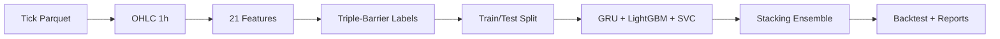

# thesis-compact

Pipeline dự báo tín hiệu giao dịch **XAU/USD** sử dụng hybrid stacking ensemble (GRU + LightGBM + SVC) với purged-embargo cross-validation để tránh data leakage.

## Pipeline



## Chạy nhanh

```bash
# Cài dependencies (cần pixi)
pixi install

# Smoke test (1 tháng dữ liệu)
pixi run smoke

# Chạy 12 tháng
pixi run run

# Chạy toàn bộ 5 năm
pixi run run-full
```

### Tham số CLI

```bash
python main.py [--full] [--months N] [--long-only] [--walk-forward]
```

| Flag | Mặc định | Mô tả |
|---|---|---|
| `--full` | tắt | Dùng toàn bộ dữ liệu |
| `--months N` | 12 | Số file parquet theo tháng |
| `--long-only` | tắt | Chỉ cho phép long positions |
| `--walk-forward` | tắt | Chạy walk-forward validation |

## Cấu trúc thư mục

```
main.py                          # Entrypoint
src/
  cli.py                         # CLI + orchestration pipeline
  config.py                      # Hằng số cấu hình
  data.py                        # Parquet → OHLC (Polars streaming)
  dataset.py                     # Build dataset: features + labels + split
  features.py                    # Feature engineering (frac diff, indicators, OBV)
  labeling.py                    # Triple-barrier labeling (swing H/L + ATR fallback + auto-tune)
  models.py                      # GRU, LightGBM, SVC + Stacking ensemble
  backtest.py                    # Mô phỏng equity barrier-based
  reporting.py                   # Báo cáo + artifacts (JSON/CSV/PNG)
  validation.py                  # PurgedEmbargoTimeSeriesSplit
data/XAUUSD/                     # Dữ liệu parquet đầu vào (không track)
reports/run_*/                   # Artifacts đầu ra mỗi lần chạy
  ├── run_data.json              # metadata + config + kết quả
  ├── figures/                   # PNG: equity, OOF, confusion, importance, ...
  └── tables/                    # CSV: predictions, trades, metrics, ...
viz.ipynb                        # Notebook phân tích
```

## Cấu hình chính (`src/config.py`)

| Tham số | Giá trị | Mô tả |
|---|---|---|
| `TIMEFRAME` | 1h | Khung thời gian nến OHLC |
| `FRACTIONAL_D` | 0.4 | Bậc fractional differencing |
| `RANDOM_STATE` | 42 | Seed tái lập kết quả |
| `PURGE_PCT` | 0.02 | Tỷ lệ purge mỗi fold |
| `CV_SPLITS` | 5 | Số fold cross-validation |
| `EMBARGO_PCT` | 0.02 | Tỷ lệ embargo mỗi fold |
| `MIN_OOF_F1` | 0.50 | Ngưỡng smart filtering |
| `META_LABEL_THRESHOLD` | 0.55 | Ngưỡng meta-label classifier |
| `CONFIDENCE_THRESHOLD` | 0.45 | Ngưỡng confidence position sizing |
| `RISK_PER_TRADE` | 0.02 | Rủi ro tối đa mỗi trade |
| `ADX_THRESHOLD` | 20 | Ngưỡng lọc xu hướng ADX |
| `USE_META_LABELING` | true | Meta-labeling cho position sizing |
| `LEVERAGE` | 100 | Đòn bẩy tài khoản |
| `LABELING_HORIZON` | 24 | Vertical barrier (nến) |

## Kết quả đầu ra

Mỗi lần chạy tạo thư mục `reports/run_{timestamp}/`:

- `run_data.json` — metadata, config, kết quả
- `figures/` — equity curve, OOF scores, confusion matrix, feature importance, ablation, ...
- `tables/`
  - `predictions.csv` — predictions + positions + PnL
  - `trades.csv` — danh sách trades
  - `feature_importance.csv` — importance từ LightGBM
  - `backtest_metrics.csv`, `per_class_metrics.csv`, `trade_statistics.csv`, ...

## Kiểm tra code

```bash
pixi run check       # ruff lint src/
```

## References

- López de Prado, M. (2018). *Advances in Financial Machine Learning*. John Wiley & Sons.
  - **Chapter 3**: Triple-Barrier Labeling — labeling method for financial series
  - **Chapter 5**: Fractional Differencing — preserving memory while achieving stationarity
  - **Chapter 7**: Cross-Validation — purged k-fold and embargo for time series
  - **Chapter 9**: Backtesting — performance evaluation methodology
  - **Chapter 11**: Hyper-Parameter Tuning — Deflated Sharpe Ratio for multiple testing
- Wolpert, D. H. (1992). Stacked Generalization. *Neural Networks*, 5(2), 241–259.
  - Foundation of stacking ensemble — combining multiple learners via meta-learner
- Ke, G., Meng, Q., et al. (2017). LightGBM: A Highly Efficient Gradient Boosting Decision Tree. *NeurIPS 2017*.
  - Leaf-wise growth, histogram-based splitting — base learner in the ensemble
