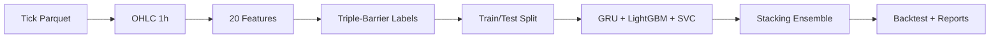

# thesis-compact

Pipeline dự báo tín hiệu giao dịch **XAU/USD** sử dụng hybrid stacking ensemble (GRU + LightGBM + SVC) với purged-embargo cross-validation để tránh data leakage.

## Pipeline



## Chạy nhanh

```bash
# Cài dependencies (cần pixi)
pixi install

# Smoke test (1 tháng dữ liệu)
pixi run smoke

# Chạy 12 tháng
pixi run run

# Chạy toàn bộ 5 năm
pixi run run-full
```

### Tham số CLI

```bash
python main.py [--full] [--months N] [--seed S]
```

| Flag | Mặc định | Mô tả |
|---|---|---|
| `--full` | tắt | Dùng toàn bộ dữ liệu |
| `--months N` | 12 | Số file parquet theo tháng |
| `--seed S` | 42 | Random seed |

## Cấu trúc thư mục

```
main.py                          # Entrypoint
src/
  cli.py                         # CLI + orchestration pipeline
  config.py                      # Hằng số cấu hình
  data.py                        # Parquet → OHLC (Polars streaming)
  dataset.py                     # Ghép features + labels + chia train/test
  features.py                    # 20 features (frac diff, indicators, calendar)
  labeling.py                    # Triple-barrier labeling (swing H/L + ATR fallback)
  validation.py                  # PurgedEmbargoTimeSeriesSplit
  models.py                      # GRU, LightGBM, SVC + Stacking ensemble
  backtest.py                    # Mô phỏng equity barrier-based
  reporting.py                   # Báo cáo + artifacts (JSON/CSV/PNG)
data/XAUUSD/                     # Dữ liệu parquet đầu vào (không track)
reports/run_*/                   # Artifacts đầu ra mỗi lần chạy
docs/                            # Tài liệu chi tiết
viz.ipynb                        # Notebook phân tích
```

## Cấu hình chính (`src/config.py`)

| Tham số | Giá trị | Mô tả |
|---|---|---|
| `TIMEFRAME` | 1h | Khung thời gian nến OHLC |
| `FRACTIONAL_D` | 0.4 | Bậc fractional differencing |
| `CV_SPLITS` | 5 | Số fold cross-validation |
| `EMBARGO_PCT` | 0.02 | Tỷ lệ embargo mỗi fold |
| `MIN_OOF_F1` | 0.36 | Ngưỡng smart filtering |
| `CONFIDENCE_THRESHOLD` | 0.15 | Ngưỡng confidence position sizing |
| `FIXED_LOTS` | 0.01 | Khối lượng mỗi lệnh |
| `LEVERAGE` | 20 | Đòn bẩy tài khoản |

## Kết quả đầu ra

Mỗi lần chạy tạo thư mục `reports/run_{timestamp}/`:

- `run_data.json` — metadata, config, kết quả
- `predictions.csv` — predictions + positions + PnL
- `trades.csv` — danh sách trades
- `feature_importance.csv` — importance từ LightGBM
- `figures/` — equity curve, OOF scores, confusion matrix, feature importance

## Tài liệu

Xem [docs/](docs/) để biết chi tiết từng bước pipeline.
