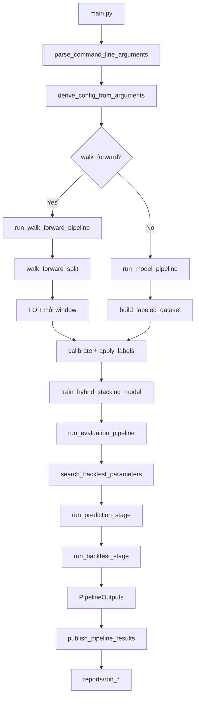

# CLI Orchestration

> CLI entrypoint qua `main.py` → `src/cli.py` (607 dòng) orchestrate pipeline đầy đủ: data loading → feature → labeling → split → OOF stacking → meta-label → backtest → reporting. Hỗ trợ single-split và walk-forward mode.

## Tóm tắt

Module `src/cli.py` triển khai CLI duy nhất của pipeline thông qua `argparse`. Entry point `main.py` chỉ re-export `src.cli.main()` — bản chất `main.py` là shim 5 dòng cho `python main.py ...`. Module chia pipeline thành các stage đo lường thời gian độc lập (data loading, model training, tuning, prediction, positions, backtesting, reporting), lưu snapshot config vào `reports/run_*/run_data.json` qua `src.reporting`. Hai chế độ: single train/test split và expanding walk-forward.

## Cơ sở lý thuyết

Pipeline orchestration cho ML tài chính yêu cầu: (i) tính đúng đắn về mặt thời gian (không lookahead), (ii) reproducibility qua seed và config snapshot, (iii) khả năng kiểm tra từng stage qua timing log, (iv) hỗ trợ cả single-split và walk-forward cho robust evaluation. Module `cli.py` đáp ứng bốn yêu cầu này thông qua dataclass `TimingResults`, `RunConfigPayload`, `PipelineOutputs` — tất cả `frozen=True` để đảm bảo immutability trong suốt vòng đời pipeline.

## Công thức

Cấu hình Pipeline được tạo qua hàm `derive_config_from_arguments(args)`:

```python
PipelineConfig(
    months=None if args.full else args.months,
    long_only=args.long_only,
    walk_forward=args.walk_forward,
)
```

Timing từng stage đo bằng `measure_step_duration(name, step, *args, **kwargs)`:

$$
t_{\mathrm{stage}} = \mathrm{perf\_counter}(\mathrm{after}) - \mathrm{perf\_counter}(\mathrm{before}).
$$

## Cài đặt

### CLI args

Định nghĩa trong `parse_command_line_arguments()`:

| Argument | Loại | Mặc định | Vai trò |
|---|---|---|---|
| `--months N` | int $\geq 1$ | `PipelineConfig().months = 12` | Số tháng load từ parquet đầu tiên |
| `--full` | flag | `False` | Dùng toàn bộ data (override `--months`) |
| `--long-only` | flag | `False` | Disable position SHORT |
| `--walk-forward` | flag | `False` | Chạy expanding walk-forward thay vì single split |

TP/SL/min_hold backtest luôn được grid-search trên train — single source of truth là `TUNE_TP_RANGE_BT`, `TUNE_SL_RANGE_BT`, `TUNE_HOLD_VALUES` trong `src/config.py`. Không có CLI override.

Validator `validate_positive_month_count(value)` đảm bảo `--months >= 1`.

Ví dụ invocation:

```bash
# Smoke test 1 tháng
pixi run smoke                # ≡ python main.py --months 1

# Single split 12 tháng, default
pixi run run                  # ≡ python main.py --months 12

# Full data 5 năm, walk-forward
pixi run run-full             # ≡ python main.py --full --walk-forward

# Long-only experiment
python main.py --months 24 --long-only
```

Xem `00-reproducibility.md` cho full task `pixi` matrix.

### Logging

Pipeline dùng `print()` trực tiếp cho log console — không dùng `logging` module, đảm bảo thứ tự log đơn giản, dễ đọc trong cả console lẫn redirect file. Khi chạy walk-forward, mỗi window in block `=== Window N ===` followed by `=== WALK-FORWARD AGGREGATE ===` ở cuối.

### Exit codes

| Code | Ý nghĩa |
|---|---|
| `0` | Pipeline thành công — tất cả stage hoàn tất, reports ghi vào `reports/run_*/`. |
| `$\neq 0$` | Có exception chưa được catch — Python traceback in ra stderr. |

Module không định nghĩa exit codes tùy chỉnh — dựa vào exception propagation mặc định của Python.

### Subcommand structure

CLI hiện tại là **flat** (không subcommand) — single entry point với flags. Lý do: pipeline có thứ tự stage cố định, không cần các workflow thay thế. Mọi biến thể (walk-forward, long-only) được kiểm soát qua flag.

Tuy nhiên logic nội tại có thể chia thành các stage function riêng biệt — xem "Pipeline orchestration" bên dưới.

### Pipeline orchestration

Flow chính trong `run_pipeline(config)`: `start_accelerator_with_seed(42)` → seed Accelerator. Nếu `walk_forward`: `run_walk_forward_pipeline(config)` gọi `load_featured_candles`, `walk_forward_split(timestamps, n_windows=3)`, mỗi window gọi `calibrate_barrier_params` → `apply_labels_to_frame` cho train/test với cùng params, `train_hybrid_stacking_model`, `run_evaluation_pipeline`. Nếu không walk-forward: `run_model_pipeline(config)` gọi `build_labeled_dataset(config)` (load parquet + features + auto-tune barriers + labels + purge split), `train_hybrid_stacking_model`, `run_evaluation_pipeline`. Trong eval pipeline: `search_backtest_parameters` (grid TP/SL/hold — luôn chạy); `run_prediction_stage` (predict + positions + min hold); `run_backtest_stage` (barrier backtest → metrics, trades, equity).

### Stage functions

| Function | Vai trò |
|---|---|
| `parse_command_line_arguments` | Định nghĩa CLI args qua argparse |
| `derive_config_from_arguments` | Build `PipelineConfig` từ args |
| `start_accelerator_with_seed` | Seed `set_seed(42)` + init Accelerator |
| `run_model_pipeline` | Pipeline single split — main entry |
| `run_walk_forward_pipeline` | Pipeline walk-forward — list of windows |
| `run_evaluation_pipeline` | Tune + predict + backtest |
| `run_prediction_stage` | Predict + position assignment |
| `run_backtest_stage` | Backtest runner |
| `train_hybrid_stacking_model` | Wrapper build + fit model |
| `build_position_strategy_kwargs` | Kwargs truyền vào HybridStackingSignalClassifier |
| `build_run_config_payload` | Build `RunConfigPayload` cho reporting |
| `measure_step_duration` | Wrap step + đo thời gian |
| `print_timing_summary` | In bảng timing cuối run |
| `run_pipeline` | Top-level orchestrator |
| `main` | Entry shim, gọi `run_pipeline` |

### Dataclasses

`TimingResults` (immutable, 8 stage timing), `RunConfigPayload` (snapshot config cho `run_data.json`), `PipelineOutputs` (bundle: train, test, features, model, predictions, positions, backtest_metrics, equity, executed_trades).

### Mermaid flow



## Tham số quan trọng

| Tham số | Giá trị | Vị trí | Lý do |
|---|---|---|---|
| `RANDOM_STATE` | $42$ | `src/config.py`, `start_accelerator_with_seed` | Seed gốc cho toàn pipeline |
| `INITIAL_BALANCE` | $\$10{,}000$ | `src/config.py`, `RunConfigPayload.initial_balance` | Vốn giả lập |
| `timeframe` | `"1h"` | `src/config.py`, `PipelineConfig.timeframe` | Cân bằng granularity vs noise |
| `n_windows` | $3$ | `PipelineConfig.n_windows` | Số walk-forward window |
| `TUNE_TP_RANGE_BT` | $(3.0, 15.0, 1.0)$ | `src/config.py`, grid search | TP range — single source of truth |
| `TUNE_SL_RANGE_BT` | $(3.0, 15.0, 1.0)$ | `src/config.py`, grid search | SL range |
| `TUNE_HOLD_VALUES` | $[6, 8, 12, 16]$ | `src/config.py`, grid search | Min hold candidate values |

Bảng đầy đủ ở `08-config.md`.

### Code refs

| Hàm | Vai trò |
|---|---|
| `main` | Entry point, gọi `run_pipeline` |
| `parse_command_line_arguments` | argparse setup |
| `derive_config_from_arguments` | args → `PipelineConfig` |
| `run_pipeline` | Top orchestrator |
| `run_model_pipeline` | Single-split mode |
| `run_walk_forward_pipeline` | Walk-forward mode |
| `run_evaluation_pipeline` | Tune + predict + backtest |
| `train_hybrid_stacking_model` | Model build + fit |
| `measure_step_duration`, `print_timing_summary` | Timing utilities |
| `start_accelerator_with_seed` | Seed + Accelerator |

## Kết quả thực nghiệm

### Time profile (12 tháng, `pixi run run`)

| Stage | Thời gian |
|---|---|
| data_loading | $\sim 12$ s |
| model_training | $\sim 180$ s |
| tuning | $\sim 45$ s |
| prediction | $\sim 5$ s |
| positions | $\sim 1$ s |
| backtesting | $\sim 2$ s |
| reporting | $\sim 0.5$ s |
| **total** | $\sim 246$ s ($\approx 4$ phút) |

Smoke test (1 tháng) $\approx 13$ s total. Walk-forward (5 năm, 3 windows) $\approx 20$ min. Mỗi run tạo thư mục `reports/run_{timestamp}/` chứa `run_data.json`, `predictions.csv`, `trades.csv`, `feature_importance.csv`, `figures/`. Chi tiết schema ở `07-reporting.md`.

## Tham khảo

- `\cite{de_prado_2018_cross_val}` — purged CV, walk-forward.
- `\cite{de_prado_2018_backtest}` — backtesting risk.
- `docs/00-reproducibility.md` — cách invoke `pixi run`, seed propagation.
- `docs/05-models-stacking.md` — model training được orchestrate.
- `docs/06-backtest.md` — backtest stage.
- `docs/07-reporting.md` — output artifacts.
- `docs/08-config.md` — bảng đầy đủ tham số.
