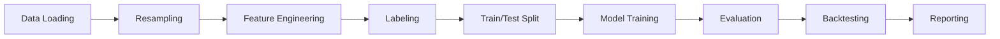
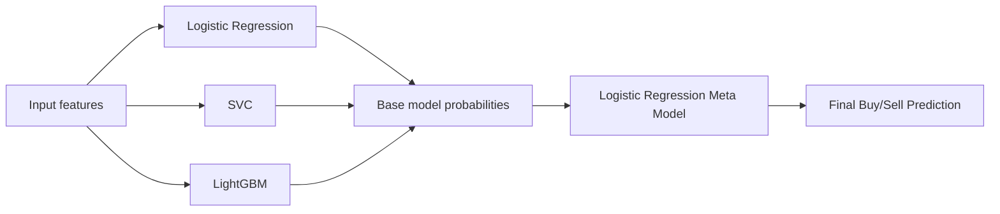

**TRƯỜNG ĐẠI HỌC THUỶ LỢI**

**KHOA CÔNG NGHỆ THÔNG TIN**

**![][image1]**

**ĐỒ ÁN TỐT NGHIỆP**

**Tên đề tài:** Ứng dụng mô hình Hybrid Stacking dự báo tín hiệu giao dịch CFD Vàng

 

**Sinh viên thực hiện**: Nguyễn Đức Hiếu

**Lớp**: 63CNTT.VA

**Mã sinh viên**: 2151061192

**Số điện thoại**: 0929033808 

**Email**: hieuteo03@gmail.com

**Giáo viên hướng dẫn**: Hoàng Quốc Dũng

|  |  TRƯỜNG ĐẠI HỌC THUỶ LỢI  KHOA CÔNG NGHỆ THÔNG TIN BẢN TÓM TẮT ĐỀ CƯƠNG ĐỒ ÁN TỐT NGHIỆP |
| :---: | :---: |

**Tên đề tài**: Ứng dụng mô hình Hybrid Stacking dự báo tín hiệu giao dịch CFD Vàng  
**Sinh viên thực hiện**: Nguyễn Đức Hiếu  
**Lớp**: [63CNTT.VA](http://63CNTT.VA)  
**Mã sinh viên**: 2151061192  
**Số điện thoại**: 0929033808   
**Email**: [hieuteo03@gmail.com](mailto:hieuteo03@gmail.com)  
**Giáo viên hướng dẫn**: Hoàng Quốc Dũng

TÓM TẮT ĐỀ TÀI

Trong bối cảnh thị trường tài chính ngày càng phát triển, đặc biệt là sự phổ biến của các sản phẩm giao dịch như Forex, Crypto và CFD, nhu cầu phân tích dữ liệu giá để hỗ trợ ra quyết định giao dịch ngày càng được quan tâm. Trong đó, vàng với mã giao dịch XAU/USD là một sản phẩm có tính thanh khoản cao, biến động mạnh và được nhiều nhà đầu tư lựa chọn. Tuy nhiên, giá vàng chịu ảnh hưởng bởi nhiều yếu tố như tin tức kinh tế, lãi suất, lạm phát, tâm lý thị trường và biến động của đồng USD, khiến việc dự báo xu hướng trở thành một bài toán khó.

Với sự phát triển của công nghệ số và các phương pháp học máy, việc ứng dụng trí tuệ nhân tạo vào lĩnh vực tài chính đã mở ra nhiều hướng tiếp cận mới. Thay vì chỉ dựa vào kinh nghiệm cá nhân hoặc phân tích kỹ thuật truyền thống, mô hình học máy có thể học từ dữ liệu lịch sử, phát hiện các mẫu biến động tiềm ẩn và hỗ trợ dự báo tín hiệu giao dịch một cách có hệ thống. Vì vậy, đề tài **“Ứng dụng mô hình Hybrid Stacking dự báo tín hiệu giao dịch CFD vàng”** được thực hiện nhằm nghiên cứu khả năng áp dụng mô hình học máy kết hợp vào bài toán dự báo tín hiệu **Buy/Sell** cho sản phẩm CFD vàng.

Sau quá trình khảo sát và tìm hiểu, tôi lựa chọn hướng tiếp cận **Hybrid Stacking** để kết hợp nhiều mô hình học máy khác nhau, tận dụng ưu điểm riêng của từng mô hình trong quá trình dự báo. Đề tài tập trung xây dựng quy trình từ xử lý dữ liệu giá XAU/USD, tạo đặc trưng kỹ thuật, gán nhãn tín hiệu giao dịch, huấn luyện các mô hình cơ sở, kết hợp kết quả bằng mô hình stacking và đánh giá hiệu quả thông qua các chỉ số phân loại cùng mô phỏng backtest đơn giản.

Kết quả của đề tài không hướng đến việc xây dựng một hệ thống giao dịch tự động hoàn chỉnh, mà tập trung vào việc xây dựng mô hình dự báo tín hiệu có quy trình rõ ràng, có cơ sở dữ liệu và có khả năng mở rộng. Từ đó, đề tài đặt nền móng cho việc phát triển các hệ thống hỗ trợ quyết định giao dịch trong tương lai, như quản trị rủi ro, tối ưu chiến lược hoặc kiểm thử trên nhiều loại tài sản tài chính khác nhau.

**Công nghệ sử dụng:**

* **Ngôn ngữ:** Python  
* **Thư viện:** Pandas, NumPy, Scikit-learn, LightGBM  
* **Mô hình:** Logistic Regression, SVC, LightGBM, Hybrid Stacking  
* **Dữ liệu:** Dữ liệu giá lịch sử XAU/USD  
* **Bài toán:** Dự báo tín hiệu Buy/Sell cho CFD vàng  
* **Khung thời gian:** 1 giờ

CÁC MỤC TIÊU CHÍNH

* **Xây dựng pipeline xử lý dữ liệu giá vàng**  
  * Thu thập và xử lý dữ liệu giá XAU/USD.  
  * Chuyển dữ liệu đầu vào thành dữ liệu OHLC khung thời gian 1 giờ.  
  * Làm sạch dữ liệu và loại bỏ các mẫu không phù hợp.  
  * Đảm bảo dữ liệu được chia theo thứ tự thời gian để phù hợp với bài toán tài chính.  
* **Xây dựng bộ đặc trưng phục vụ mô hình học máy**  
  * Tạo các đặc trưng kỹ thuật từ dữ liệu giá.  
  * Sử dụng các nhóm đặc trưng như:  
    * Đặc trưng xu hướng.  
    * Đặc trưng biến động.  
    * Đặc trưng cấu trúc nến.  
    * Đặc trưng động lượng giá.  
  * Chuẩn bị dữ liệu đầu vào phù hợp cho các mô hình phân loại.  
* **Xây dựng phương pháp gán nhãn tín hiệu Buy/Sell**  
  * Gán nhãn dựa trên biến động giá trong tương lai.  
  * Dự báo hướng giá sau một khoảng thời gian cố định, cụ thể là 4 giờ tiếp theo.  
  * Loại bỏ các mẫu có biến động quá nhỏ để giảm nhiễu trong quá trình huấn luyện.  
  * Tập trung vào bài toán phân loại nhị phân: Buy hoặc Sell.  
* **Huấn luyện và so sánh các mô hình học máy**  
  * Xây dựng các mô hình cơ sở gồm:  
    * Logistic Regression.  
    * SVC.  
    * LightGBM.  
  * Kết hợp các mô hình cơ sở bằng mô hình Hybrid Stacking.  
  * Sử dụng Logistic Regression làm mô hình meta để tổng hợp dự báo từ các mô hình cơ sở.  
  * So sánh hiệu quả của Hybrid Stacking với từng mô hình riêng lẻ.  
* **Đánh giá mô hình bằng các chỉ số định lượng**  
  * Đánh giá mô hình trên tập test theo thứ tự thời gian.  
  * Sử dụng các chỉ số:  
    * Accuracy.  
    * F1-score macro.  
    * Precision.  
    * Recall.  
    * ROC-AUC.  
  * So sánh mô hình Hybrid Stacking với các baseline đơn giản và các mô hình cơ sở.  
* **Mô phỏng backtest tín hiệu giao dịch**  
  * Chuyển kết quả dự báo của mô hình thành tín hiệu giao dịch Buy/Sell.  
  * Thực hiện mô phỏng backtest đơn giản trên tập kiểm tra.  
  * Đánh giá khả năng ứng dụng của mô hình trong bối cảnh tín hiệu giao dịch.  
  * Xuất báo cáo kết quả, bảng số liệu và biểu đồ phục vụ phân tích.

KẾT QUẢ DỰ KIẾN

* **Về mặt sản phẩm chương trình**  
  * Sau khi hoàn thành, đề tài dự kiến tạo ra một chương trình có khả năng:  
    * Đọc và xử lý dữ liệu giá XAU/USD.  
    * Tạo bộ đặc trưng kỹ thuật từ dữ liệu giá.  
    * Gán nhãn Buy/Sell dựa trên biến động giá trong tương lai.  
    * Huấn luyện các mô hình học máy cơ sở.  
    * Kết hợp mô hình bằng phương pháp Hybrid Stacking.  
    * Đánh giá mô hình bằng các chỉ số phân loại.  
    * Sinh tín hiệu giao dịch Buy/Sell.  
    * Thực hiện backtest tín hiệu đơn giản.  
* **Về mặt học thuật**  
  * Đề tài dự kiến làm rõ được:  
    * Cách áp dụng học máy vào bài toán dự báo tín hiệu giao dịch tài chính.  
    * Quy trình xây dựng dữ liệu đầu vào cho mô hình dự báo giá.  
    * Cách gán nhãn dữ liệu theo hướng biến động giá trong tương lai.  
    * Cách kết hợp nhiều mô hình học máy bằng phương pháp stacking.  
    * Cách đánh giá mô hình dự báo tín hiệu không chỉ bằng độ chính xác, mà còn bằng các chỉ số phân loại và mô phỏng giao dịch.  
* **Về mặt đánh giá thực nghiệm**  
  * Kết quả thực nghiệm dự kiến bao gồm:  
    * Bảng so sánh giữa Hybrid Stacking và các mô hình cơ sở.  
    * Bảng so sánh với các baseline đơn giản.  
    * Các chỉ số đánh giá phân loại trên tập test.  
    * Biểu đồ hoặc bảng mô phỏng kết quả backtest.  
    * Nhận xét về mức độ hiệu quả, hạn chế và khả năng ứng dụng của mô hình.  
* **Về mặt ứng dụng**  
  * Đề tài dự kiến cung cấp một hệ thống thử nghiệm có thể hỗ trợ:  
    * Phân tích dữ liệu giá vàng theo hướng định lượng.  
    * Sinh tín hiệu Buy/Sell dựa trên mô hình học máy.  
    * Làm nền tảng để phát triển các hệ thống hỗ trợ quyết định giao dịch trong tương lai.  
    * Mở rộng thêm các chức năng như quản trị rủi ro, thêm lớp Hold, tối ưu tham số, hoặc kiểm thử trên nhiều giai đoạn thị trường khác nhau.

LỜI CAM ĐOAN

Em xin trân trọng cam kết toàn bộ nội dung, kết quả nghiên cứu trình bày trong đồ án tốt nghiệp này là công trình do chính bản thân tôi thực hiện dưới sự hướng dẫn của giảng viên hướng dẫn. Đồ án được hoàn thành bằng kiến thức, nỗ lực và sự sáng tạo của cá nhân em trong suốt quá trình nghiên cứu, không sao chép từ bất cứ công trình nào khác. Mọi số liệu, kết quả thí nghiệm, phân tích trong đồ án đều được thực hiện một cách trung thực, khách quan và khoa học. Các thông tin, dữ liệu sử dụng đều có nguồn gốc rõ ràng và được xử lý theo phương pháp luận chính xác. Tất cả các nội dung tham khảo từ các nguồn tài liệu, công trình nghiên cứu đã công bố đều được trích dẫn đầy đủ theo đúng quy định về trích dẫn khoa học. Mọi tài liệu tham khảo đều được ghi nhận trong danh mục tài liệu tham khảo với đầy đủ thông tin về tác giả, nguồn, năm lưu hành. Việc sử dụng các ý tưởng, kết quả nghiên cứu của người khác (nếu có) đều được dẫn nguồn minh bạch và chỉ sử dụng ở mức độ tham khảo, có đóng góp phát triển thêm. Em hoàn toàn chịu trách nhiệm về tính chính xác và độ tin cậy của các kết quả trình bày trong đồ án. Nếu phát hiện có bất kỳ sự gian lận, sao chép hoặc vi phạm quy tắc đạo đức học thuật, em sẵn sàng chấp nhận mọi hình thức kỷ luật của nhà trường.

|  | Tác giả ĐATN Hiếu Nguyễn Đức Hiếu |
| :---- | :---: |

LỜI CẢM ƠN

Hoàn thành đồ án tốt nghiệp là một trong những cột mốc quan trọng nhất trong hành trình học tập của em. Đây không chỉ là kết quả của nỗ lực cá nhân mà còn là thành quả từ sự giúp đỡ, động viên và dìu dắt của rất nhiều người. Nhân dịp này, em xin được bày tỏ lòng biết ơn sâu sắc đến tất cả những người đã đồng hành, hỗ trợ và truyền cảm hứng cho em trong suốt thời gian qua.

Trước hết, em xin gửi lời tri ân chân thành nhất đến ban giám hiệu trường đại học Thủy Lợi, các thầy cô trong khoa công nghệ thông tin \- những người đã tạo dựng một môi trường học tập chuyên nghiệp, năng động và giàu tri thức. Những bài giảng tâm huyết, sự nhiệt tình giảng dạy và kinh nghiệm thực tiễn quý báu của các thầy cô đã trang bị cho em nền tảng kiến thức vững chắc, giúp em tự tin hơn trong học tập, nghiên cứu và ứng dụng vào thực tế.

Đặc biệt, em xin bày tỏ lòng biết ơn sâu sắc và sự kính trọng đến TS. Hoàng Quốc Dũng – người thầy, người hướng dẫn tận tâm và nhiệt huyết. Thầy không chỉ truyền đạt kiến thức chuyên môn mà còn luôn sẵn sàng lắng nghe, góp ý và định hướng cho em trong từng giai đoạn thực hiện đồ án. Những lời khuyên quý báu, sự kiên nhẫn chỉ bảo và sự động viên kịp thời của thầy đã giúp em vượt qua những khó khăn, thử thách để hoàn thành đồ án một cách tốt nhất. Em luôn ghi nhớ và trân trọng công ơn dạy dỗ của thầy.

Ngoài ra, em xin gửi lời cảm ơn chân thành đến cố vấn học tập, bạn bè, các anh chị khóa trên đã luôn sát cánh bên em trong suốt quá trình học tập và nghiên cứu. Những buổi thảo luận, trao đổi về những vấn đề liên quan đến chuyên môn, những lời động viên chân thành và sự giúp đỡ nhiệt tình của mọi người đã tiếp thêm động lực để em cố gắng hoàn thiện bản thân và hoàn thành đồ án đúng tiến độ.

Cuối cùng, không thể không nhắc đến và cũng là quan trọng nhất, em xin dành tình cảm và lòng biết ơn sâu sắc đến gia đình – những người luôn yêu thương, ủng hộ và đồng hành cùng em trên mọi chặng đường. Sự hy sinh thầm lặng, những lời động viên đúng lúc và niềm tin vững chắc của gia đình, người thân chính là nguồn sức mạnh to lớn giúp em vượt qua mọi khó khăn, chân cứng đá mềm để hoàn thành mục tiêu của mình.

# **CHƯƠNG 1\. GIỚI THIỆU ĐỀ TÀI**

## **1.1. Lý do chọn đề tài**

Trong những năm gần đây, thị trường tài chính ngày càng phát triển mạnh mẽ, đặc biệt là các sản phẩm giao dịch như Forex, Crypto và CFD. Trong đó, vàng với mã giao dịch phổ biến là **XAU/USD** là một trong những sản phẩm được nhiều nhà giao dịch quan tâm do có tính thanh khoản cao, biên độ dao động lớn và thường phản ứng mạnh trước các yếu tố kinh tế vĩ mô như lạm phát, lãi suất, biến động của đồng USD và tâm lý thị trường.

Đối với nhà giao dịch, việc xác định xu hướng tiếp theo của giá vàng là một nhiệm vụ quan trọng. Tuy nhiên, dữ liệu tài chính nói chung và dữ liệu giá vàng nói riêng thường có nhiều nhiễu, biến động thất thường và khó dự báo chính xác bằng các phương pháp đơn giản. Vì vậy, bài toán dự báo tín hiệu giao dịch không chỉ phụ thuộc vào kinh nghiệm cá nhân mà còn cần đến các phương pháp phân tích dữ liệu có hệ thống.

Cùng với sự phát triển của trí tuệ nhân tạo và học máy, các mô hình Machine Learning ngày càng được ứng dụng nhiều trong lĩnh vực tài chính. Các mô hình này có khả năng học từ dữ liệu lịch sử, phát hiện các mẫu biến động tiềm ẩn và hỗ trợ đưa ra tín hiệu dự báo. Thay vì dự báo giá vàng tuyệt đối, hướng tiếp cận của đồ án tập trung vào việc dự báo tín hiệu giao dịch dạng **Buy/Sell**, phù hợp với bài toán phân lớp trong học máy.

Trong đồ án này, mô hình **Hybrid Stacking** được lựa chọn nhằm kết hợp nhiều mô hình học máy khác nhau. Việc kết hợp này giúp tận dụng ưu điểm riêng của từng mô hình cơ sở, từ đó tạo ra một mô hình tổng hợp có khả năng đánh giá tín hiệu tốt hơn so với việc chỉ sử dụng một mô hình đơn lẻ. Hệ thống sử dụng các mô hình cơ sở gồm **Logistic Regression, SVC và LightGBM**, sau đó kết hợp bằng mô hình meta **Logistic Regression**.

Từ những lý do trên, đề tài **“Ứng dụng mô hình Hybrid Stacking dự báo tín hiệu giao dịch CFD vàng”** được thực hiện nhằm nghiên cứu khả năng ứng dụng học máy vào bài toán dự báo tín hiệu giao dịch cho sản phẩm CFD vàng XAU/USD trên khung thời gian 1 giờ.

## **1.2. Vấn đề nghiên cứu**

Bài toán của đồ án là **dự báo tín hiệu giao dịch Buy/Sell cho CFD vàng XAU/USD trên khung thời gian 1 giờ**, dựa trên dữ liệu giá lịch sử và các đặc trưng kỹ thuật được xây dựng từ dữ liệu giá.

Cụ thể, hệ thống không tập trung vào việc dự báo chính xác giá vàng trong tương lai, mà chuyển bài toán thành dạng phân lớp nhị phân. Với mỗi thời điểm trong dữ liệu, mô hình sẽ dự báo tín hiệu thuộc một trong hai lớp:

* **Buy:** dự báo giá có xu hướng tăng trong tương lai gần.  
* **Sell:** dự báo giá có xu hướng giảm trong tương lai gần.

Nhãn được tạo theo phương pháp **fixed-horizon future-return labeling**, tức là xét biến động giá sau một khoảng thời gian cố định. Với cấu hình hiện tại, hệ thống sử dụng horizon 4 giờ và loại bỏ các mẫu có biến động nhỏ hơn hoặc bằng 0,05%, thay vì gán thêm lớp Hold. Vì vậy, bài toán chính vẫn là phân lớp nhị phân Buy/Sell.

Phạm vi nghiên cứu của đồ án được giới hạn rõ ràng như sau:

* Không dự báo giá vàng tuyệt đối.  
* Không xây dựng bot giao dịch tự động thực chiến.  
* Không cam kết mô hình có khả năng sinh lời trong thực tế.  
* Không mô phỏng đầy đủ các yếu tố giao dịch CFD như margin, leverage, swap, lot sizing hoặc slippage nâng cao.  
* Tập trung vào bài toán phân lớp tín hiệu giao dịch dựa trên dữ liệu lịch sử.

Như vậy, mục tiêu nghiên cứu chính là kiểm tra xem mô hình Hybrid Stacking có thể hỗ trợ dự báo tín hiệu Buy/Sell trên dữ liệu XAU/USD hay không, đồng thời so sánh hiệu quả của mô hình này với các mô hình học máy cơ sở.

## **1.3. Mục tiêu đồ án**

Đồ án hướng đến các mục tiêu chính sau:

* Thu thập và xử lý dữ liệu giá lịch sử của XAU/USD.  
* Chuyển dữ liệu đầu vào thành nến **OHLC** trên khung thời gian **1 giờ**.  
* Xây dựng bộ đặc trưng kỹ thuật từ dữ liệu giá.  
* Gán nhãn tín hiệu **Buy/Sell** dựa trên biến động giá trong tương lai.  
* Chia dữ liệu huấn luyện và kiểm thử theo thứ tự thời gian để phù hợp với đặc thù dữ liệu tài chính.  
* Huấn luyện các mô hình học máy cơ sở gồm:  
  * Logistic Regression.  
  * SVC.  
  * LightGBM.  
* Xây dựng mô hình **Hybrid Stacking** để kết hợp kết quả từ các mô hình cơ sở.  
* So sánh mô hình Hybrid Stacking với từng mô hình cơ sở.  
* Đánh giá kết quả bằng các chỉ số phân lớp như:  
  * Accuracy.  
  * F1-score.  
  * Precision.  
  * Recall.  
  * ROC-AUC.  
* Minh họa khả năng ứng dụng của tín hiệu thông qua backtest đơn giản.  
* Xuất kết quả thực nghiệm dưới dạng bảng, biểu đồ và file báo cáo phục vụ phân tích.

Luồng xử lý chính của đồ án gồm dữ liệu tick parquet, tạo OHLC 1H, sinh đặc trưng kỹ thuật, gán nhãn future-return 4H, chia train/test theo thời gian, huấn luyện mô hình, đánh giá metric và backtest tín hiệu.

## **1.4. Đối tượng và phạm vi nghiên cứu**

| Nội dung | Phạm vi |
| ----- | ----- |
| Sản phẩm giao dịch | CFD vàng XAU/USD |
| Timeframe | 1H |
| Bài toán | Phân lớp nhị phân Buy/Sell |
| Dữ liệu | Dữ liệu lịch sử XAU/USD |
| Đặc trưng | Các đặc trưng kỹ thuật được xây dựng từ dữ liệu giá |
| Mô hình cơ sở | Logistic Regression, SVC, LightGBM |
| Mô hình kết hợp | Hybrid Stacking |
| Mô hình meta | Logistic Regression |
| Phương pháp gán nhãn | Future-return labeling theo horizon cố định |
| Đánh giá | ML metrics và backtest minh họa |
| Kết quả đầu ra | Bảng metric, dự báo, giao dịch, biểu đồ và file báo cáo |
| Không bao gồm | Bot giao dịch thật, quản trị vốn đầy đủ, margin, swap, leverage, slippage nâng cao, tối ưu TP/SL thực chiến |

Phạm vi này giúp đồ án giữ được sự tập trung vào bản chất của bài toán học máy: xây dựng dữ liệu, huấn luyện mô hình, đánh giá kết quả và phân tích tín hiệu. Phần backtest chỉ đóng vai trò minh họa hành vi của tín hiệu dự báo, không được xem là một hệ thống giao dịch hoàn chỉnh. Backtest trong đồ án chỉ dừng ở mức tín hiệu, chưa mô phỏng đầy đủ các yếu tố như lot, leverage, margin, swap, slippage hay TP/SL.

## **1.5. Phương pháp thực hiện**

Quy trình thực hiện của đồ án được xây dựng theo hướng tuần tự, từ dữ liệu đầu vào đến kết quả đánh giá cuối cùng. Luồng xử lý tổng quát như sau:

Dữ liệu giá

→ Tạo nến 1H

→ Tính toán đặc trưng kỹ thuật

→ Gán nhãn Buy/Sell

→ Chia train/test theo thời gian

→ Huấn luyện mô hình cơ sở

→ Huấn luyện Hybrid Stacking

→ Đánh giá mô hình

→ Backtest tín hiệu

Cụ thể, phương pháp thực hiện gồm các bước chính:

**Bước 1: Chuẩn bị dữ liệu**

Dữ liệu giá XAU/USD được thu thập từ dữ liệu lịch sử, sau đó xử lý để tạo thành chuỗi nến OHLC trên khung thời gian 1 giờ. Đây là dạng dữ liệu phù hợp để xây dựng các đặc trưng kỹ thuật và phục vụ mô hình học máy.

**Bước 2: Xây dựng đặc trưng kỹ thuật**

Từ dữ liệu OHLC, hệ thống tính toán các đặc trưng kỹ thuật phản ánh biến động giá, xu hướng, động lượng, cấu trúc nến và các thông tin liên quan đến hành vi thị trường. Các đặc trưng này đóng vai trò là đầu vào cho mô hình phân lớp.

**Bước 3: Gán nhãn dữ liệu**

Nhãn Buy/Sell được tạo dựa trên biến động giá trong tương lai. Nếu giá sau một khoảng thời gian nhất định tăng vượt ngưỡng quy định, mẫu dữ liệu được gán nhãn Buy. Ngược lại, nếu giá giảm vượt ngưỡng quy định, mẫu dữ liệu được gán nhãn Sell. Các mẫu có biến động quá nhỏ được loại bỏ nhằm giảm nhiễu cho quá trình huấn luyện.

**Bước 4: Chia dữ liệu huấn luyện và kiểm thử**

Do dữ liệu tài chính là dữ liệu chuỗi thời gian, việc chia dữ liệu cần đảm bảo thứ tự thời gian. Tập huấn luyện được lấy ở giai đoạn trước, tập kiểm thử được lấy ở giai đoạn sau. Cách chia này giúp mô phỏng gần hơn với tình huống thực tế, trong đó mô hình chỉ được học từ dữ liệu quá khứ để dự báo cho dữ liệu tương lai.

**Bước 5: Huấn luyện mô hình cơ sở**

Các mô hình Logistic Regression, SVC và LightGBM được huấn luyện trên cùng bộ dữ liệu đặc trưng. Mỗi mô hình có cách học khác nhau, từ mô hình tuyến tính đến mô hình phi tuyến và mô hình boosting cây quyết định.

**Bước 6: Xây dựng mô hình Hybrid Stacking**

Sau khi các mô hình cơ sở tạo ra kết quả dự báo, mô hình meta sẽ học cách kết hợp các dự báo này để đưa ra tín hiệu cuối cùng. Cách tiếp cận này giúp tận dụng nhiều góc nhìn khác nhau từ các mô hình cơ sở.

**Bước 7: Đánh giá mô hình**

Mô hình được đánh giá bằng các chỉ số phân lớp như Accuracy, F1-score, Precision, Recall và ROC-AUC. Ngoài ra, kết quả của mô hình Hybrid Stacking được so sánh với các mô hình cơ sở và một số baseline đơn giản để đánh giá mức độ cải thiện.

**Bước 8: Backtest tín hiệu**

Tín hiệu Buy/Sell từ mô hình được sử dụng để mô phỏng giao dịch đơn giản trên tập kiểm thử. Kết quả backtest được dùng để minh họa hành vi của tín hiệu theo thời gian, thông qua các chỉ số như tổng lợi nhuận, drawdown, Sharpe, win rate, profit factor và số lượng giao dịch.

## **1.6. Cấu trúc báo cáo**

Báo cáo đồ án được trình bày theo 5 chương chính:

* **Chương 1: Giới thiệu đề tài**  
   Trình bày lý do chọn đề tài, vấn đề nghiên cứu, mục tiêu đồ án, đối tượng và phạm vi nghiên cứu, phương pháp thực hiện và cấu trúc báo cáo.  
* **Chương 2: Cơ sở lý thuyết**  
   Trình bày các kiến thức nền tảng liên quan đến thị trường CFD vàng, dữ liệu chuỗi thời gian tài chính, phân tích kỹ thuật, bài toán phân lớp, các mô hình học máy cơ sở và phương pháp Hybrid Stacking.  
* **Chương 3: Phân tích và thiết kế hệ thống**  
   Trình bày quy trình xử lý dữ liệu, thiết kế pipeline, phương pháp tạo đặc trưng, gán nhãn, chia dữ liệu, huấn luyện mô hình và kiến trúc tổng thể của hệ thống.  
* **Chương 4: Cài đặt và thực nghiệm**  
   Trình bày môi trường cài đặt, công nghệ sử dụng, quá trình huấn luyện, kết quả đánh giá mô hình, so sánh các mô hình và kết quả backtest minh họa.  
* **Chương 5: Kết luận và hướng phát triển**  
   Tổng kết kết quả đạt được, nêu ra hạn chế của đồ án và đề xuất các hướng phát triển trong tương lai như bổ sung lớp Hold, cải thiện quản trị rủi ro, tối ưu chiến lược giao dịch hoặc mở rộng sang các sản phẩm tài chính khác.

---

# **CHƯƠNG 2\. CƠ SỞ LÝ THUYẾT**

## **2.1. Tổng quan về thị trường vàng và CFD vàng**

Vàng là một trong những tài sản tài chính quan trọng trên thị trường quốc tế. Trong lịch sử, vàng thường được xem là tài sản có tính trú ẩn, đặc biệt trong các giai đoạn thị trường biến động mạnh, lạm phát tăng cao hoặc nhà đầu tư lo ngại về rủi ro kinh tế vĩ mô. Vàng cũng thường được sử dụng để phòng thủ và đa dạng hóa danh mục trong các giai đoạn thị trường căng thẳng. [1]

Trên thị trường tài chính, vàng thường được giao dịch với ký hiệu **XAU/USD**. Trong đó, **XAU** đại diện cho vàng, còn **USD** đại diện cho đồng đô la Mỹ. Cặp XAU/USD thể hiện giá trị của vàng được định giá bằng USD. Vì được định giá theo USD, giá vàng thường chịu ảnh hưởng bởi sức mạnh của đồng đô la Mỹ, chính sách lãi suất, kỳ vọng lạm phát, tâm lý thị trường và các tin tức kinh tế vĩ mô.

Bên cạnh hình thức mua bán vàng vật chất, nhà đầu tư còn có thể giao dịch vàng thông qua sản phẩm phái sinh như **CFD**. CFD, viết tắt của **Contract for Difference**, là công cụ tài chính cho phép nhà giao dịch đầu cơ dựa trên biến động giá của tài sản cơ sở mà không cần sở hữu trực tiếp tài sản đó. Với CFD, nhà giao dịch không nắm giữ tài sản cơ sở mà chỉ giao dịch dựa trên sự thay đổi giá của tài sản đó. [2]

Đối với CFD vàng, nhà giao dịch không cần nắm giữ vàng vật chất mà chỉ giao dịch dựa trên biến động giá của XAU/USD. Điều này làm cho CFD vàng trở thành sản phẩm được nhiều nhà giao dịch quan tâm do khả năng tiếp cận linh hoạt và phản ứng nhanh với biến động thị trường. Tuy nhiên, CFD cũng là sản phẩm có rủi ro cao, đặc biệt khi có sử dụng đòn bẩy tài chính. Vì vậy, trong phạm vi đồ án này, CFD vàng chỉ được xem xét dưới góc độ dữ liệu giá và tín hiệu giao dịch, không đi sâu vào các yếu tố vận hành giao dịch thực tế như ký quỹ, đòn bẩy, swap hay quản trị vốn nâng cao.

---

## **2.2. Dữ liệu chuỗi thời gian tài chính**

Dữ liệu giá trong thị trường tài chính là một dạng dữ liệu chuỗi thời gian. Mỗi quan sát đều gắn với một thời điểm cụ thể và có quan hệ với các quan sát trước đó. Với dữ liệu giao dịch vàng XAU/USD, mỗi bản ghi có thể biểu diễn giá tại một thời điểm hoặc một cây nến trong một khung thời gian nhất định.

Một chuỗi thời gian tài chính có thể được biểu diễn như sau:

$$
X = {x_1, x_2, ..., x_t, ..., x_T}
$$

Trong đó:

* $x_t$: quan sát tại thời điểm $t$;
* $T$: tổng số quan sát trong tập dữ liệu.

Với dữ liệu nến OHLC, mỗi quan sát tại thời điểm $t$ có thể được biểu diễn dưới dạng:

$$
x_t = (Open_t, High_t, Low_t, Close_t, Volume_t)
$$

Trong đó:

* $Open_t$: giá mở cửa của cây nến tại thời điểm $t$;
* $High_t$: giá cao nhất;
* $Low_t$: giá thấp nhất;
* $Close_t$: giá đóng cửa;
* $Volume_t$: khối lượng hoặc tick volume.

Tỷ suất sinh lời đơn giản của giá đóng cửa có thể được tính bằng:

$$
r_t = \frac{Close_t - Close_{t-1}}{Close_{t-1}}
$$

Ngoài ra, trong tài chính định lượng, log-return cũng thường được sử dụng:

$$
r_t = \ln{\left(\frac{Close_t}{Close_{t-1}}\right)}
$$

Dữ liệu tài chính có một số đặc điểm khác với dữ liệu thông thường. Thứ nhất, dữ liệu có thứ tự thời gian, nên không nên chia ngẫu nhiên tập huấn luyện và tập kiểm thử. Nếu chia ngẫu nhiên, dữ liệu tương lai có thể bị trộn vào quá trình huấn luyện, làm kết quả đánh giá trở nên thiếu khách quan. Vì vậy, với dữ liệu chuỗi thời gian, cần sử dụng cách chia dữ liệu phù hợp để tránh việc huấn luyện trên dữ liệu tương lai và đánh giá trên dữ liệu quá khứ. [3]

Thứ hai, dữ liệu tài chính thường có nhiều nhiễu, biến động mạnh và có tính **non-stationary**. Điều này có nghĩa là đặc điểm thống kê của dữ liệu có thể thay đổi theo thời gian. Một mô hình hoạt động tốt trong giai đoạn thị trường này chưa chắc hoạt động tốt trong giai đoạn thị trường khác. Các nghiên cứu về chuỗi thời gian tài chính cũng thường nhấn mạnh rằng dữ liệu tài chính có tính phi tuyến, nhiễu và không dừng, gây khó khăn cho việc dự báo. [4]

Thứ ba, khi xây dựng mô hình học máy cho dữ liệu tài chính, cần đặc biệt tránh hiện tượng **rò rỉ dữ liệu tương lai**. Rò rỉ dữ liệu xảy ra khi thông tin chưa thể biết tại thời điểm dự báo lại bị đưa vào quá trình huấn luyện hoặc tạo đặc trưng. Trong đồ án này, dữ liệu được chia theo thứ tự thời gian, tập huấn luyện nằm trước tập kiểm thử. Hệ thống sử dụng `PURGE_BARS = 4`, tương ứng với labeling horizon, nhằm hạn chế chồng lấn nhãn và giảm nguy cơ rò rỉ thông tin giữa tập huấn luyện và tập kiểm thử. [5]

---

## **2.3. Bài toán dự báo tín hiệu giao dịch**

Trong lĩnh vực tài chính, có hai hướng phổ biến để xây dựng bài toán dự báo từ dữ liệu giá.

Hướng thứ nhất là **regression**, tức dự báo một giá trị số cụ thể trong tương lai. Ví dụ, mô hình có thể dự báo giá đóng cửa sau một số cây nến hoặc dự báo tỷ suất sinh lời trong tương lai. Hướng này cho kết quả trực tiếp dưới dạng số, nhưng việc dự báo chính xác giá hoặc return trong thị trường tài chính là rất khó do dữ liệu có nhiều nhiễu và chịu ảnh hưởng bởi nhiều yếu tố bên ngoài.

Hướng thứ hai là **classification**, tức dự báo nhãn hoặc trạng thái thị trường. Thay vì dự báo giá vàng cụ thể, mô hình chỉ cần dự báo tín hiệu giao dịch như **Buy**, **Sell** hoặc **Hold**. Cách tiếp cận này phù hợp hơn với mục tiêu hỗ trợ quyết định giao dịch, vì trong thực tế nhà giao dịch thường quan tâm đến hướng hành động hơn là giá trị chính xác của giá trong tương lai.

Trong đồ án này, bài toán được xây dựng theo hướng **phân lớp nhị phân**. Đầu ra của mô hình gồm hai lớp:

$$
y_t =
\begin{cases}
1, & \text{nếu tín hiệu là Buy} \\
0, & \text{nếu tín hiệu là Sell}
\end{cases}
$$

Bài toán tổng quát có thể biểu diễn như sau:

$$
f(x_t) \rightarrow y_t
$$

Trong đó:

* $x_t$: vector đặc trưng tại thời điểm $t$;
* $y_t$: nhãn tín hiệu giao dịch tại thời điểm $t$;
* $f$: mô hình học máy.

Đồ án sử dụng phương pháp gán nhãn dựa trên **future return** sau một khoảng thời gian cố định. Cụ thể, hệ thống dự báo hướng giá sau 4 cây nến 1 giờ, tương ứng với horizon 4 giờ. Future return được tính như sau: [5]

$$
R_{t,h} = \frac{Close_{t+h}}{Close_t} - 1
$$

Trong đó:

* $R_{t,h}$: tỷ suất sinh lời tương lai sau $h$ bước thời gian;
* $Close_t$: giá đóng cửa tại thời điểm hiện tại;
* $Close_{t+h}$: giá đóng cửa sau $h$ cây nến;
* $h$: số bước thời gian dự báo.

Với ngưỡng biến động $\theta$, nhãn được xác định như sau:

$$
y_t =
\begin{cases}
1, & \text{nếu } R_{t,h} > \theta \\
0, & \text{nếu } R_{t,h} < -\theta
\end{cases}
$$

Các mẫu có biến động nhỏ được loại bỏ:

$$
-\theta \leq R_{t,h} \leq \theta
$$

Trong đồ án, giá trị được sử dụng là:

$$
h = 4
$$

$$
\theta = 0.0005 = 0.05%
$$

Điều này có nghĩa là nếu giá sau 4 giờ tăng hơn 0,05%, mẫu được gán nhãn Buy; nếu giá giảm hơn 0,05%, mẫu được gán nhãn Sell; các mẫu dao động trong khoảng từ (-0.05%) đến (0.05%) được loại bỏ để giảm nhiễu. Vì vậy, đồ án không dự báo giá vàng tuyệt đối, không xây dựng bot giao dịch thực chiến, mà tập trung vào bài toán phân lớp tín hiệu Buy/Sell.

---

## **2.4. Feature engineering trong giao dịch tài chính**

**Feature engineering** là quá trình xây dựng các biến đầu vào cho mô hình học máy từ dữ liệu ban đầu. Trong bài toán giao dịch tài chính, dữ liệu thô thường chỉ gồm giá mở cửa, cao nhất, thấp nhất, đóng cửa và khối lượng. Nếu chỉ sử dụng trực tiếp dữ liệu thô, mô hình có thể khó nhận diện các đặc điểm quan trọng như xu hướng, động lượng, biến động hoặc cấu trúc giá.

Các chỉ báo kỹ thuật thường được xây dựng từ dữ liệu giá và khối lượng lịch sử. Về bản chất, đây là các phép tính toán học dựa trên dữ liệu thị trường trong quá khứ, thường được chia thành các nhóm như chỉ báo xu hướng, động lượng, biến động và khối lượng. [6]

Trong đồ án, dữ liệu tick parquet được chuyển thành nến OHLC 1H, sau đó hệ thống tạo ra 30 đặc trưng kỹ thuật trước khi gán nhãn và huấn luyện mô hình. Các đặc trưng được xây dựng từ nhóm technical indicators, candle structure và microstructure. [5]

### **2.4.1. Nhóm đặc trưng xu hướng**

Nhóm đặc trưng xu hướng được sử dụng để mô tả hướng di chuyển chính của giá. Trong thị trường tài chính, xu hướng có thể là tăng, giảm hoặc đi ngang. Việc nhận diện xu hướng giúp mô hình có thêm thông tin để dự báo tín hiệu Buy/Sell.

Một chỉ báo xu hướng phổ biến là **EMA**. EMA tại thời điểm $t$ được tính theo công thức:

$$
EMA_t = \alpha \cdot Close_t + (1 - \alpha) \cdot EMA_{t-1}
$$

Trong đó:

$$
\alpha = \frac{2}{n+1}
$$

* $n$: số chu kỳ tính EMA;
* $Close_t$: giá đóng cửa tại thời điểm $t$;
* $\alpha$: hệ số làm mượt.

EMA phản ứng nhanh hơn với biến động giá gần hiện tại so với SMA, vì dữ liệu mới được gán trọng số cao hơn.

Một chỉ báo xu hướng khác là **MACD**. MACD được tính bằng hiệu giữa EMA ngắn hạn và EMA dài hạn:

$$
MACD_t = EMA_{short,t} - EMA_{long,t}
$$

Thông thường:

$$
MACD_t = EMA_{12,t} - EMA_{26,t}
$$

Đường tín hiệu của MACD được tính bằng EMA của chính đường MACD:

$$
Signal_t = EMA_9(MACD_t)
$$

Histogram của MACD được tính như sau:

$$
Hist_t = MACD_t - Signal_t
$$

MACD thường được sử dụng để nhận diện xu hướng và động lượng giá. Cách tính phổ biến của MACD là lấy EMA 12 kỳ trừ EMA 26 kỳ, sau đó dùng EMA 9 kỳ của MACD làm đường tín hiệu. [7]

Ngoài ra, **ADX** cũng là một chỉ báo thường dùng để đo độ mạnh của xu hướng. ADX không trực tiếp cho biết giá đang tăng hay giảm, nhưng giúp đánh giá thị trường đang có xu hướng rõ ràng hay đang đi ngang.

### **2.4.2. Nhóm đặc trưng động lượng**

Nhóm đặc trưng động lượng phản ánh tốc độ và sức mạnh của biến động giá trong ngắn hạn. Các đặc trưng này giúp mô hình nhận biết liệu chuyển động hiện tại của giá còn mạnh hay đang yếu dần.

Return ngắn hạn trong $k$ chu kỳ có thể được tính như sau:

$$
Return_{t,k} = \frac{Close_t - Close_{t-k}}{Close_{t-k}}
$$

Momentum được tính bằng chênh lệch giữa giá hiện tại và giá trong quá khứ:

$$
Momentum_{t,k} = Close_t - Close_{t-k}
$$

Nếu $Momentum_{t,k} > 0$, giá hiện tại cao hơn giá trong quá khứ. Nếu $Momentum_{t,k} < 0$, giá hiện tại thấp hơn giá trong quá khứ.

Một chỉ báo động lượng phổ biến khác là **RSI**. Theo Wilder, RSI được tính từ tỷ lệ giữa mức tăng trung bình và mức giảm trung bình trong một cửa sổ quan sát: [15]

$$
RSI = 100 - \frac{100}{1 + RS}
$$

Trong đó:

$$
RS = \frac{Average\ Gain}{Average\ Loss}
$$

* $Average\ Gain$: trung bình các mức tăng giá trong cửa sổ tính RSI;
* $Average\ Loss$: trung bình các mức giảm giá tuyệt đối trong cửa sổ tính RSI.

RSI thường được dùng để đánh giá trạng thái quá mua hoặc quá bán của thị trường. Tuy nhiên, trong đồ án này, RSI không được sử dụng như một quy tắc giao dịch thủ công, mà được đưa vào như một đặc trưng đầu vào để mô hình học máy tự học quan hệ giữa đặc trưng và nhãn Buy/Sell.

### **2.4.3. Nhóm đặc trưng biến động**

Biến động là một đặc điểm quan trọng của thị trường vàng. Giá vàng có thể dao động hẹp trong một số giai đoạn, nhưng cũng có thể biến động rất mạnh khi có tin tức kinh tế, thay đổi lãi suất hoặc biến động tâm lý thị trường.

Một chỉ báo biến động phổ biến là **True Range**:

$$
TR_t = \max
\begin{cases}
High_t - Low_t \\
|High_t - Close_{t-1}| \\
|Low_t - Close_{t-1}|
\end{cases}
$$

Từ True Range, chỉ báo **ATR** ban đầu được tính bằng trung bình của True Range trong $n$ chu kỳ đầu:

$$
ATR_t = \frac{1}{n} \sum_{i=0}^{n-1} TR_{t-i}
$$

Sau đó, cách tính gốc của Wilder dùng công thức làm mượt đệ quy: [15]

$$
ATR_t = \frac{(n-1)ATR_{t-1} + TR_t}{n}
$$

ATR phản ánh biên độ dao động trung bình của giá. Nếu ATR cao, thị trường đang biến động mạnh; nếu ATR thấp, thị trường đang biến động yếu. Một số thư viện cũng hỗ trợ biến thể dùng trung bình động đơn giản của True Range, nhưng khi trình bày ATR theo Wilder cần nêu rõ công thức làm mượt đệ quy.

Độ biến động của return cũng có thể được tính bằng độ lệch chuẩn:

$$
Volatility_t = \sqrt{\frac{1}{n} \sum_{i=0}^{n-1} (r_{t-i} - \bar{r}_t)^2}
$$

Trong đó:

* $r_t$: return tại thời điểm $t$;
* $\bar{r}_t$: return trung bình trong cửa sổ $n$ chu kỳ kết thúc tại thời điểm $t$.

Ngoài ra, **Bollinger Band Width** cũng là một đặc trưng biến động phổ biến. Đường giữa của Bollinger Band là SMA:

$$
MB_t = SMA_n(Close_t)
$$

Dải trên:

$$
UB_t = MB_t + k \cdot \sigma_t
$$

Dải dưới:

$$
LB_t = MB_t - k \cdot \sigma_t
$$

Độ rộng Bollinger Band:

$$
BBW_t = \frac{UB_t - LB_t}{MB_t}
$$

Trong đó:

* $SMA_n$: trung bình động đơn giản trong $n$ chu kỳ;
* $\sigma_t$: độ lệch chuẩn của giá;
* $k$: hệ số độ lệch chuẩn, thường lấy bằng 2.

Nhóm đặc trưng biến động giúp mô hình phân biệt bối cảnh thị trường. Cùng một tín hiệu xu hướng có thể có ý nghĩa khác nhau trong giai đoạn biến động cao so với giai đoạn biến động thấp.

### **2.4.4. Nhóm đặc trưng khối lượng và vi cấu trúc**

Nhóm đặc trưng khối lượng và vi cấu trúc phản ánh mức độ hoạt động của thị trường và chất lượng điều kiện giao dịch tại từng thời điểm. Tùy vào nguồn dữ liệu, nhóm này có thể bao gồm volume, tick count, spread hoặc các chỉ báo dựa trên volume.

Trong thị trường CFD và Forex, volume thường không đại diện cho toàn bộ khối lượng giao dịch toàn cầu như trong thị trường cổ phiếu tập trung. Tuy nhiên, tick count hoặc volume đại diện vẫn có thể cung cấp thông tin về mức độ hoạt động của giá tại từng thời điểm.

Một chỉ báo volume phổ biến là **OBV**:

$$
OBV_t =
\begin{cases}
OBV_{t-1} + Volume_t, & \text{nếu } Close_t > Close_{t-1} \\
OBV_{t-1} - Volume_t, & \text{nếu } Close_t < Close_{t-1} \\
OBV_{t-1}, & \text{nếu } Close_t = Close_{t-1}
\end{cases}
$$

Nếu dữ liệu có giá mua và giá bán, spread có thể được tính như sau:

$$
Spread_t = Ask_t - Bid_t
$$

Trong đó:

* $Ask_t$: giá bán tại thời điểm $t$;
* $Bid_t$: giá mua tại thời điểm $t$.

Spread là yếu tố quan trọng trong giao dịch CFD vì ảnh hưởng trực tiếp đến chi phí giao dịch. Trong phần backtest của đồ án, chi phí spread được biểu diễn bằng `spread_cost`, nhưng mô phỏng này vẫn chỉ dừng ở mức tín hiệu, chưa mô phỏng đầy đủ spread động, slippage, margin hay swap. [5]

### **2.4.5. Nhóm đặc trưng thời gian**

Thị trường tài chính có tính chu kỳ theo thời gian. Mức độ biến động của XAU/USD có thể khác nhau giữa các phiên giao dịch như phiên Á, phiên Âu và phiên Mỹ. Do đó, các đặc trưng thời gian có thể giúp mô hình nhận biết bối cảnh giao dịch của từng cây nến.

Các đặc trưng thời gian có thể bao gồm:

* giờ giao dịch;
* ngày trong tuần;
* biến đổi chu kỳ bằng sin/cos.

Với đặc trưng giờ trong ngày, có thể biểu diễn bằng:

$$
Hour_sin = \sin{\left(\frac{2\pi \cdot hour}{24}\right)}
$$

$$
Hour_cos = \cos{\left(\frac{2\pi \cdot hour}{24}\right)}
$$

Với đặc trưng ngày trong tuần:

$$
Day_sin = \sin{\left(\frac{2\pi \cdot day}{7}\right)}
$$

$$
Day_cos = \cos{\left(\frac{2\pi \cdot day}{7}\right)}
$$

Cách biểu diễn này giúp mô hình hiểu rằng thời gian có tính tuần hoàn. Ví dụ, giờ 23 và giờ 0 là hai thời điểm gần nhau trong chu kỳ ngày, mặc dù nếu biểu diễn bằng số nguyên thông thường thì hai giá trị này có vẻ cách xa nhau.

---

## **2.5. Các mô hình học máy sử dụng**

Trong đồ án này, mô hình Hybrid Stacking được xây dựng từ ba mô hình cơ sở gồm **Logistic Regression**, **SVC** và **LightGBM**. Sau đó, mô hình meta sử dụng **Logistic Regression** để kết hợp đầu ra từ các mô hình cơ sở. Cách thiết kế này giúp so sánh trực tiếp mô hình kết hợp với từng mô hình riêng lẻ. [5]

### **2.5.1. Logistic Regression**

**Logistic Regression** là mô hình tuyến tính thường được sử dụng cho bài toán phân lớp. Mặc dù tên gọi có chữ “Regression”, trong học máy Logistic Regression được sử dụng như một mô hình phân loại, không phải mô hình hồi quy theo nghĩa dự báo giá trị liên tục. [8]

Với bài toán phân lớp nhị phân, Logistic Regression dự báo xác suất một mẫu thuộc lớp dương thông qua hàm sigmoid:

$$
P(y=1|x) = \frac{1}{1 + e^{-z}}
$$

Trong đó:

$$
z = w^Tx + b
$$

* $x$: vector đặc trưng đầu vào;
* $w$: vector trọng số;
* $b$: hệ số chặn;
* $P(y=1|x)$: xác suất mẫu thuộc lớp Buy.

Quy tắc phân lớp có thể viết như sau:

$$
\hat{y} =
\begin{cases}
1, & \text{nếu } P(y=1|x) \geq 0.5 \\
0, & \text{nếu } P(y=1|x) < 0.5
\end{cases}
$$

Trong đồ án, Logistic Regression có hai vai trò. Thứ nhất, nó là một mô hình cơ sở để so sánh với các mô hình khác. Thứ hai, nó được sử dụng làm meta-model trong mô hình Stacking. Ưu điểm của Logistic Regression là đơn giản, dễ huấn luyện, tốc độ nhanh và dễ giải thích, nên phù hợp làm baseline cho bài toán phân lớp Buy/Sell.

### **2.5.2. Support Vector Classifier**

**Support Vector Classifier**, viết tắt là **SVC**, là mô hình phân lớp thuộc nhóm Support Vector Machines. Mục tiêu của SVC là tìm một siêu phẳng phân tách dữ liệu sao cho khoảng cách từ siêu phẳng đến các điểm dữ liệu gần nhất của mỗi lớp là lớn nhất. SVM là nhóm phương pháp học có giám sát có thể áp dụng cho classification, regression và phát hiện ngoại lai; mô hình này cũng có ưu điểm khi làm việc trong không gian nhiều chiều và có thể sử dụng các hàm kernel khác nhau. [9]

Siêu phẳng phân tách có dạng:

$$
w^Tx + b = 0
$$

Trong đó:

* $w$: vector trọng số;
* $x$: vector đặc trưng;
* $b$: hệ số chặn.

Với trường hợp dữ liệu phân tách tuyến tính, bài toán tối ưu cơ bản của SVM có thể biểu diễn như sau:

$$
\min_{w,b} \frac{1}{2} ||w||^2
$$

Với điều kiện:

$$
y_i(w^Tx_i + b) \geq 1
$$

Trong thực tế, dữ liệu tài chính thường không thể phân tách tuyến tính hoàn toàn. Vì vậy, SVC có thể sử dụng biến slack $\xi_i$ để cho phép một số điểm bị phân loại sai:

$$
\min_{w,b,\xi} \frac{1}{2} ||w||^2 + C \sum_{i=1}^{n} \xi_i
$$

Với điều kiện:

$$
y_i(w^Tx_i + b) \geq 1 - \xi_i, \quad \xi_i \geq 0
$$

Trong đó:

* $C$: tham số điều chỉnh mức phạt đối với lỗi phân loại;
* $\xi_i$: biến slack cho mẫu thứ $i$.
* $y_i \in \{-1, 1\}$: nhãn lớp trong công thức SVM chuẩn.

Một ưu điểm quan trọng của SVC là khả năng sử dụng **kernel** để học quan hệ phi tuyến. Trong đồ án, SVC được sử dụng với RBF kernel và được hiệu chỉnh xác suất để phù hợp với pipeline stacking. [5]

### **2.5.3. LightGBM**

**LightGBM** là mô hình thuộc nhóm **Gradient Boosting Decision Tree**. Đây là nhóm mô hình xây dựng nhiều cây quyết định theo cách tuần tự, trong đó mỗi cây mới được huấn luyện để xấp xỉ hướng giảm của hàm mất mát hiện tại. LightGBM được thiết kế theo hướng tăng tốc độ huấn luyện, giảm sử dụng bộ nhớ và xử lý dữ liệu quy mô lớn hiệu quả. [10]

Mô hình boosting tổng quát có thể biểu diễn như sau:

$$
\hat{y}_i = \sum_{m=1}^{M} f_m(x_i)
$$

Trong đó:

* $M$: số lượng cây quyết định;
* $f_m$: cây quyết định thứ $m$;
* $x_i$: mẫu dữ liệu thứ $i$.

Tại vòng lặp thứ $m$, mô hình được cập nhật theo công thức:

$$
F_m(x) = F_{m-1}(x) + \eta f_m(x)
$$

Trong đó:

* $F_m(x)$: mô hình sau vòng lặp thứ $m$;
* $\eta$: learning rate;
* $f_m(x)$: cây mới được thêm vào.

LightGBM phù hợp với dữ liệu bảng và có khả năng học các quan hệ phi tuyến giữa đặc trưng và nhãn. Điều này phù hợp với bài toán của đồ án, vì mối quan hệ giữa các chỉ báo kỹ thuật và tín hiệu Buy/Sell thường không đơn giản. Nhờ các kỹ thuật như Gradient-based One-Side Sampling và Exclusive Feature Bundling, LightGBM có thể tăng tốc huấn luyện so với GBDT truyền thống trong khi vẫn duy trì độ chính xác tốt. [11]

Một ưu điểm khác của LightGBM là khả năng đánh giá **feature importance**, giúp quan sát mức độ đóng góp tương đối của các đặc trưng trong quá trình dự báo. Trong đồ án, LightGBM được sử dụng như một mô hình cơ sở quan trọng và cũng là nguồn để trích xuất feature importance trong báo cáo kết quả. [5]

### **2.5.4. Stacking Ensemble**

**Stacking Ensemble** là phương pháp kết hợp nhiều mô hình học máy nhằm tận dụng ưu điểm của từng mô hình. Thay vì chỉ chọn một mô hình duy nhất, stacking sử dụng nhiều mô hình cơ sở để tạo ra dự báo ban đầu, sau đó một mô hình meta sẽ học cách kết hợp các dự báo đó.

Ý tưởng stacking được giới thiệu trong công trình **Stacked Generalization** của Wolpert năm 1992. Công trình này đề xuất việc sử dụng một mô hình ở tầng cao hơn để học từ đầu ra của các mô hình ở tầng thấp hơn, nhằm cải thiện khả năng tổng quát hóa. [12]

Giả sử có $K$ mô hình cơ sở:

$$
h_1(x), h_2(x), ..., h_K(x)
$$

Mỗi mô hình tạo ra một dự báo hoặc xác suất dự báo. Các đầu ra này được ghép thành vector meta-feature:

$$
z = [h_1(x), h_2(x), ..., h_K(x)]
$$

Vector $z$ sau đó được đưa vào meta-model:

$$
\hat{y} = g(z)
$$

Trong đó:

* $h_k(x)$: mô hình cơ sở thứ $k$;
* $g(z)$: mô hình meta;
* $\hat{y}$: dự báo cuối cùng.

Trong đồ án, các mô hình cơ sở là:

$$
h_1 = Logistic\ Regression
$$

$$
h_2 = SVC
$$

$$
h_3 = LightGBM
$$

Mô hình meta là Logistic Regression:

$$
\hat{y} = LogisticRegression([h_1(x), h_2(x), h_3(x)])
$$

Trong các thư viện học máy hiện nay, stacking thường được triển khai bằng cách sử dụng đầu ra của các estimator riêng lẻ làm đầu vào cho classifier cuối cùng, nhằm tận dụng điểm mạnh của từng estimator. [13]

Trong phạm vi đồ án, Hybrid Stacking được sử dụng nhằm kết hợp góc nhìn của nhiều mô hình: Logistic Regression đơn giản và ổn định, SVC có khả năng xử lý ranh giới phi tuyến, còn LightGBM mạnh với dữ liệu bảng. Mục tiêu là kiểm tra xem mô hình kết hợp có cho kết quả tốt hơn hoặc ổn định hơn so với từng mô hình cơ sở hay không.

---

## **2.6. Các chỉ số đánh giá**

Do bài toán trong đồ án là phân lớp tín hiệu Buy/Sell, các chỉ số đánh giá cần phản ánh chất lượng dự báo nhãn của mô hình. Các chỉ số được sử dụng gồm `accuracy`, `f1_macro`, `precision_sell`, `recall_sell`, `precision_buy`, `recall_buy` và `roc_auc` trên tập test đã được gán nhãn Buy/Sell. [5]

Với bài toán phân lớp nhị phân, có bốn trường hợp dự báo cơ bản:

| Ký hiệu | Ý nghĩa                           |
| ------- | --------------------------------- |
| TP      | Dự đoán Buy và thực tế là Buy     |
| TN      | Dự đoán Sell và thực tế là Sell   |
| FP      | Dự đoán Buy nhưng thực tế là Sell |
| FN      | Dự đoán Sell nhưng thực tế là Buy |

Các chỉ số đánh giá chính gồm:

| Chỉ số           | Ý nghĩa                                                                        |
| ---------------- | ------------------------------------------------------------------------------ |
| Accuracy         | Tỷ lệ dự đoán đúng trên tổng số mẫu                                            |
| Precision        | Trong các mẫu được dự đoán là một lớp, có bao nhiêu mẫu được dự đoán đúng      |
| Recall           | Trong các mẫu thực tế thuộc một lớp, mô hình nhận diện đúng được bao nhiêu mẫu |
| F1-score         | Trung bình điều hòa giữa Precision và Recall                                   |
| ROC-AUC          | Khả năng phân biệt giữa hai lớp Buy và Sell                                    |
| Confusion matrix | Ma trận thể hiện số lượng dự đoán đúng và sai giữa nhãn thật và nhãn dự đoán   |

Các metric classification phổ biến gồm accuracy, precision, recall, F-score, ROC-AUC và confusion matrix. Đây cũng là nhóm chỉ số phù hợp để đánh giá mô hình phân lớp trong đồ án. [14]

**Accuracy** được tính như sau:

$$
Accuracy = \frac{TP + TN}{TP + TN + FP + FN}
$$

Accuracy cho biết tỷ lệ dự đoán đúng trên toàn bộ tập dữ liệu. Tuy nhiên, nếu dữ liệu bị lệch lớp, Accuracy có thể chưa phản ánh đầy đủ chất lượng mô hình.

**Precision** được tính như sau:

$$
Precision = \frac{TP}{TP + FP}
$$

Precision cho biết trong các mẫu được dự đoán là Buy, có bao nhiêu mẫu thực sự là Buy.

**Recall** được tính như sau:

$$
Recall = \frac{TP}{TP + FN}
$$

Recall cho biết trong các mẫu thực tế là Buy, mô hình nhận diện đúng được bao nhiêu mẫu.

**F1-score** là trung bình điều hòa giữa Precision và Recall:

$$
F1 = 2 \cdot \frac{Precision \cdot Recall}{Precision + Recall}
$$

F1-score hữu ích khi cần cân bằng giữa việc dự báo đúng các tín hiệu được chọn và việc không bỏ sót quá nhiều mẫu thực tế của một lớp. Với `f1_macro`, F1 được tính riêng cho từng lớp rồi lấy trung bình không trọng số, nên phù hợp hơn Accuracy khi phân bố lớp không cân bằng.

**Confusion Matrix** trong bài toán Buy/Sell có dạng:

$$
\begin{bmatrix}
TN & FP \\
FN & TP
\end{bmatrix}
$$

Ma trận này giúp quan sát chi tiết mô hình nhầm lẫn giữa hai lớp như thế nào. Ví dụ, nếu mô hình thường dự báo Buy trong khi thực tế là Sell, số FP sẽ cao.

**ROC-AUC** đánh giá khả năng phân biệt giữa hai lớp dựa trên điểm xác suất hoặc điểm quyết định của mô hình. Có thể hiểu tổng quát, AUC là xác suất mô hình xếp một mẫu dương cao hơn một mẫu âm; nếu có hai điểm bằng nhau thì trường hợp hòa thường được tính trọng số 0.5: [16]

$$
AUC = P(score(x^+) > score(x^-)) + \frac{1}{2}P(score(x^+) = score(x^-))
$$

Trong đó:

* $x^+$: mẫu thuộc lớp dương;
* $x^-$: mẫu thuộc lớp âm;
* $score(x)$: điểm xác suất hoặc điểm dự báo của mô hình.

Giá trị ROC-AUC càng gần 1 thì mô hình càng có khả năng phân biệt tốt giữa hai lớp.

Do bài toán được xây dựng dưới dạng phân lớp Buy/Sell, các chỉ số regression như **MSE** và **MAE** không được sử dụng làm chỉ số đánh giá chính. MSE và MAE phù hợp hơn với bài toán dự báo giá hoặc return dạng số, trong khi đồ án này tập trung vào dự báo nhãn giao dịch.

---

## **2.7. Backtest tín hiệu giao dịch**

**Backtest** là quá trình mô phỏng việc sử dụng một chiến lược hoặc tín hiệu giao dịch trên dữ liệu lịch sử. Mục tiêu của backtest là quan sát nếu tín hiệu được áp dụng trong quá khứ thì kết quả có thể diễn biến như thế nào. Trong các hệ thống giao dịch, backtest thường được sử dụng như một bước kiểm tra sơ bộ trước khi đánh giá sâu hơn trong môi trường thực tế.

Trong đồ án này, backtest chỉ được sử dụng để minh họa khả năng ứng dụng của tín hiệu Buy/Sell do mô hình tạo ra. Phần backtest chỉ là mô phỏng ở mức tín hiệu, không mô phỏng đầy đủ các yếu tố CFD như lot sizing, margin, leverage, swap, slippage hoặc TP/SL. [5]

Giả sử tín hiệu tại thời điểm $t$ được biểu diễn như sau:

$$
s_t =
\begin{cases}
1, & \text{nếu tín hiệu là Buy} \\
-1, & \text{nếu tín hiệu là Sell}
\end{cases}
$$

Return của giá ở kỳ tiếp theo được tính là:

$$
r_{t+1} = \frac{Close_{t+1} - Close_t}{Close_t}
$$

Return của chiến lược có thể được mô phỏng đơn giản bằng:

$$
StrategyReturn_{t+1} = s_t \cdot r_{t+1} - Cost_t
$$

Trong đó:

* $s_t$: tín hiệu giao dịch tại thời điểm $t$;
* $r_{t+1}$: return của giá ở kỳ tiếp theo;
* $Cost_t$: chi phí giao dịch giả định, ví dụ spread cost.

Giá trị tài khoản tích lũy có thể được tính bằng:

$$
Equity_T = Equity_0 \prod_{t=1}^{T} (1 + StrategyReturn_t)
$$

Trong đó:

* $Equity_0$: vốn ban đầu;
* $Equity_T$: giá trị tài khoản tại thời điểm cuối;
* $T$: số quan sát trong giai đoạn backtest.

Drawdown tại thời điểm $t$ được tính như sau:

$$
Drawdown_t = \frac{Equity_t - Peak_t}{Peak_t}
$$

Trong đó:

$$
Peak_t = \max(Equity_1, Equity_2, ..., Equity_t)
$$

Maximum Drawdown:

$$
MDD = \min(Drawdown_t)
$$

Sharpe Ratio có thể được tính đơn giản bằng:

$$
Sharpe = \frac{\bar{r_s}}{\sigma_s}
$$

Trong đó:

* $\bar{r_s}$: lợi nhuận trung bình của chiến lược;
* $\sigma_s$: độ lệch chuẩn lợi nhuận của chiến lược.

Win rate:

$$
WinRate = \frac{Number\ of\ Winning\ Trades}{Total\ Number\ of\ Trades}
$$

Profit Factor:

$$
ProfitFactor = \frac{Gross\ Profit}{|Gross\ Loss|}
$$

Các metric backtest chính gồm Total return, Max drawdown, Sharpe, Win rate, Profit factor và Number of trades. [5]

Tuy nhiên, kết quả backtest trong đồ án cần được hiểu đúng phạm vi. Backtest không đại diện đầy đủ cho giao dịch thật vì chưa mô phỏng đầy đủ các yếu tố như spread động, slippage, swap, margin, leverage, tâm lý giao dịch và quản trị vốn nâng cao. Vì vậy, backtest trong đồ án chỉ có vai trò kết nối kết quả phân lớp của mô hình với bối cảnh giao dịch, không phải bằng chứng khẳng định mô hình có thể sinh lời trong thực tế.

---

# CHƯƠNG 3. PHÂN TÍCH VÀ THIẾT KẾ HỆ THỐNG

## 3.1. Tổng quan hệ thống

Hệ thống được xây dựng nhằm dự báo tín hiệu giao dịch cho cặp XAU/USD trên khung thời gian 1 giờ. Đầu vào của hệ thống là dữ liệu giá lịch sử, sau đó được xử lý qua các bước: nạp dữ liệu, chuẩn hóa khung thời gian, tạo đặc trưng, gán nhãn, chia tập huấn luyện/kiểm tra, huấn luyện mô hình, đánh giá kết quả, mô phỏng backtest và xuất báo cáo.

Mục tiêu chính của hệ thống là chuyển dữ liệu giá XAU/USD thành bài toán phân lớp nhị phân, trong đó đầu ra của mô hình là tín hiệu **Buy** hoặc **Sell**. Pipeline này phù hợp với hướng tiếp cận học máy có giám sát, trong đó dữ liệu đầu vào được biến đổi thành tập đặc trưng, nhãn được xây dựng từ biến động giá tương lai, sau đó mô hình được huấn luyện và đánh giá trên dữ liệu chưa được sử dụng trong quá trình học. Quy trình chính gồm: Tick Parquet → OHLC 1H → 30 technical features → 4H future-return labels → chronological split có purge → Logistic Regression, SVC, LightGBM → Logistic Stacking Meta-Model → ML metrics và signal backtest.

```text
Input: Dữ liệu giá XAU/USD
Output: Tín hiệu Buy/Sell và kết quả đánh giá
```

**Hình 3.1. Pipeline tổng quan của hệ thống**



Pipeline xử lý tổng quát:

```text
Data Loading
→ Resampling
→ Feature Engineering
→ Labeling
→ Train/Test Split
→ Model Training
→ Evaluation
→ Backtesting
→ Reporting
```

Về bản chất, hệ thống này không nhằm xây dựng một robot giao dịch hoàn chỉnh, mà tập trung vào việc xây dựng một quy trình học máy có khả năng dự báo tín hiệu giao dịch từ dữ liệu lịch sử. Kết quả cuối cùng được đánh giá theo hai hướng: đánh giá mô hình phân lớp bằng các chỉ số machine learning và mô phỏng hành vi tín hiệu thông qua backtest đơn giản.

---

## 3.2. Thiết kế dữ liệu đầu vào

Dữ liệu đầu vào của hệ thống là dữ liệu giá XAU/USD theo thời gian. Ở mức dữ liệu gốc, hệ thống có thể sử dụng dữ liệu bid/ask. Từ hai mức giá này, giá trung bình được tính như sau:

```text
mid = (ask + bid) / 2
```

Chênh lệch giá mua/bán được tính bằng:

```text
spread = ask - bid
```

Trong bước nạp dữ liệu, dữ liệu parquet được đọc từ thư mục dữ liệu, sau đó hệ thống chọn các trường `timestamp`, giá trung bình `mid`, `spread` và `tick_volume`. Dữ liệu được sắp xếp theo thời gian, gom nhóm động theo khung thời gian được cấu hình, sau đó tổng hợp thành các cột OHLC, volume, spread trung bình và tick count. Các bản ghi thiếu được loại bỏ bằng `drop_nulls()`.

| Trường dữ liệu | Ý nghĩa                             |
| -------------- | ----------------------------------- |
| `timestamp`    | Thời gian của nến                   |
| `open`         | Giá mở cửa trong khung thời gian    |
| `high`         | Giá cao nhất trong khung thời gian  |
| `low`          | Giá thấp nhất trong khung thời gian |
| `close`        | Giá đóng cửa trong khung thời gian  |
| `volume`       | Khối lượng hoặc tổng tick volume    |
| `spread`       | Chênh lệch giá mua/bán trung bình   |
| `tick_count`   | Số tick trong nến                   |

Dữ liệu được chuẩn hóa về khung thời gian 1 giờ nhằm đảm bảo toàn bộ pipeline có cùng đơn vị quan sát. Việc chuẩn hóa này giúp các bước tạo đặc trưng, gán nhãn và đánh giá mô hình được thực hiện nhất quán. Trong cấu hình chính, `TIMEFRAME` được đặt là `1h`, tức hệ thống sử dụng nến OHLC 1 giờ làm đơn vị dữ liệu đầu vào sau xử lý.

Ngoài ra, hệ thống loại bỏ các giá trị thiếu, vô hạn hoặc không hợp lệ trước khi đưa dữ liệu vào mô hình. Đây là bước cần thiết vì các thuật toán học máy thường yêu cầu dữ liệu đầu vào ở dạng số hợp lệ; nếu tồn tại giá trị thiếu hoặc bất thường, kết quả huấn luyện có thể bị sai lệch.

---

## 3.3. Thiết kế bước tạo đặc trưng

Sau khi dữ liệu được chuẩn hóa thành nến OHLC khung 1 giờ, hệ thống thực hiện bước tạo đặc trưng. Đây là bước chuyển đổi dữ liệu giá thô thành các biến đầu vào có ý nghĩa hơn cho mô hình học máy. Trong phân tích dữ liệu tài chính, các đặc trưng thường được xây dựng nhằm phản ánh xu hướng, động lượng, độ biến động, thanh khoản và yếu tố thời gian của thị trường.

Danh sách đặc trưng gồm 30 cột, bao gồm các nhóm như volume, spread, tick count, return, EMA, MACD, RSI, ADX, ATR, Bollinger Band width, volatility, OBV, cấu trúc nến và đặc trưng chu kỳ thời gian như `hour_sin`, `hour_cos`, `dow_sin`, `dow_cos`.

| Nhóm feature     | Ví dụ                                                                                    | Vai trò                                            |
| ---------------- | ---------------------------------------------------------------------------------------- | -------------------------------------------------- |
| Return           | `return_4`, `return_12`                                                                  | Đo biến động giá trong quá khứ                     |
| Trend            | `ema_12`, `ema_26`, `macd_pct`, `adx_14`                                                 | Nhận diện xu hướng và sức mạnh xu hướng            |
| Momentum         | `rsi_14`                                                                                 | Đo động lượng tăng/giảm của giá                    |
| Volatility       | `atr_14`, `volatility_24`, `bb_width`                                                    | Đo mức biến động của thị trường                    |
| Volume           | `volume`, `vol_ratio_6_24`, `obv_z_48`, `obv_delta_12`                                   | Phản ánh hoạt động giao dịch                       |
| Candle structure | `body_pct`, `upper_wick_pct`, `lower_wick_pct`, `range_pct`                              | Mô tả hình dạng và cấu trúc nến                    |
| Microstructure   | `spread`, `spread_pct`, `spread_z_24`, `tick_count`, `log_tick_count`, `tick_count_z_24` | Phản ánh điều kiện giao dịch và chất lượng dữ liệu |
| Time             | `hour_sin`, `hour_cos`, `dow_sin`, `dow_cos`                                             | Biểu diễn chu kỳ thời gian                         |

Các chỉ báo như RSI và MACD là các công cụ phổ biến trong phân tích kỹ thuật. RSI thường được dùng để đo tốc độ và mức độ thay đổi của giá nhằm đánh giá động lượng, còn MACD sử dụng quan hệ giữa các đường trung bình động hàm mũ để phản ánh xu hướng và động lượng. [17]

Việc sử dụng nhiều nhóm đặc trưng giúp mô hình quan sát thị trường từ nhiều góc độ khác nhau. Nhóm return phản ánh biến động trong quá khứ gần; nhóm trend phản ánh xu hướng; nhóm momentum phản ánh sức mạnh biến động; nhóm volatility phản ánh mức dao động; nhóm microstructure phản ánh spread và số tick; còn nhóm time giúp biểu diễn chu kỳ theo giờ trong ngày và ngày trong tuần.

Đặc biệt, các đặc trưng thời gian được biểu diễn bằng sin/cos thay vì số nguyên trực tiếp. Cách biểu diễn này phù hợp với dữ liệu có tính chu kỳ, vì giờ 23 và giờ 0 là hai thời điểm gần nhau trong chu kỳ ngày nhưng nếu biểu diễn bằng số nguyên thông thường thì khoảng cách giữa chúng có thể bị mô hình hiểu sai.

---

## 3.4. Thiết kế bước gán nhãn

Bước gán nhãn có nhiệm vụ chuyển dữ liệu giá lịch sử thành bài toán học có giám sát. Trong đồ án này, nhãn được xây dựng dựa trên lợi suất tương lai sau một khoảng thời gian cố định. Cách tiếp cận này phù hợp với bài toán dự báo tín hiệu giao dịch, vì tại mỗi thời điểm hiện tại, hệ thống cần xác định xem sau một khoảng thời gian nhất định giá có xu hướng tăng hay giảm.

Công thức tính lợi suất tương lai:

```text
future_return = close[t + horizon] / close[t] - 1
```

Hàm `compute_future_returns` tính giá trị `close[t + horizon] / close[t] - 1`; sau đó hàm `assign_future_return_labels` gán nhãn dựa trên `horizon` và `threshold`.

Các tham số sử dụng trong đồ án:

```text
horizon = 4
threshold = 0.0005
```

Quy tắc gán nhãn:

```text
future_return > threshold   → Buy
future_return < -threshold  → Sell
|future_return| <= threshold → loại bỏ
```

| Điều kiện                      | Nhãn                         |
| ------------------------------ | ---------------------------- |
| `future_return > 0.0005`       | Buy / `+1`                   |
| `future_return < -0.0005`      | Sell / `-1`                  |
| `|future_return| <= 0.0005`    | Loại bỏ khỏi tập huấn luyện  |

Nhãn `+1` được gán khi lợi suất tương lai lớn hơn threshold, nhãn `-1` được gán khi lợi suất tương lai nhỏ hơn âm threshold, còn các mẫu có độ lớn lợi suất nhỏ hơn hoặc bằng threshold bị loại bỏ. Các dòng cuối không đủ dữ liệu tương lai cũng bị loại vì không thể tính nhãn hợp lệ.

Các mẫu biến động quá nhỏ được loại bỏ nhằm giảm nhiễu nhãn. Nếu các biến động rất nhỏ vẫn được giữ lại, mô hình có thể phải học từ những trường hợp mà hướng giá không đủ rõ ràng, làm giảm chất lượng tín hiệu. Vì vậy, bài toán cuối cùng được đưa về phân lớp nhị phân Buy/Sell thay vì phân lớp ba lớp Buy/Sell/Hold.

Ngoài ra, hệ thống lưu thêm `event_start` và `event_end` để biểu diễn khoảng thời gian mà nhãn phụ thuộc vào. Đây là thông tin quan trọng khi áp dụng các kỹ thuật chia dữ liệu có purge, vì nhãn tại thời điểm `t` thực chất sử dụng thông tin giá trong tương lai đến `t + horizon`. [18]

---

## 3.5. Thiết kế chia tập dữ liệu

Dữ liệu tài chính là dữ liệu chuỗi thời gian, do đó không thể chia train/test bằng cách trộn ngẫu nhiên như nhiều bài toán học máy thông thường. Nếu shuffle dữ liệu, mô hình có thể học gián tiếp thông tin từ tương lai, làm cho kết quả đánh giá trở nên lạc quan hơn thực tế. Với dữ liệu có thứ tự thời gian, các phương pháp cross-validation thông thường có thể không phù hợp vì có nguy cơ huấn luyện trên dữ liệu tương lai và đánh giá trên dữ liệu quá khứ. [19]

Vì lý do đó, hệ thống chia dữ liệu theo thứ tự thời gian:

```text
Train set | Purge gap | Test set
```

Minh họa:

```text
|---------------- Train set ----------------|---- Purge gap ----|------------- Test set -------------|
t0                                      split              test_start                              tn
```

Về mặt thiết kế:

```text
split = int(N * (1 - test_size))
test_start = split + purge_bars

train = data[0 : split]
purge_gap = data[split : split + purge_bars]
test = data[test_start : N]
```

Trong cấu hình thực nghiệm, `TEST_SIZE = 0.20`, nghĩa là 20% cuối của chuỗi dữ liệu được dùng làm tập kiểm tra. `PURGE_BARS = 4`, bằng với `LABELING_HORIZON`, nhằm tạo khoảng cách giữa train và test để giảm rủi ro rò rỉ nhãn.

Hàm `compute_test_start(split, purge_bars)` trả về `split + purge_bars`; sau đó tập train được lấy từ phần đầu dữ liệu, còn tập test được lấy từ sau purge gap. Cách xử lý này giúp giảm nguy cơ label leakage giữa hai tập dữ liệu.

Lý do cần purge gap là vì nhãn tại thời điểm `t` không chỉ phụ thuộc vào giá hiện tại, mà còn phụ thuộc vào giá tương lai tại `t + horizon`. Nếu mẫu cuối tập train có nhãn được tính bằng giá nằm gần vùng test, mô hình có thể bị đánh giá không hoàn toàn độc lập. Trong học máy tài chính, hiện tượng chồng lấn thông tin giữa tập huấn luyện và tập kiểm tra là một nguồn gây rò rỉ dữ liệu đáng chú ý; các phương pháp purging và embargo thường được sử dụng để giảm rủi ro này khi nhãn phụ thuộc vào khoảng thời gian tương lai. [18]

Trong hệ thống, có thể phân biệt hai tập dữ liệu sau:

| Tập dữ liệu       | Vai trò                                                |
| ----------------- | ------------------------------------------------------ |
| `train_labeled`   | Tập huấn luyện đã có nhãn Buy/Sell                     |
| `test_labeled`    | Tập kiểm tra đã có nhãn, dùng để tính metrics phân lớp |
| `test_continuous` | Chuỗi test liên tục, dùng để mô phỏng backtest         |

Việc tách `test_labeled` và `test_continuous` là hợp lý. `test_labeled` chỉ gồm những mẫu có nhãn rõ ràng sau khi loại bỏ vùng nhiễu, phù hợp để tính Accuracy, F1-macro và ROC-AUC. Trong khi đó, `test_continuous` giữ chuỗi thời gian liên tục hơn để phục vụ mô phỏng equity curve và vị thế giao dịch.

---

## 3.6. Thiết kế mô hình Hybrid Stacking

Mô hình chính của hệ thống là Hybrid Stacking. Stacking, hay stacked generalization, là một kỹ thuật ensemble trong đó nhiều mô hình cơ sở được huấn luyện trước, sau đó đầu ra của chúng được dùng làm đầu vào cho một mô hình cấp cao hơn, gọi là meta-model. Phương pháp này được Wolpert giới thiệu năm 1992 với mục tiêu kết hợp nhiều bộ dự báo để giảm lỗi tổng quát hóa. [20]

Trong đồ án, kiến trúc Hybrid Stacking gồm:

```text
Base models:
- Logistic Regression
- SVC
- LightGBM

Meta model:
- Logistic Regression
```

Luồng xử lý:

```text
Input features
→ Base models
→ Base model probabilities
→ Meta model
→ Final Buy/Sell prediction
```

**Hình 3.2. Kiến trúc mô hình Hybrid Stacking**



| Thành phần               | Vai trò                                                                  |
| ------------------------ | ------------------------------------------------------------------------ |
| Logistic Regression      | Base model tuyến tính, giúp học quan hệ đơn giản và ổn định              |
| SVC                      | Base model phi tuyến, dùng kernel RBF để học ranh giới phân lớp phức tạp |
| LightGBM                 | Base model cây quyết định boosting, phù hợp với dữ liệu dạng bảng        |
| Logistic Regression meta | Kết hợp xác suất đầu ra của các base models                              |

Các base model được xây dựng gồm `logistic_regression`, `svc` và `lightgbm`. Logistic Regression và SVC được đặt trong pipeline có `SimpleImputer` và `StandardScaler`; LightGBM được đặt trong pipeline có `SimpleImputer`. Các mô hình đều dùng `class_weight="balanced"` để giảm ảnh hưởng của mất cân bằng lớp.

SVC là mô hình phân lớp dựa trên Support Vector Machine. Ý tưởng cốt lõi của SVM là tìm siêu phẳng phân tách có biên lớn, giúp mô hình tăng khả năng tổng quát hóa trên dữ liệu chưa quan sát. Trong triển khai thực nghiệm, SVC sử dụng kernel RBF để học ranh giới phân lớp phi tuyến, phù hợp với dữ liệu tài chính có quan hệ giữa đặc trưng và nhãn không hoàn toàn tuyến tính. [21]

LightGBM là mô hình gradient boosting decision tree được thiết kế để cải thiện hiệu quả huấn luyện trên dữ liệu dạng bảng. Mô hình sử dụng các kỹ thuật như Gradient-based One-Side Sampling và Exclusive Feature Bundling để giảm chi phí tính toán trong quá trình xây dựng cây, nhờ đó phù hợp với các bài toán có nhiều đặc trưng và số lượng mẫu lớn. [22]

Quá trình huấn luyện stacking trong hệ thống gồm ba bước:

1. Huấn luyện từng base model bằng cross-validation để tạo xác suất dự báo out-of-fold.
2. Dùng xác suất dự báo của các base model làm đặc trưng đầu vào cho meta-model.
3. Huấn luyện lại các base model trên toàn bộ tập train để dùng cho dự báo cuối cùng.

Trong lớp `HybridStackingSignalClassifier`, quá trình này gồm: tạo out-of-fold probabilities, huấn luyện meta-classifier Logistic Regression trên stacked OOF Buy probabilities, sau đó huấn luyện lại toàn bộ base models trên tập train đầy đủ.

Đầu ra của mô hình là xác suất dự báo cho hai lớp Sell và Buy. Tín hiệu cuối cùng được xác định theo lớp có xác suất cao hơn:

```text
P(Buy) >= P(Sell) → Buy / +1
P(Buy) <  P(Sell) → Sell / -1
```

Thiết kế này phù hợp với mục tiêu của đồ án: thay vì chỉ sử dụng một mô hình đơn lẻ, hệ thống kết hợp các mô hình có bản chất khác nhau để tận dụng ưu điểm của từng mô hình. Logistic Regression đóng vai trò mô hình tuyến tính đơn giản, SVC hỗ trợ ranh giới phi tuyến, còn LightGBM có khả năng học các quan hệ phi tuyến phức tạp trong dữ liệu dạng bảng.

---

## 3.7. Thiết kế đánh giá mô hình

Sau khi huấn luyện, mô hình được đánh giá trên tập test có nhãn. Mục tiêu của bước đánh giá là xác định mô hình Hybrid Stacking có cải thiện so với từng base model và các baseline đơn giản hay không.

Các mô hình được so sánh gồm:

```text
Hybrid Stacking
vs Logistic Regression
vs SVC
vs LightGBM
vs Naive baselines
```

Hệ thống tạo bảng so sánh gồm các baseline: `naive_majority`, `naive_random_prior`, `naive_momentum_return_4`, `naive_buy_only`, ba base model và mô hình `hybrid_stacking`.

| Baseline                  | Ý nghĩa                                                |
| ------------------------- | ------------------------------------------------------ |
| `naive_majority`          | Luôn dự đoán lớp chiếm đa số trong tập train           |
| `naive_random_prior`      | Dự đoán ngẫu nhiên theo phân phối nhãn trong tập train |
| `naive_momentum_return_4` | Dự đoán dựa trên momentum 4 nến gần nhất               |
| `naive_buy_only`          | Luôn dự đoán Buy                                       |

Các chỉ số đánh giá chính gồm:

| Chỉ số             | Ý nghĩa                                           |
| ------------------ | ------------------------------------------------- |
| Accuracy           | Tỷ lệ dự đoán đúng                                |
| F1-macro           | Trung bình F1 của hai lớp Buy/Sell                |
| Precision Sell/Buy | Tỷ lệ dự đoán đúng trong các tín hiệu Sell/Buy    |
| Recall Sell/Buy    | Khả năng nhận diện đúng từng lớp Sell/Buy         |
| ROC-AUC            | Khả năng phân biệt hai lớp dựa trên điểm xác suất |

Các chỉ số được tính gồm `accuracy`, `f1_macro`, `precision_sell`, `recall_sell`, `precision_buy`, `recall_buy` và `roc_auc`. Đây cũng là các chỉ số phân loại phổ biến trong học máy, bao gồm accuracy, F1, precision, recall và ROC-AUC. [23]

Ngoài các chỉ số dạng số, confusion matrix được sử dụng để quan sát mô hình nhầm lớp nào nhiều hơn. Confusion matrix biểu diễn số lượng quan sát thuộc lớp thật `i` nhưng được dự đoán thành lớp `j`, giúp đánh giá chi tiết hơn so với chỉ nhìn Accuracy. [23]

Với bài toán Buy/Sell, confusion matrix có thể trình bày như sau:

|              |                   Dự đoán Sell |                    Dự đoán Buy |
| ------------ | -----------------------------: | -----------------------------: |
| Thực tế Sell |                      Sell đúng | Sell bị dự đoán nhầm thành Buy |
| Thực tế Buy  | Buy bị dự đoán nhầm thành Sell |                       Buy đúng |

Trong bối cảnh tín hiệu giao dịch, việc phân tích confusion matrix là cần thiết. Một mô hình có Accuracy tương đối cao nhưng thường xuyên nhầm Sell thành Buy vẫn có thể tạo rủi ro lớn khi đưa vào mô phỏng giao dịch. Vì vậy, kết quả đánh giá cần được xem xét đồng thời qua Accuracy, F1-macro, ROC-AUC, precision/recall từng lớp và confusion matrix.

---

## 3.8. Thiết kế backtest

Sau khi mô hình tạo ra tín hiệu Buy/Sell, hệ thống sử dụng các tín hiệu này để mô phỏng backtest đơn giản trên chuỗi dữ liệu test liên tục. Mục tiêu của backtest không phải là chứng minh chiến lược có thể giao dịch thực tế, mà là kiểm tra hành vi của tín hiệu mô hình khi được đặt vào một mô phỏng lịch sử.

Nguyên tắc mô phỏng:

```text
Nếu mô hình dự đoán Buy  → vào vị thế mua
Nếu mô hình dự đoán Sell → vào vị thế bán
```

Ký hiệu vị thế:

```text
Buy  = +1
Sell = -1
```

Backtest được thiết kế theo dạng vectorized close-to-close Buy/Sell signal backtest trên chuỗi nến liên tục. Vị thế phải thuộc tập `{-1, +1}` và được căn chỉnh một-một với dữ liệu test liên tục. Đây là mô phỏng chất lượng tín hiệu, không phải engine giao dịch CFD hoàn chỉnh.

Hệ thống giữ mỗi quyết định vị thế trong `hold_bars` nến liên tiếp. Việc này giúp backtest khớp với logic nhãn fixed-horizon, vì nhãn được xây dựng dựa trên lợi suất tương lai sau nhiều nến thay vì chỉ sau một nến.

Công thức lợi suất đơn giản:

```text
close_return[t] = close[t] / close[t - 1] - 1
```

Lợi suất chiến lược có thể mô tả ở mức ý tưởng như sau:

```text
strategy_return[t] = position[t - 1] * close_return[t] - spread_cost
```

Equity curve:

```text
equity[t] = equity[t - 1] * (1 + strategy_return[t])
```

Các chỉ số backtest chính:

| Chỉ số           | Ý nghĩa                             |
| ---------------- | ----------------------------------- |
| Total return     | Tổng lợi suất của chiến lược        |
| Max drawdown     | Mức sụt giảm vốn lớn nhất           |
| Sharpe           | Lợi suất điều chỉnh theo biến động  |
| Win rate         | Tỷ lệ giao dịch thắng               |
| Profit factor    | Tổng lãi chia tổng lỗ               |
| Number of trades | Số lượng giao dịch hoặc đoạn vị thế |

Các chỉ số được tính gồm `total_return`, `max_drawdown`, `sharpe`, `win_rate`, `trades`, `trade_signals` và `profit_factor`. Equity được tính bằng vốn ban đầu nhân với tích lũy của `1 + bar_returns`.

Tuy nhiên, cần nhấn mạnh giới hạn của backtest. Kết quả mô phỏng lịch sử có thể bị overfitting, đặc biệt khi thử nghiệm nhiều cấu hình chiến lược trên cùng một tập dữ liệu. Bailey và cộng sự đề xuất khung đánh giá xác suất backtest overfitting, cho thấy kết quả backtest cần được diễn giải thận trọng trong bối cảnh lựa chọn chiến lược đầu tư. [24]

Vì vậy, trong đồ án này, backtest chỉ được xem là bước mô phỏng bổ sung để kiểm tra hành vi tín hiệu. Đây chưa phải là hệ thống giao dịch thực tế. Backtest hiện tại chưa mô phỏng đầy đủ các yếu tố sau:

| Yếu tố chưa mô phỏng    | Ý nghĩa                                           |
| ----------------------- | ------------------------------------------------- |
| Lot size                | Chưa tính khối lượng giao dịch thực tế            |
| Leverage                | Chưa xét đòn bẩy                                  |
| Margin                  | Chưa xét ký quỹ                                   |
| Swap                    | Chưa xét phí qua đêm                              |
| Slippage                | Chưa xét trượt giá                                |
| Stop loss / Take profit | Chưa tối ưu điểm cắt lỗ/chốt lời                  |
| Risk sizing             | Chưa có quản trị khối lượng theo rủi ro tài khoản |

Do đó, kết quả backtest chỉ nên được hiểu là công cụ đánh giá bổ sung cho chất lượng tín hiệu, không phải bằng chứng rằng chiến lược có thể giao dịch sinh lời trong điều kiện thị trường thực tế. Mục tiêu phù hợp của backtest trong đồ án là kiểm tra xem tín hiệu Buy/Sell có tạo ra equity curve hợp lý hay không, drawdown có quá lớn hay không và hành vi tín hiệu có tốt hơn baseline đơn giản hay không.

---

\newpage

# **TÀI LIỆU THAM KHẢO**

## **Chương 2**
[1]: https://www.gold.org/goldhub/research/why-gold-2026-gold-still-strategic-asset-japanese-investors "Why gold in 2026? Is gold still a strategic asset for ..."
[2]: https://moneysmart.gov.au/investment-warnings/contracts-for-difference-cfds "Contracts for difference (CFDs)"
[3]: https://scikit-learn.org/stable/modules/generated/sklearn.model_selection.TimeSeriesSplit.html "TimeSeriesSplit — scikit-learn 1.9.0 documentation"
[4]: https://arxiv.org/abs/2006.09247 "Prior knowledge distillation based on financial time series"
[5]: https://www.oreilly.com/library/view/advances-in-financial/9781119482086/ "López de Prado, M. (2018). Advances in Financial Machine Learning"
[6]: https://www.fidelity.com/bin-public/060_www_fidelity_com/documents/learning-center/Understanding-Indicators-TA.pdf "Understanding Indicators in Technical Analysis"
[7]: https://www.investopedia.com/terms/m/macd.asp "What Is MACD?"
[8]: https://scikit-learn.org/stable/modules/linear_model.html "1.1. Linear Models — scikit-learn 1.9.0 documentation"
[9]: https://scikit-learn.org/stable/modules/svm.html "1.4. Support Vector Machines — scikit-learn 1.9.0 documentation"
[10]: https://lightgbm.readthedocs.io/ "Welcome to LightGBM's documentation! — LightGBM 4.6.0 ..."
[11]: https://papers.nips.cc/paper/6907-lightgbm-a-highly-efficient-gradient-boosting-decision-tree "LightGBM: A Highly Efficient Gradient Boosting Decision Tree"
[12]: https://dl.acm.org/doi/abs/10.1016/S0893-6080%2805%2980023-1 "Original Contribution: Stacked generalization"
[13]: https://scikit-learn.org/stable/modules/generated/sklearn.ensemble.StackingClassifier.html "StackingClassifier"
[14]: https://scikit-learn.org/stable/modules/model_evaluation.html "3.4. Metrics and scoring: quantifying the quality of predictions"
[15]: https://archive.org/details/newconceptsintec00wild "Wilder, J. W. (1978). New Concepts in Technical Trading Systems"
[16]: https://doi.org/10.1016/j.patrec.2005.10.010 "Fawcett, T. (2006). An introduction to ROC analysis"

## **Chương 3**
[17]: https://www.murphy.com/ta.htm "Murphy, J. J. (1999). Technical Analysis of the Financial Markets"
[18]: https://www.oreilly.com/library/view/advances-in-financial/9781119482086/ "López de Prado, M. (2018). Advances in Financial Machine Learning"
[19]: https://scikit-learn.org/stable/modules/generated/sklearn.model_selection.TimeSeriesSplit.html "TimeSeriesSplit — scikit-learn documentation"
[20]: https://dl.acm.org/doi/10.1016/S0893-6080%2805%2980023-1 "Wolpert, D. H. (1992). Stacked Generalization"
[21]: https://link.springer.com/article/10.1007/BF00994018 "Cortes, C., & Vapnik, V. (1995). Support-vector networks"
[22]: https://papers.nips.cc/paper/6907-lightgbm-a-highly-efficient-gradient-boosting-decision-tree "Ke, G. et al. (2017). LightGBM: A Highly Efficient Gradient Boosting Decision Tree"
[23]: https://jmlr.csail.mit.edu/papers/v12/pedregosa11a.html "Pedregosa, F. et al. (2011). Scikit-learn: Machine Learning in Python"
[24]: https://papers.ssrn.com/sol3/papers.cfm?abstract_id=2326253 "Bailey, D. H. et al. (2015). The Probability of Backtest Overfitting"


PHỤ LỤC

[image1]: <data:image/png;base64,iVBORw0KGgoAAAANSUhEUgAAASsAAAClCAYAAAAEaduoAACAAElEQVR4XuydBZxcRbbGB+KekczEnUDcjQS3FVh2l4XNAostsguLQwIEQggkIe7uStxdJx4gIe7umYxLu3zvnK/une6ZBJZ9b99vGegz+Wemb9++faXqq1NVp6qiELGIRSxiBcCi8m+IWMQiFrGfokXEKmIRi1iBsIhYRSxiESsQFhGriEUsYgXCImIVsYhFrEBYRKwiFrGIFQiLiFXEIhaxAmERsYpYxCJWICwiVhGLWMQKhEXEKmIRi1iBsIhYRSxiESsQFhGriEUsYgXCImIVsYhFrEBYRKx+CRb8AfLscAO74f625X8znEA+rvswLe9hwz93o+NF7JdsEbH6RdgPCUiIoGwL53st/GP5Lb/G/NB+4ecQtIDfwmf9/r4DROyXZhGx+gWYytCNfowI2MKgqEjlsxts+KGfcIW6fkt+6cm/Nfw4N/jqiP2iLSJWvwTLrwn5LNepycXakLvx+72x7zfdV4Xw+z53AyHTrwx7N/gvPh+xX5ZFxOoXYVaGD/qNIvwkLb8A6d8hkTTV0vyiGbFfkkXE6mdswVxhsqt56qnkNb/s4rNwyi6pOcC5qx5y8HgGtn57BSvWnSEz5+/HqEk70XfYRtKt5zJ88OkidP5kAekif3/8+VLS7Yul+KzXMvQbsoaMnbIVsxZ9hxWJR8n2PZdw5GQWLiX5SEY24BUN8noNgetPNY8Fg4Gw64vYL8EiYvVft/wZLv9rtRtt+/Fm+yxuUYPUdBeOHEsh69YmY/SwVHR54yJ54o87cN/9S9Gq9UxS77bxqFp9BGIrDCLlYvqjbHR/lCrTj5Qo1Q8lSw8Q+pNSZQagbLlBpFy5AShdug9KlepNypXrg/iEQUioaKhafRhuazAeLVpNJXfeORdP/GkD3n/vIBk3/jJWrUvG4cPpJCXFh5ycf/c+2Fdu8312o/fzvw63H3ovYv9fFhGr/4KZpG5nEK2ehb/rh7bWBGSbYvby0YswhH/2RpkMSM8wHDrkxOp1SRg2eg955Z9Lcf+vJ6D2rZ+R8jGfokSJvihRsg8pV7474it0R80afUizZqNwz71f4ZFHF5MnOq3Ec89vxBtvfks+/vgIPvv8GD797DD55NND+LT7UfJZ92Po9vFhvPfeHvLii5vx+BOr8PBvl5B775uPVm2moO4tQ0hChR4oU7oLykd/Yoj5HDEV+qFarf6kbcdReOm1JRg6ajdZtvIcdu9JQ0oqyPWmVUW7ZzG8d9FUhc2ds3s+rbax3NtpPZfcKqht9g56rOvve8T+fy0iVv8VC2841mQf3gtmZQK7gTsQsFTL4gZ26mwqVmzcTfqPWImnX5hDGjQeg+JlBiKqUH9yc5GhSKg6BY3bTCP3PTodz725AB8NWELGzViFBYs3Y/2m/WTPgQs4dykLqVl+kuUGPIFQ9g9ZKOvnN/uKvPJfjgfIchmupQdx5FQWtu48T5au3IcJUzag94CV5KVXl+H3f1qHdncsIFVqjkCJMj1xU+FPSPGSPdCwyTD85bkZpNewVVi8Zi9Onk0n5s7mt9D91Vsafrtz/85zCeEbw9+4/joj9v9vEbH6r5iW4kEL/ZcvQ/DXjRuSVSROnw5g2oRk8sqLu9H+ztmIjv+cRN30Cm4q+gKp1qAz7vrjMPy9ywIyYuI+ydDJ2LHPSQ6f9eJaDiDaQX6MBeQM7B+veBheuOV/p4WLWxXbJ/HzE4EbCtmNzL7qlGw/Tl1x47vDOWTN5ssYM20P3v90DXnkL+NRt9nHKFf5LRJV8jWUjOmC9h1nkL///VtMmnKNHD2h35/f7Ptvzkv/N2eqnpe1IXzfXG/qx11HxP7zFhGr/5bl6pNmGLuaYhMypxc4f9mHOYv2k5dfn4amrXujeIkvSFThfihfcTTadFhFXnt7H8ZOO0q27D6Ds9dSkOHLIiooeX0izcQOOQ0X8Qd8gmTXgJ94fYpsCwZIQM7TF/Qh9KOypD8u4gnK76DHAFZewwjAK8f3+Ax6bL9fjmnhl9cBn+7pJD4kyzHOy6euEfHHeJRsr5ecuXYNOw6exbyl58nH3Q7hngeWoULFcaRI8aEoXr4nua15Dzz70hjMW7SHXLjsgcsddhugj8KWKpVVE3OWV5tCIhWRq/+ORcTqv2AmD1jVPrthKsySc7xI/DqVvP/BYTRpMgtFi/ciNxfrifg63XD7778gnfvPxortZ3Digo9kO6/3yexqm/o76gvZSMVOuCRcJAFI9SmYLb8N/mCWvM6hoBlRy6GQBINugqAoKTTXG99M3wO3y/tQzDaDwxwrqL/1WA75zuxcfAH5rkA2gjY+2c8jouU3BOGxriav2dfqkLcvpgEbvzlHhk5YhYef60cqN+uKQmU/RImyA0i926bhnXcOYMvWDJKRodcRbtpu6M9tJ+SNzPOMrvfTIvb/bxGx+q+Ypvy8LT8nzrnIxOmn8MfHFyKuYm9SqJj8rjQKHe5ZQN75eC/mrk/CoTQXSaVnY6RIUZHwigdEZLPfb/SQMANqXICFX8THLwJlERShCoqgQMSE0BOzK4lCUIVKBclj4HFUnPQ9RQQq4CG5+1jiRQL6WXtfFSARKAsKYTBTvied6HlBvMHc46k+aA1NvDBFnDSD/EfkCEZybPny4qrHT5bvTcNnw/bjN39eR2KrDkdUoS8QF9efdHp8CSZPPIGTJ3wkZNYzClpeVq5qRRrY/xsWEav/uF1XDFtbbzze7ti5bAyasB0dHppIbi7eE4UKf4mGjWeRF17biJnLT+FEcoBodhY5kextSPN74ZSM7xOhUfyBDMleTmK8A61mBUlQFCuogVWS2YlUvYgqmhJUj0KrYnYvmf7Yf2tck2Za/aweI8jgrKBX8AVysd/jd6lnor+tv037kAVf6/FsUVMhU4E0VxYIXBaBPSPb0gx+ETtVX4+P+MWV8jpFyGQbkXNxi3h6/S4S9HuQJVVWReVP5fZMup/MX3ca7368E207rCalSk1C4WJ90fGeyWTYyESckucSsvzPU0Xs+meZe20R+3+xiFj9OxaeFjWvWT8m4dqZ0GTo3GzJ/fM2zp45n4E+/RJJy5ZjULJMDxQp9zZpcccAfD5gJ7474iLpLlPRMn6T+dsRCIhAeYhHPBu/ZEy/z0sCfnU31J0y4hPQ9yTzKlptC6o3xEh2y2Ogy6W/jW9isFuaNFPmzXw31Jtw7O35yXMU2zQkw65SWt6bemqKRzwtt3h6XjeBX704D71BeoS+DHHsRMSkyqgE5XoD2tbm03vhgc/rhUdOSHHJ83GIaDlEEBWtDDvk0g4cd5NxMw7g90+PRbnK75DCRd9Du3Yr8MUXyeTE6bzCZIc7hK7NFEN50sONLzhi/weLiNX/wkyS1MxsZ+5QYjbtHCFvxLZz511k4NBtaNymO6KKv0zKxfTGvfcswqixh8ixs6kiQiatK9pU7RaPw8vGa/Ua5LVHRMrjIn6KlWRHyciKX973SOZWfD5tNxIBE1FTzN+2V3Ajz0DfC2sW5775c519ZlamZKYNEXov/743stA9NN5VqIoalGsLuF1seGfjuwoq9zVtYNq25g9kihOnbWvZcl+cxqvyGNxOuX53gKhX6RfP0SMipngD2tmQJmefQdzie51LT8eCNedJp2c2ID5uBqKixpEmLUZj4IgdOH7GQ3It/PLyXLsS6T38T1tErP4NCyVFq2QNEyQz/EPQhpQwIUjPcWPqrG/R7s4+JKrIa4ipMhS/+eN8MmX2AZy/nDdwgDJgtcV4vKnw+rRKdJX4velSIxKBkhqT4nVJBvRqA3WmRTo8/gziDUhmF/H0SUZXzE+eil0ebKHNm+nym2ZKu33MRoXQJsw7u07EbmDhX0O3zRzbL96Sz58uNc0c4qd/JKKrgiv4RJjdXvGgAnp9+m1+uV6pDvuySUBujt/pMjjkXrpUsHwGbeiXe6PCrfihPZumCV9Jk//W7DiP516fRBKqDRTR6oHW7YeQabN240pKeDURRmTtKi30kvILd8T+rxYRqx9tzM78yU2Deeo4IW9Fk+uKxEzy+HOrUKLsRyhc/FVy76/7YvTYrbhyNZ3YoQp2NcrEgKo34CZBv2QKbfj2Z5KAJ91UhXxZJODJkM9p47Rp/DZVKpNpNAv7GI5gQhHs0w3If+GEfn6M6TWaEIvwwITr8f4LsdLX4cJom7mPAfF3/NpzSIEy13IDec390c4Dn4iVP+AgbOzXUAhFI1J9en/9prqoHhxF2fpGuQcamsGxiXr/Ya4wy29YuzENL748F3Hxr5Kbiz2P+x4ZheWJ14hp2Fez5C6oQp27MWL/IYuI1Y+2kEdhC1Ru13ZYZjuf5EWXXlsQW2MYiSrUD3UbzkSPL3aRCxcyZK9k4YgheI0CYwuKilVQSv8ghUpRb83kLeYvLcEhwoUkgkCKoJlTc6N+TvexoFBIRmfmYW610PYqm/CD/9gcZl/zD2GfRO7J8JMh09dG9Ay6T953838ir9nH1Qu2sVv2FPV8859VPlG21RuWz5l7j1UIVRz1GHpcD3KyUzFj5m5y1/1zUKR8b8TW7EXe7rYMp65o54BtflXAsNcR+09YRKz+LQvLIGFtFLpl2cokcnuHMVJl+CdKxHUmL76/EDsOO+CUnRSaVzwgdybRXi7TxmVlDD2k9qbpNvWw1PthBrO9Cctrsatd2mhOMdLfpn3KCJTljVhCRa6rsuWtuuUXjP+7hUvFjexG7+cXuXC+7ziw3tL/wr0++57ZV2Z/ly1stsjZFnqfn1fR0iq0Sz200FmcvBDEZ0O2omqDD0lUsdfR9q5xWLj8PMk9Wm5hFrH/hEXE6oZ24wQWylYm6Sen+Um3zzahRu3eJKrw62h310R8tew8uaqNvdC2FdNu5PZ44XH62O3OrveAtsGIZwVtl1Gk+sd2GVP9McNX7Nhq8xezYNAU3kY69R17mIv5nKk6mTDQvG1LdsBmOP9fYvXvmC0p1l3OvdnmD9sjup48vlKYhW/T44Y3eOce/IZm9EULCh9xeoLI8eod1Sdpnk+OeL/b9iSTPz+7EiVK90KFOEPn99YhOfk/eS+//1x/SRYRK5qWgPoraKHVp3ytI/SkQrb1mww8+dwyUrjEq6hc/SPy+lsLceBIJrOH4vS5kJGVDLc3i3ikWueWfOP1e4gvkA13MA1OpBAH0vjaE8gg7qC+nwMdg2fQ5uC8FSgNiQxFpuuQGBANeVJps8fyme2mncp4bCpz+mnz8/O1HxanG5t9V+R5SSGT5fPAEXQQp08HSoca2JOkVj9s4FE0qj2ZFI7qjkf+OBmbt58keYzeViip5a8C54qvfcrcKW/a+6VaRKxsy5OW8zbf2mnJ5TdMnX0V9ZsuQdTNPUjtpp9gzKTvSBbnXBJvyptKPC6NDRK/xesgbhEvVzALzmAy8VKMnCJD6oEpKkwZ0FBGxSt4RLy83K6el8qVqXoSVhW1tLeHyWjUt9PChAPY1T3jsRlvwaCfU69OPTjd59/N0D9n03tsfpxe8a5ENFxyPxW3L8saiuQmrHaK5mzb7CB/6bQQUVF/RvVbupJZ8y9w1gnFCI9Wy1W07EIwXKxM8WiEyiJitIhY0UzbhZ02TEVLq0Wh1JKcEcTng74hpROkuld8MO74wzqycPN56whqOv7tCnIjr8WdCTjliB63IeATsUqTEvoy8YhQeQPaG2XBWCk3fP4c4g+ql6ZDUjSYUaO8rXYtC9NWpWP20i30e9MtdOiMtonZPYUO+biKmMvAcxWBs8brRUrwvGbfZpc8Q6cWVL4A0Y4Qn188LPcVEgzqQGv1tEwRcupCNt7tuh7lKw8jxcr0w4dfbCNJ2gEcZnScrhMmfQ72Aw7f/su2iFjR7C52k3iMGx5KIReSHHjqldm4uXxnUqZqD7zZZzN2XfIRHUHn0GoCo6fNGDg71AAaeqChBlaktc5s4BYBoTclOJ0+ZGdK5c0TtBDvxy0ZQlw4BRzCIsW2PSTGrvtZRbXGdWm7V9AXIuC18Mk12f3xQsAtmSxbPCj5rcCn9VEf9+F+kUyRx2yd0MKE83gFraq1/OeTZx3wZ5Bg4LQ866MiU2eJDtJOF6d2+IyrpHqDmVK4DSCdnknEybOaYmzTwkc7U2xPy/5muwBVIg9GLSJWltEdz9eFv3+fg/zqdzMQVfIDVGswmIyYfhZJIiBStpJsKWkdIjCKNcol5L0EU+RIV2GHGviQKSLlym1w9ziDcGca8SBe+YwInt/lIhonZIaZuAw+Seg+HXKiQmiJoQgUHUFFQ320ZhKG3+EnnqwAR7UELIIezX0IEckTecxuBvDqmEO27VnNA3zGWlB4LdSTPinvnCIeJLNSnSSPSlmyxYt7Hk0kUUV74t4HxuKbb1KIMdOTa2BpyW/PS8QiYmVZKF7KJIzde5Nx910zSFTUZ2jZfhrmrrlEtMKUjfPI8J8gLnpMMIi4+LwaL+UlQWSwmuAXwVI8SGWfks+vVQk/PSAd9+b35Bh8Gtgoe3iyiEZyB6FVQTM0JCBVSD9SpHZ5hQREDM1MCJrIg6YmYp1MUD0r8czc4r0pjhw/vF6N5IZB3ne7nRxTp0Qsr9ntRzrMycNquImet+9z7iBtDgVSedLZI7Jk/xxJE16rJdB0iOw44CJ/+MsyFCr8MZo3G0i277BDHUxpw1kxIhp1Q/tFiNX1z/z6LeG27dskdLhnuIjUu+S+e2fh6z1Z2sJj8DvgEpFwBa8SNoT7s4jHm8WBxbkxNhQSM5+ToklYJczHmRKEgLZ5nJfa2EWi36Bml+rmXFVIbNdJk766TyqZZuI88/6NLTzdU8dy65HqKWTB6bsGhz+FaON9xNT0Ttm/tc9UZ0DVdkEzSSFdq7CB3xpCog557vCdgA7fkQIpqIWKcjX3WMfO+PHia+tRonQ3UqfOZ9i0+UzuNxvBUiW0Ch8+W/t8ftn2sxar8Eya17T0sus9oSJsw9dXSYN2nyHq5pfx0CNfkW/3ZTEaKUe8HCXTkSxeidaltIommV6qY16fjuFLhU4w5w84ORsCZ0RgYg/VtJiwg3pORvrcOCfVjHOS9pNIano6jh1Px6kzTnL6nA/HzgZw9ILhyHn97ceRC15y6KJbfgsXveToBR+OnzccPe/HYfnM3rMecuScF6cueLDn2DVy8mKKeIZZSMM1ojN9mlthMpa5M3a7iemAyGvh9+/6dwu85TZi6v0I61VlL6p6WVb8m/bI6mBpn8EMD5V3gknEGzyJbNcxoh0w5y4F8OobO0mhEt1Rp+Hn2LDlIlFjyrS+2nzv9Sk4r+n7P9NnEGY/a7HKNX3wMNnPZEFtTNfSy7yntvO7ZLS6axyJKvx3dPjdOHxzIodocskJiBhZ+H2Z8DnEW3IECduGwhq8PeJ5Obw5JBSeaeD3yz97qmCnX/ZzOKTqGCTTpu9Dm/Zfou0dY0iz22ejaftlaHj7CnJrh8Wod+cC1LlrvsUC1L9jLhp2XEAadViIxrfPIw1l30by2cYdlpLmdy9A03vno3q7MaTx/WPRc+xhXBbnT6Ex3duZVDfkb9QKF/nrLeQRFnyzb4Pp31CxNpHxKlTGQ7ZCcdk7KM+TszsY2Hbp8ZOAX6r+/q+Jw/MtNMFcTAZ57Z09uKnYKNRrNpFs26dDsUJfbgJ/fx738/9qP2+xsvMU852WgiGx4CA8yw4e9aD1nUMQVfRFct9fJmDzsQxWyEhQ2x50FoAUomIV0F40HTPMMBstUc18Ul6fW15qAGaAeIImCMKufNlZ3Z7F3OXPhtur05UYnRgw4hBKxX+G0gmDSJlKA1E89lOUjO1Fisb2QOGEj3BTwifk5vhPZHsXlC7/GSkR3Q9F474kNyf0kN9dUS6hGylZ7j0UKfMmomt2JlGln0Kx6j3x2ZjzxMwXIOfo9VtoLyHYvq+YGQXS5PxTczHjFM20LUaOzY99PXmxW4EsNCP+RAnq+QYstNZnbeN2qH+lcsXKnnjQkj7oSWkhFPZZelnaIK/T0lwmbu8JuAPJIleZ5GQS8FLnQ4gq1ZXUv7039h0OxTfwvukBc7/9l2s/b7GyzB57l/u8jX+NQ0cd5MFfzxOR+ghN7/6EJB67xKiZdPGSFFeAzaxCKvFzAQOtGJpsFxoWYwI2w1ubTGIz7VeMimc3tUnuii+YDO3utpI9+o04jwq1pqNOi/mkS999GDt7K8ZO3U7GTfkaY6cnYtTULWTs5K2YNnkDZkzcRsZP2IuRU3eTwTO3YcSMjZhsMXXKOkwavwyz524iXwxbiZptZ6BQxRGk39CNyMwK9Xo5XXJOIsZeR4AEvZlyURfl/E8bAifl9Rm5wiskGNRZPu32MJOpf5Dg9SLxUyFoPzs+v/yYoi+8gqzY18XPBkMFlL7WTl3F4cjmyIR0/zmSiQwcyXDgsdcWkKhSndH27oE4IoWlYkzPIty7/WXaz1qs7MSjQ01Y7bOLPrFMcZke/+s0EhX1PBq37I/VO88R9YSyoDNx6pTB6jHJZ12SCCXzKgGvTtuiDdxmdkvTeB4aa5d37nLdFr5wAqOykNvwTjXQhRtMC8jg0UkoHj0W7R5YTvafsy7mX5pel7k2O5Pot/9Q0tYzGbM4CfH1vyQ3Ff4bun+xBanyhqItbm5/lniTaSQY0FAJuXGebINLXruyxbt0kIDHG5rMAQUZW3IM9utwL/HHmC1fekMCLp1Tywdvhnjk8tspoqWku918Dicu+8nDT85GVLEX8FinieTaVbvTwzoXq6D9JdrPWqzs5KZJxhYptSxPEG98tBwl4t8mtRt3x8KVp3MTojeoa+Fp2ICHBN1BrQtadUIwsZmFEux6YNjfKkKhCiTsXru823QaXjMkxq/TguohLBs9KRWFiw1Ai3bjyJFzdmlqdW3TAzOLRHCcoHpsSJe/NKQhTTQ1AD1dxRnUhSO0PmLhDvAw9vJXGmKRJZvmb0oi9duMR5Fyb+H1jxeTSxrPKt/nQQrx6hxaOr2wx2PQ+6Dnb00pwTgxa0GHgm0m1eQln0jYiYvY+9sb8u0kblbQkWXIlCpetif3nrkEh1er1+Z7jpxx4L7fTchtknjng4W8zblHjIhVQbXwFHMjs96zW0otGzLhBKJKdEX5ygPJsPGn2V5jBvX6xF1Pld2lehbIJmwoVc/K4zIw9ilU4VMByZ14Ldev+SEkQ1sTwXlyJPPrYgswZzt+xhVEx3+GtncMJkdOq/jJcS0x5JJWGndlj0vjQg/i+XA8YQaktgY5XWLrYEDEmaSLjymi63a4iS/bVNssucWSHTmo13GgVEWeJX97ey5OXVL/ylRA3F7tBdPvTiHBgGQ89bZ0Pi3OqWV3IQR+YZlKr9V4X+YnX4rUcAb/ERL075by7KqkJxcJ+DQ42CGFTgZR27TjGhq06UlKVnwTA8ZuzpVMczz7D9sKeuHw46yAi5WdjW5Q72Cisd1w8zDXbU0l1RoPRomqPdCtzz6S6dIqkwMOz1UCXBa0G9ksC2UqVOod6XvKJWivUMgYOWVty38iP4zJ1HoNxkZNP4sy8d3QsmM/sv+YNmJrSIHlubG12wgcRU6nUlBPzQpIVDmzZ3My7SiwC234RXB9bjlXry7EoG6TXEfgHDRQVdGssvFIJjo8MohERf0BT/x1Bo6c8BFzKBNzZOKOtLH9Kuy2PFMNDs+u4Z7Jjbj+fvw0uNH5/W/O3TZtnzxAgP3QTgrTxSgwhEYLOS2UnKYnUf5atPE8KVvrLZSt+T7mr75AaLlTZytiLIz1t3n5c7WCLVbXld7hCUv/sjMOcOFSAL9+dDqJKvsyfv/idJzLCBJNLpm+bKRkpRANJXCJ5+F0BA2iFdmSydNcmSTVnYEs0Q2H05At72c5DTmCU97TxUZtclx50f1tnNo2JPvn+Awjpl5FybieaHXXcLL/pBEhsyCpeEJafdRxaR4f8UvVLsvpQUZOgKTLsTKdBp6ffIcuDqMY0670JEPgENz+fVIbOU/SfDrrA7DrRDp59PGJiLrpb3j0D9PIgaNeuEQncxyGLLk3mbIhw+0gmS43v49Y3/2D2OcYvm/4tn91jB/aL/9x/h3yH+tG5P/MjQjbN0vSjZLuTJbnJVV1uX82miZ0tg5F99UWznRJtkrvsV8jqsxbaH3XeHLxqmkWCE2oqKbp3S64f75WgMXKCFOoQNH/7WqW3c5jTJ2QLh9uQdHin5CODwzCN4fScpvAde99B5LwwjPTyasv7sCzT+/CX57eS555+Qg6vbQPv31xM/nDP7biqec347kXtpLnX96NJ5/aSl54YSde+cd3ePqZLeSZ57bj2ed35OWF7bJ9K3n22Q2y/3I8/Y955PaHN6J8zSVodu9csuukDs7JkDL3KglIqezzJYtHlEqupGbh1Q9X4g/PbSHPvr4Xj/11JXn2lSV4+e1F+PjTb8iCecm4eElj2HV5dinFpfqY5UiFy5NFdKyijme27fR5Dzo9NQKlyvyN3H3PPDnXE3j+RcMzLx3BU//YgSffXEiefmMenv37RvLCS1/jxZeFV775AXb+CHb8B9Hz+THkP88bkf8z+Qmd+/Oy/7OvHCSd/rENT76+As//0/DSqxvwvKShp55YSaZN3c9B03Z3zFUpPZ55dSmiinQmnbst5XOyPSvj49kFdNjD+xnaz0istCoYtNCHFqqmLVh2HOVjuiK+Ym8yf4m64zrmy0vUlq8+jvj4j0jZ6GEoUnISikRPJVHRIxFVfiii4gYZqg5D0bLdUCL6I3JzuY9RIqabIborbi71PopHf0yKyeti5bua30Jx0k22dTeU+QiFS72Im+IMxWpMQJFqK9H4weVk+0m/VEB1lqts4gnIK49UI6zG+iPnnajRfqyc4zBStvYcFI7rQ0pUfB+FKryEctV7kPgaI/DHTktx7KKfcI5SXeVFV4Px6YBoD0OpdNYHRe1ykguvvjab3Hzzq4gq1AtRhYcbigol+yFKrp+UfV9ef0huKiH3pcSHYeR/bfa5qWQ+dFs4eqzvg8ew+KH37Pdzj/l932Vv7yp8/AN0De37Pce5WfYpXPwDElVM7k2xiYZyExAVL8JT9gVDKUlDpcagfJmRpFu3RBaeLvGiFY3mOnTShzvuHk9iKv9N0vMuO2nDeFn8FV4+/yytgIuVkSsjWVr/N5vtQcmXkjzkwUckMxf5J97sso44velsq/EFrhG1VevOIq7ie6RRm7F4/4sD+HL8UdJtzE50HbsJH03cRj4Weo5aji9HLSafDl2AfuNWkoFCz2ELMUB+K31GLUXf0cvQZ/RSon/3Hb1ctq8mA0dvQt+hq9F7zDby538eQcmqi1Dvrjlk2ykVK5jOSEFnGXXohH6WnbsCNHloFaIqTifRdRfjD89vJ/0mbEen16agYrN+pFSdEShR5XO823M1ueTKgTOYAr/nssGhYQhSTXR6iddh6o4XLrnJlwNW4m+vT8OLby8hz7+1Cn99ew2eensd+etbq/G3dxeRF9+bg5feFfT3DZkr+8wXFljo3+Gv82+/ET+0X/7j3Gjf79v+f+eldxfgH+/MIy/J6yfEg1IefW0znvhgGZ7ttog8894mNG29HtHlZpFPP9vD/lcnLhO3zo0mNm3yYVKy/Atof88HUog4iVreGUN+vlbAxSocfVjmTxUvXWn8i97bSKHSr+Guh0fjwCknoZPtSUHQr5PR6QKiIlabryG2Wjfy0J8W4nhyqH/PBB9oJ35oW3ghZjeR2n2BmmTsYce2hZ+pmu20a4S7ml2BHTUnXTyiYah/xwSy+4zO5Qlky0kqXp1JQT5iD89ZvTYZVVpuROlGu0l07bVSHdxDdp/xYt9l4KFn1pAydWcj9rapqNjgQ7Lhu9NgcKpfl/oS78opV5ktV+vR8AQVqwCcnPnUoCETOchEVjCbZAa8XM5eG+aV9EBo+apsIScQQl/nJ6egY1/fDbbris/2a+2hTfMZRPNxyacVe3PPzqQDD3dajcJFe5CPP98l91bDjK8Rb+ACtKc1MwXkxX8sQlSJP+PDHnOJMTMEiDNC/IztZyZWodJl964sNGgwmBQp/x6GTNmdKyhejWuxJ5sLmvCjFZuuony1j0jbhyZi/8UABUpJDyZLArqMgN9JVJ34cQt5ySXdFbeODQtq6ECA2POhh6Pv28Nx3B63HCs7NxpryLSzKBLXDc3uGUX2ntJQUfWodO72AFzasi2fv3rBQTo9Ph4lay1HyYbfkSqNEpFQdyhp1LYX1uxKw+DpqaRwhVmo1HQt4m4bQEZP38l7ZQ+v0cBO9a4C4r4Rr94rjTvTeC1dykJXLz4nHCeeoM6Qqqsba1ya4skd82iyTmhmeJ09Pnd4ioW5BzoDhY25J3kJf//HkP/zdkCKou11Gptm//6h/fL9cAhV2Gd/8Me8b4bk6DL2ZukOg1ME/7y8e42kSmHwuydnoET0O+TjXpvpQTsDWUTnygo4U0yiEbbucqJ2q76IrfkS2b3bHvxsen+N2b9/XlaAxUrNrgTagqWy4demF7z56tcoVrIv+f3Tq3HgigupSCMujbb26ngtFQrtbgfWbL2CspVfJbc/PBxHLmv2SjUEzsDnPgNvaoohRRJ0VjB3hk0dcW+fQWZ6Ko4fOpYbyc2uaJ+qGww6Vkx+68KbxC8ejHg1GrypjJh0DiXju6ONCJWy+4j6VdouodMTu818V74seF2GcePXolb7OSjbeLmh2mD8+vFxZNr8vTh02YmXum4ghSoNRqlaE1CtyTCyYPUxcxetAbde9aaCOse40+CXeyAZzSWiq7jlgjycFtlBdCxOwKevr5GAeAGcv0vgnPFBnUNe54/XgNUMlX3Zx+DT6ZoDShbx+zPB5eADGbnY7/F9vpeXAPcx6PTPekx7ZWoeQ77fYP4OBHVWDCGQZmGdjz8vZll6OWfZV/Hp4HWek76npH0P1rlb32cPfPfJtflcLsJJFb0a5qHhJtlITfHj949NQrn4zuSzL7fSk3YEnMQrxwpoLcCTSTIkbX/S/zAKlXuZvPjqUEnPoWYBLbTVBw7lC7PNYKfSgmkFW6zy3HcVKmNrNqWiYrXhiKncnyxcrZPe6QolyUSn/vW4xWvy+ogeZvmWyygV34W0f2gkDl/Q+CrjrGvpFnQnwZeRZZD6js5S7HFmE7c/xUogPuzZfRY9uk9HRlaAaFmqE+Bx9hUh4NL52CUDynkoPo/DtDlYNnryBZSK64nWd44me46aSqe9FqAue+7K0XY208B+8YoXDe79CqVvnUMq3jIeL7+1niTuykTvUZtRqUlvUrbuVBSvOgy/fXouuZptJWArilSrlX71HAI5hqADHp+Kl5d4AuIlybVkZzqJy619qeJtqtcp+LxJSHNmEQ9csn+miJzBobObaqd8QIftqHglC0lyf3RspP4tmZqCZkI0GHwKa8JBoivKqBBqbJcO/FZ0Di79rKJ/m1VnDJnWNnsf/c5QCIj5jtAiG4oRVP0ufa2xZHoMxSzeYQfe+vN9zkyOmB8j2mbyRbkfcq8MWu3WYFzj56ekBXHf76ajcGxX8n7vREZc2T6a158Dzpuva016zRxoB46l4e6HBpOyCf/E0pV5x2SFF9/hhXhBt5+RWEmycPnJ468uRFTJHnjm1USSyfzu59g1RRcZ9fl19sdQO9PiLWkoW2EUufPBuThxSStllun0INoIlusuSSUm0w1HxmVDYB/de2XExD1ofdcAfHfcTbyaoOX7/Lrqu5ImYuA6LaJwhGhEeriNnHgRpWIGomXHCWTfSTuRmeRnGlO17DUJ8NT5bNRpPxJR5caSMgnTUbnWSFKxZm8UjX1PMsEXpEzl6bjv8eXYuCeD6HVzeXoLM0uAfpdxA7XzXKOr/UGfwbrhV1JSSe/h4/D1wSOwW9xSsx3o2m8tWbZFZ0YFskQAlS/7r8DGjeGZSq/bbv37vtI+3BvI7yXod+rn9V4o4d6FbbY7a3/P/87MYmYavW8PX/73zZYLlfegaamgpclt6PDHjYiq0J+8MXAD97FbSnUqax2S5ZF0ragHqyNXp0w7SEpFj8Yjv9+WG/umFuTtsptE9Fute/a/OfGfkBVcsdIbz/sfcndXbDhKStR4FQkN+2LVdgdh/tPGIo/PkCtWZtpZTc4LtyWhTIXR5K4H5uLURZ13wTIVK52v3Bp2r1N+BOU4HmemAVeR7taAzAAe/vN4lIz7BOO/OkmYbnT64pwg8WbovOrqUVwgWrULN4pVbH+06DiR7D9lpWwrv3IKXU7VYuxySjaefGM07n5sIvnt4wvx8GOTDU8Mxq869cOTL88kA0edxd5TYeswS8L3u9XTzCEB7XBQ781eqov+qA85usincPqMA+vXXsaCBVdIw+Y9cOfdE7B2dTZZtjINtZuNJi3unYM5K5OwemsKaXfHCLRqNRJzZp8n23ZexubN57F5YwpJXJuFjevTkZiYbNiQhMT1aUhcl0k2rlUy5G8L3Xd9quyn+wrrk7FJtm+S/ZTEtfr+NbJJWZeOjTbrlTT520KOs3FDSu7+ietS5LvS5VozyboNaVi38SrWynmS9RlYL2zMRb8rTb4nlWxen8LfieuyyCY51uYdKSTx62vYIde3Z9s5snrjGbT7zXZExY4hrw/ebImVjqJQj/WsFBgp4mG5iZ8r6aTg6hUfufe3a1Co9CAsXXeBGNPEYstjyMsq4FpVsMUqfPyZW6p1/3hzGokq+SKee3sFkiVPKznaHqQje3UQrqKeTiAkVipmC7ddFaEaRu5+YA5O5hErn9GH3PlDxOtwyuccLqL21dKLpHK9QSgXPwwPPTqRnE/SMXz6tT6DR+c9d4gwZBPjIYSK2pETpToaO+B7xSpAsdKpb9XLCsqx3LiQkoxz19LJxasOXLqUbZGBi0kZSM70Eh07a5rNfCTgF6HySLVHz0dg+wpjuXSOJjNPk/pXDrl2ZejwdWje7GO0aT2KNGwyGWXK9UOD28aRVq2no2aTr0jZmoNRp0kvtOk4nNzWeDSKl+yKVi2/JB07dkGHju/j9tu/IO3bDkH7dn3k708suqFD+75o32agxSCLweT2toNwe7sBQl/Sob18tl0/eW+Aoa1u722Q9zrIe7e31c8JbYbw8x3aDjTIcTq07c99zH5yHHm/XduhpG37AWh7e1+0ad/f0G4I2rUbGoLHlfNpO8Civ3zHANzZagi5o3UftGjzDmnd7g3c1+ZDdGz6DLnzvldQtfFXuLnqLPJG/x30EyFVZCUYOAWd+tob1F5rnRY7XdJRGr0nZcjY8ygmnvgfnplMHOwQ1DdtzyokVOGVw4JoBVesoA2JIQ9j+85zqFzzDVK9/hAslNLOBCloN7K2tWgGN0g9TDKqO08FYuFW9axGEvWs8oqV3+xor7SgVQK/XYH04fhZN+57eCmJr7sYCbcuQ1ztgaRbv+Vcejw3dQW0rUvE02Uw6SlcrC6hVFxfEapxJFesLDMznMp321VSHsCu7jClhmpKuTVIs6+2z7l0Gmb5jKLLcAWyXPT2iFerrTohoGlQd/q1R0t+y2Uq3+2/glXrT2LBIkPTlm/gkccGYvmaC2SleCT1W39OGnTsjklz9mLb7lTSusPHaNW+O6bO2E82bTmFtYnHxFM5bdhwAWs2nsGazYdCJJ4Ivb/xrHBO9jtP1mw4Z207Q9YknpbPnMTazcctTsi2UxbyXqLup/ufFS/p3HWY90LftSZRvZ7zFvJ34tnQ68QLwjnuw/0SrXMLY50cI3H9ObJuwwmsStxLNmzch12bTmPP9kNkxZoDuP/RbxFVZhJ5+8udpibAVKnLfTnhkQLO6fUQCpYOpmf6D+CsOFodHpyI2CpdyZbt1oo5dnqDiXJXjFjlTU8FyQqwWFkPIqDeBtC9eyKiop4jz7y4Aecy7KGhkmcD+sB0dRKzArHpxdLudDP0VjPk4q3iWcWNI9pmdfKSRhBZxiqkZngf0aqRdhRrM5byductiK0xk1RstB6x9VahSuPZJK72O1ix6VRugtHz0NkWfFJlVKh9YaUdxSq2nwjVeHJDsdLpabRxSYWHnmEydNUbhUMxbA/SlyUaJSWxVO8UnUQwJ2Cmv1EgnlUgS/5ODRDVXz0du4tfp8rRkAUd/sF186xzuJqSRT7vNRGHTljT8IolZ7vx/mdTyeqvz3Jblqic0rPPQqzf/KMn5/pfmt4r+6lbwv0TMFsicp+kfSNh2pl+88ReRBUfS979cpf1thEr7cnxiEi5fH6iC+D62XusPYVO7tVz4FYUKfoJeefdjaGD0zSNmB+TyiKe1X/evsdjtTfbb5076yStWoxATPle5KuvzvCBO9SbCOpqI7K/DgDmTAHaPuOAz68xMFbbDdSzuorSCaPInVINPHXRrDLD72QDuwqVl9jVz/WbL5M6DcajdLUlpGLLbSjfcB0qN19LSicMw5+fm4m0LA/RniOvX6dZMd4Nh3mFXegotlnpjAsTyYHrxEquTK4loIOZdVHVgMYWaeI1Q4dYKlvnCSucwK5CaLObmevKLLDKgEOdo8qaW4nKGwy7x3IMv1+80ID2Qpr2K09AS3cTZuEUj1GjMjzikSkOrwvpIuqKOqJZUiDoIq5KVo7OvgWTUYk+FF2gVZ+Nfp9WyLVHzvTAcZVoq6fN9LZpz5t6FCaiyD5Ju81SOwNMD+Ali/Ny/tnE3Dcd+Gtem5WrtadX31NM/1toMkVdzEO/14QXaJHGlWuswi7ApeMZBmsh56mrX+dGy9mTLZoVjXTV62wpIBWnDmXSqFFd61FITw3i7t9swE1lx5POfWyxMr29AVyRZ5Umj8dHfPI9gUCO3G8VMT23AA6e8KDeLdNIi+YzceJ0WK2AR7Ol0nq4BdR+umL1I23q9B2kWNHO+O1vl5PDRzRD5cAliUTRNiNW3ZjIstiY7PProIZQb6CKVamEkeQu8axO5xErH2Oi/F4v0QevU9R+8OEGUiZuFCo3W0tiW6xCdIu1qNB0K6ladwtq1RuJ9VI1UPQ8tG0od6WUfGJlGtj7/kuxsqt2Sdfc6N1nB956Zyt5861VGDpyBUlO0658P+YsPUX+8c56vPOh7PP+IrLtm+NGKaz6sE4yqBpnL3rA5ea1259xRjoNjMZ62XfNnL/fp57bZeILaIiA+VHhdKvnZ8VJ6bTHGqIQdLuJVkFVsAK6oILGeWncFJJk01Xi80ihwvvtIEFdGNanbX1ewtHpGqfGaXIC9JSDIphBf6ohmCTbtTPDZeZJlPcDvgyioQRMC4zVElHSWDu9Xi2UWNVXoVfvVX/r6tZ+Vt117inFq+s76gKztthxQVsvOz8IAzh1pIGetwbxukRogiRbXFS/LjKi90RIS3fgV39aiZuiB5POX26nrISEU6fvyZBvcROP4PNplT2TaAiFzoTx+t8PkZLFe2PCpN12ckGBVqd8VqDFyiGJ6KnnRxBd3+/Dbt8RbfPmem26GCh0ojidDE5LRRMfo2Ll1/ghmHxqe1Yl40cQFaszYaELuhCEipVHMpmin7h0JQePPDKVlK88AVXaLiExbReiXNuliG6ykdRscAgVq07BgEHbiMZiacyQ359hUNGxylK1fy1WWv1TT8C4FifO5uC2FpNRKmYsKVLsA9z168/J2SuamIFXOm8kUUU/RNGEAShX/RMyYda3/Ga/20+4SrNcZ0C9KSHIFZ9ToJP7EWYgFSwnMZlJS/fLJCD4JWMqLo/GWen+2oainJPrPScZP43QJVOltiYnD2qQKOOudGaJq/x+v/a4uhxEhdHjDVVpKbJ2G6LC5kP1HPQ9fXZZ9IYVr1OFSLsKjGft0yFWUpXyiHApWgDQuzP6b86L7YsG7Qn2Oe3v0PQg1S+vBo2aa2UsHavn+ln5lzt9tnm2WgXTITQGOSfOpGoa0FOyLuPhpxYiKvpz0rnPJiNWVvuGDgfTweYmoovFhZy/tplaS9fTwwti2ZIMUrpUTzzz3HzJA0FCs7zQgm4/WbG60f1l9UsftDVt7p6jKahS911SqeYALFyZRMy+1+iqG3c9yN4/DXJUoCW0TxvYTZuVEasklKo4inS49yucOBdypbWNSROpT0puRcXq2MmruOveoSSmxnCUbTqZFGsxHWVuny/e1UYSX/s7VKs1F/36fU1M20EmPJ5k4tdS3CRPWkisTJzVdWLFtioVCpMzTp5zo1HHlYiutYSUS+iL+x8fSM6nG8Ht3G8PKVxxEMrXm4qKjfuRSUvMECSfiLGis6FqaEdQPRlFPAho0CqFS4Un77lcbyHRtS133nmNctfJ/qxq3b9vusJ1mjhkOcR4y/+e2XPkuzxaaOlzvFEq+9em5+F0aZiAPjvlX5vdkqbfakzb9M7iWuZhPNRpKqLKdiFd+m40d9ESxoCkN6d4mJkifopHBM+vzRieNOL1aPp24/xFQ+u241D7lr7Yfyid0GzRZdoruPaTFasbmVnhWEs9k2lGTD6AqFJvkt92mo8LySAqP36flM6aqDWGSEoot9fFRTy5kKeO8btOrELVwI73zcLJ8yGxYhVDx+a5solm2qtJHnR6eiopXeVzVLljPinVZj6KtPwK0a3WkIRb1yOuygD0G7CRMMt4UiWhZRBzLaFMPmLSvydWZ8550eSu7ShRYyOpfOtCNLh/NPlw0A4MmHYIj778NalUfwUSbluJyg3GkgmLDhnPMqjVZo+qMYVc7w/RxSwCUtVjFTiILYnnMWDgdowYcY4MH56MIcNSMHhYpmFEGoaMOmUYcRxfDjqMiXO/I8mZqchypeOrRXtI334HMHLkeQwbdZoMGX0QQ8cdweDRxw0jTmDwyP3oNXQtWbLpoPhxXlxMTSMjpq7DgGGJGDpqPxmmnx91UD67hwwbtxvDxhwiun3g8ERs3X2KqD/49aFLGDBqFRkyeheGjz6M4aOOE35u7H6MGPctGTnuIAYNleON3EYOnLwCp9yvNZuPkz4j18i575ZjHMll2JjDGDp+Nxky8Vv0Gn+QdB+8D5MmHcC1lBSS6sjAr56ei6jYj0jnfmtNarCmivb7k+HypSDLn0V8WkPQIVfuLOKVwiQQUAEOko8+2YxCJTtjysxDxEo0RL36gmwFT6ys0lBjO59+ea3U83uRj/puV2ec6FCMYFDnBzdtDlq1cXq0DcVDNCpY2zLs/UPVwJHk7ofm4eylUFXL63GzqmGPz9Nteio9JWEpUaVeQbmmM0l0+3Uo2nI5KnZIJMXih+KWJp9i0+YLRE2rOO7sbKJR40Z4jP1LscpXDTxz3ovG9ybi5uobSa0WOxFdfzIpUasfosp/iOLVJpFaTb5DhTprUPW2sWTqosO5FRVFG591XcQAA0N1ULJ5J1suWenSdR2KlemCStVmkspV1iGuUiLKVdpOoqtuQcU6Cw01Zsh9GY7m948jhy9k4kKqEw88Np4UKz0Q1aovREKNqSSm9gDE3jIMMbUmkwq1ZgrDEBX3MnnijYlIlUvfeewCqdX+Hyhd+TXE1elPEuqMQnzN0YirNcRQt79c62ASW7Mviie8hi9GbCDagjZk1i4Ur/ISian1hXjAw5FQcyypUGukHG8QKtb7nNSoPwylK3yOuBpdyMxVRzjY+K3PlpBClZ5HTN2eSKg9jlQQYuvIudT7ksTe1hPlGkwhUeVGoHnz0Th4KItkyKO89y/LEVXhU/Jev3VWajCN98HgObgCF5EVSCbugG7zsD1PYZtf2AIdK9ZcRJmKn+Fvry0hOhOtnVbMFN+5uxY4++mK1Q089PAgUG0Ab9phKspUnUGmLdVFE+x2qsN01e2FElSsOGuBZHRFhUpjrWyxUvmhWCWMIHc9pBHsoTargHoccgxHTgbJcZju+t0Hr5CH/jIdhepMIFF1FiOqwSpE1Z1CStXsgh5DVtqeOC0nIwfuDA8JaCMxzBAOZSTFKtQbeH3ogi1WxrTXssGv5btvnU4qN12MW9rNJo+9tE5YiEZ3LyIJt62VzDMD1Zp8QmYs3cpjaBuL4pPjOsUT1VkCFJ2SxiElcop8pfJ6t2UoWuVtVGk23GI6Yhp+hdINZ5HyTRagfIOFpHKT5ShW/SvUf3AK2X0hCyfS03HXkyNJ0fghqNZwGSo2m0Vi5HgxzabJ8daScvU2Ia7hchSp1ZP8/s15uCDlzKajl0il299GiTrdEN14OolvtBoVbluP2PpLSUyDuSLY80iFxjNRqGo3dB6yg2hseL/5x1Cqfk9Svv4UxDVYjgr11xvk7/iGc5DQZAKp2HAuytWegfK39CfjVxzFVXlYL326nhSq3RXlG+kxVpHYRqsQ3WgZYprOINHNJqFs89WkSLVlaN52NvYdcZI0SYodn5A0E/0hea/fekus7NCFDLj9OcgOOohLZ4rV8YLaGcKuXUkTmj6txv79RzPR6t7pqNesLzl9JpRWcsv6Amo/QbGy72jQ+meC3yhUYfl2ZeIpVLp1BG5tNo/sOaFVfEusgifY6+MTb0rRwb86ts0jJZLBzLZgTwmih12y+ZqUSANI2wen4lB4mxUbRYNYvmov+aDbWBw4pEne2N6zPrzd5wR56MWtaCfi9auX55CJK86wM9tualu64AC++HgGzh5LJWpmUhJTGWSbVVwfNL9jAjl4Mq9YmYZXTcjmEycuONDwwdmS4VaTuFrTcO+jU8i+Ey7o4jld+xwl5arNQ/lbZyGhcS8yw5px0l4+yxvQYFDjaSo5bhH3gB+ZcuuVN3uLWNXsivhWY0hc22lS1Z2J8q2mk7j2sxHXbhmJabkIxWtPQutHp5EDV7JxLC0Td/91HCleawwqtVyFmFZzSfm2YxHbRsSq1XIS3WIDYiTTF60xlPz53WW4KIK5/XgSqX3nABGayYiVzxLxZmOaiRg3XUEqNFsqIrGSlG++CEXq9kXXCbuIFjUD558QURxG4huvQnyTrSIsm0hsCxGrFrOR0HIKiWsuAtxwHmIbDicTVpzkMrd//3wPKVVXjtFsGWKb7SAxTTfLMVbL9cy3mIsyck1KaRHg9vcvwt4jOUTF6oHnxLOK707eF7GinthVN/XC/T6OwlB0mh6/rr7k9BPVM59HVyAyg7OvZfvwcudEFI/7hCxfZ9pwzYM2eaqg2k9QrMKM9zb0E36jB47cJl7Qp/jDMwtIitb4rB926WhXtGRqxYQsaICjj7hFqFS0zDwJ5qDLNiWhdKV+pP1vpuPgxVCJpPFMagNG7Sc3l/9ASq8BmLhgP+FAacuyXGm4lLYJjsAVorb3zDW8/fFqUiGhF+68fRxOHnEQc4UqmUaLR024iJJxfdHszonEFqtcCWd8kn6hkZTTp72o12ArypTdaSg+GHfd+y5JTjYe4Ifdt5OoYuNRKHYJSlYeQSbN1xVX9LgmdknxM45Mq7x+KcHNd5sZ2314p9d6FKksVbYmq0h06yWIFpGIbb6MVGi5QIRjjqH1VGbiNr8dSY5cTseZFA/uf3IuKV51JhKabRFvYymJvX2yiN94EboZJLr1THolRaoMJE+9u0D7dfHt0XRya9sF4rUmyvcuIDHtx6JsW6n+tp5GYtvMQdmWy0hpOf5NNQfiiwnfEL17Y5ecQnStSSThlr2o0EQEps0sEtduFuLlWBVajzK0moWyDcWLbDCAzFpzksd4+5PDpGyVcajYWMSx5TpSpuUalG0t19RuJqnQXmoAbWaQQnXHoM19E7H3aApJFbG6769LEBX7KVGx4l23egMDuohHQIfI+4mXs4BIIecKEIbU6bOyfvSzfcZLeqj0ORk84lyYV69ph4+0QNpPVqwoTsxAlmdlbbdv/OvvLkHxmPfxad89RNsh7GnRdGcGm1vzLpkgQF1CyrTN6MP3BHUqtNCRVySqWPUlHX//FY4mhfptjJsdxOhpR0h0nVGIEkEpV6cPeeXtldi0/QJhmxhScSXTTUZNO4F2v56CMlX6kELF+uCe+2bhxGknCcmQMYpVbF80Fa9KuZFYaVyQkbYAkq558MSzS9Ci3VTSofUIvPp3w7UkbX8SYR+xmTRsOwAtH5iIDg8PIgvW7oCD4Rg+wtipoHZIuIlfwwuCWtPIIe/02ISbK6oXs5bE3b4M5VsslirQIhLXZLFUyRaSuObixdWdjDsfmUROXc7AhTQ3HnxyOiledRwqt96CmNarDO2no1zTKYgRL0iJa7VSvJUVKFF1KHnmnfnIkIs5cDyd3NZ6OopWWoIEEUbScZJ4ZzNRToRLiWmxUry7zaRcs41S/RqNPmO/IXrnJi4Rz6rmSBJfdwcqtUhEQvsFFotEoMRjbDKJxDRbIp7VUlRsNJ7MW3OWx3jvw6MkutJkJDQUD6r1YhLTbgXKt1lNj04p00jOq80CUvSWiWh112TskeqakibJ5d6nliEqpjt5v7/VG2iPUPBpmIUbOpJV0alqdIodzhipmOROmTLjGYCvVh1BfK3+5KV/bGGUiEILa0opaPYTFyttUbIili1LyzDc/+vxKF7+LSxck0SMn2FmpTTDorTqmGng3EdaFdT5moIcoKtiZQuh2ioVq8p9SbOHJuK7c2Hd65aHMXTGARJ92zjEN1yEyk3mk1LxvVHjFsO0OVdwLNmL5zsvJ0UrDEGxqhNQTzKkUjZhLH7zxCwcu5hJ8tuoCZfEs/pSvKqx5MB1YqX3Qhv69Tp9cEmCPXrlKvaePk+OH0vG+VMZxOUIMCj9QnIW2X/mCvaeF86eJcnZl+FxyB3LDhJ2Rmgktgqu9gJqDBR07gUHee+L7ShcUTyWRstJmWaLULbpXCS0mEOqtVmCCk1XGxqvQXTN6bjj1xPI6YtyDmk5+PWzE0jZW+QetliFUk0WkLLNZqBc/fmIa7SRVGy+DZWabELJiuPI02/MRqZ4uAfEG1Ea3T4eZevME29uColtNRblm0mVsuFGktDoWyQ03UNiGmxBkXgRq9E7idq4RXtQplovEn/LOlSUqmNs81mGZvOlGrlIPL9VFtsQfesaVLp1Epm/6gzT25sf7iNlxUut0nwm4lrOIzFSJYxusg6xTTaS+CbrEd9mEylZazZad5iNPYcdJF0OdE+nNYgq9zl5r78VZ2VNgKaTAXqD2XBLzUDR+ba4uKwtVlqjCKpY2UV1EDsOOVGv+RTS7s7JyHEGiLGIWP3HzYiViolVBbTs2EmNcfKiYbMhSKj5HnYdTSOUtqBBHx5jo6zuXw1c5CS7+lAFV9BEWNvtPmqrE6+hZKU+pPlvJuOARrAb1bM8K2DktKOkZO1BKNtgPCq1nkPqtFqDm4vOJX956hgWbsxAtdbjSbHq81Gj3SLc0nY2KVtlGFo/MBwHTqcSWlj64XAbEavmd44j+cUqt82KrqMpfb1Igj1NLs26LBUij8tIvaJHUjHPXYNQ9g/kOHPHBpoeT6066zAY2U+jxKGLF7jJ+72/Fi9nDqIbrCSx4lVVbDUPVVt9RSo3m42qLdaQ6s02Ibb6ZHR4cBQ5dSEbFzNErF4YSUrUGiQZebF4U0tIlbYr5DObUbnBt4ZGX6N6420oX3kaef7tWcgUD2P/0VTSWIS8/C1zxIObThLaidfTZjGqNP2WVLxtv3hBe0m8iFUJKST6jPmaqE1Ythtla3QjsbXno1JToeUcUlHEpkqjdfL9O0ntFnuRcOtaVKozkSxceVYdGrzbbS8pU/VLxDcdI+cxyyCfj2+aiMqNt5Oqch1VWxnKy3d1vHMx9h/xkAxxkh94Sqro5bXnth/e67fZSg4mMisYSIZO+KeBNvqjE/8x+l3HTmnnkc48GzRBCcY3Bs5JsrrvkZWkRr2hOHk2gxiLiNV/3HhL89xX82LzzhRSudaXaHXnQBy/6CT6bq4rrF4Vq0pmfJU+QpU9u+FYewQZV5Qbsiye1cYkEaq+pM0jM3DsspZsllhxhgVxrxeeJ3H1x6BwrdEoWX8cqS3ufcUay8hfX9iHFTsz0fDu+aR0nbXicaxGuXrjSVS5zvjdSyNxOvkqsWXIFiNtYC8d2wct7hhPvk+szPAO9Q51lu8kSdbJxFRrzZVqC4feDzueTGOtnaxMJBG/zqfllXNwJRukJDdiZY6tM4eqzNltVm/12IZCCSIOTZaTym3nokrrKYivP4zE1B6IcrVGkAq1JqNs7Je4/f4+5PSlTBErB3713AhSvFp/VG6+EgkW1VotREKdBSJMi0jpSrMRV302SscMIc+9MRFZARf2HUsjje8ajeh6IpBtppEqHcYhoaV4RXWWk5hqK1FKhJVUn4LC0b3Rc1gi0auasmw/KtTtRRLqLUatNgulUJlFEhp8hdhqc1Gh8kISV32WnM8oqe4NIHMXn6Lwd+m+j8TW6Cde4Cipjs4k8c3nILaBVEVrLiJlK81E6ZpTSNH4gWjdeiL27sshOvneA0/uRFTsYPJevy2Wr2+L1TXoNMl2T7Y+DUbo24mZbZghsdLQ3SzZ9Nzr20jFmoOxZftpYsz2sAqe/QTFys68KhTh281NXrDsNCkX/zn+9NfZuJjmJfqu3WDuZ4aTEkiHhBDT46eSo9xIrFaqZ1W5P2nx0BQcCgsK5XAP8TQuS61Nmb4+E3c8noiiNQaTmFu/QHSN7uRvb6/Cun1X0fL+8aR0lXm4qeJUVGgwmXTptxuHUpKkfLxA2EKKsNCFiZdFrHSKGGvWhevEKkixMqPv3fD5pdx1eqAzFCt6fZkuH0n1upAhl3fNYyFflerVobY+4gleFe2TjOc/SjQ2jbJmxZNZTXUUOUXFqkglEYjWq0lCa/F6bhuIirf2Jo3aDUOT9qNJy9snoH6jPnj4sb7kfFIazqc4cO8Tw0mpaoNQp61Uv5otILG3DUXFOkPRqM1s0rzjHLS64yvUazCQvNl1Khxyr747lEJuaytiVXsearSdSiq2HoAydfqiSt0JpF2HlfL5eaT5HTNQ87a+GD5+M9H7OHHhQVQQD1mpcpsUKNr712IEibt1IOo0nIh2dywmLTtOQuPbh6FpW8PSNafp2LzRZR+Jqz4CtVpMlCrnaBJbf7gcYxTqNZtF2t61GE3unkrqtOiHRx+djGMnHCRFktldf9oQ5lnZYqWyI+i4TFYDg4RTRWqsX667rP+FvGctlDQNvNdjP6lUexhmzt5OCrr9BMUq3EypQSzlGjXuMCleuidefT8RKVLNUTRf2dU8jjcL6LipHIsAt+d6GJyhQMXKPraI1UatBvYjrX41RaqBIbFy5+iCBl6s23GV9J96HOuP+vH5uAOkxT2DEFXsn6TTc/OwYe951G75T1Ik4T088MxsLN+VTdZ/ncao6TOXLxFzXaHSTquB9Kw6TCD7TuQrCbVLO8yzunTRg9de2Yw/PLaWPPX8Gjz98mry2Msr0emlzfjz33aTP/zlGzz25BbZZzVZseykHEOvTYf9JEOXqQ9yUK6OlfObGLCgRu9o5cOPLr13oXjCTFRvvZRUaDEUxap9iNc/WEW27LiCnd+mkB3Clq2X8O13F4jH58fZJBceemImKVVxBKo1XYpytwwnNZp/gp6DdmL7N2nk691Z2Lk7HRvlGMrB43p+wO4D6aSReHVlqy5FjRbTSel6H+DWDt0xdfYpsvPbDDmHTMOuDKzfcglnxbtT9DhT5h4XcZxAqtTfKgXJRJSp24U82Gkslq6/hB3fpZOt36Vi665r2PL1ZZKU5oFbElyXD06TmMqT5VmLd9dkEClR+T281jUR6zcnk51yDpu+yyAbdl7G3r3i2XoDJDUjgAf/shpRMb3IewM25BUrfyoX6XCJEinGc1ZZyi16mb7tjifmA2H4uGukSu1R+HLAMlLQrQCJFTg2tEfPb0jRkr3x4RffIl2ejKKPLVesNLw9oHM86Yom2nsi5VHATCKiGLGy3AZLBFeJZ1W6Sj/SWsRqf76ZQtV6Dd5FCsd9ivufmoolO3NI4m4nXv77OvJu5/VYtu0g7vvTW6TXmG347mIAQ0TglOp1Pkbrdr1w/FQ2MWbaxNRGTtQFI3rnelb5xcoMmNWrNWXpqZMu3FJzPG4uPJyUSRiGktWGk8LVJ6NMbalW1VxMoivOlH0GoljxbmTsyIM8pr04Fqc0UbGyZzJQ9wE6JNi0cr3z+XbxHmejctOZpHSd7nj2rSU4dcVDrDMMI6+dvuzBw53WknJSzavSaAEqiMejdBu0HmnsgNXrtclvQXy7N500ab0YCbdsQYV6k0iNNh9h3Py90EOE+nFtfyPvueiRJ888i7hqk0i1BttRvu4otP7Nl2T73tAcXcauvxanfMmHXc6QuKozUbvFHJSt/gV55q0FOH6Nbk8udkFpUpKaqcelZrhErDR04TPy7sD1PGNzFfIJf7oIY7hYqckf2hFiTUsTLlZ2dXDmXBdRsXqryzRS0O0nLFaaQPKKlcMdwD/fXkOKlOiD3sMPIEveUvTRavXdhCFJQghoFSfF4DfTldjVH13aQeOt7KmB1VSsSlbuQ9o/MhNHrmrJZpnV7zti2kESXWc0bi4zAbUbzSZduu3A17tc5OgZD85lOXDwUg6ZvTwbv3ksEbEJk0mJEqPx8KNLcPqch+Q3FauScToH+ySyz6oG2maCY3m1JE2qwOMn7sGQ8fvIW59/jVodZ5BSDWcwwLHUrWPIs2+vwKjJ32LEhPVk/9FrcEo12YGrxPQ0aQYxU6UEPKYct2d1ev3TRJSuOh4V6o8kje7+EvvOhuLRfF6dkPAq0cZ+nQPK7oHVcz172YuHHl9JtB0nrtYkdHplJTmbZnpmddpexadLaOngc2vwuM4JpW043+3NJI01hqryesTUGUy6Dl6BjKB+i2mr0yltvIFLBl1WSxuiNW1Yt3ParPOIrTSJJNRMRJWGozFm/i6iu/jcLnjdqcQTvCxCofOga++qOU9d2OeD98+SmMoz5RxGovUDY8mukxoRJWnSl0F84rVmyzkoOf4cTjljr5yUnJGKh/6yUISqOwmJlfGcgv4M8cCcuetQmuYRbas0K+fw6eiwKLnHiulACWL+UjepXGs4nn5hBCno9hMXq7wlWlqmG08+u4gULjEIo2actJohVawCdhwdpwWBJNIAJ5+7Br/OtBjQSCGPgQOatRqlDfEm9WroQikRKqX1r6fmqQbaoQtjZh0ksbeOldJ8EeLrzSTRFXuKtzSKzF10BZdyxAvpsZTE1xmKIrHDUa/ZMlKp2lw88OAKnDgdIMZC1zlKxKqEiFXzjhPJ9WMDVaw0HsqELvjNVKO5tlqqTvXvm0mK1p2K6KbL5Xd/Mmbed9ZeplTXT+YEdAn5JGJmRJBMwp5UyQA6pEMLA5jpSd7skYjC8SMQXa8fGTTtW1ZW3DrrKqve6rdeIrr8ld5b+5monbnslirgIlIyYQxqNJyA5VvTiXYEODmwO4toyAnnrLGnY+UQIxe+25dOmrSZg6hS09D6wVnkwBV9vtq5omMadVJCHclwkviDF8H5syyBV5v21RlUEbFUSsXMxdOvbsBlt59kBRxwOrV6nEY8OCPpRwTYr4Gy+nm5S3I6XbucJ2UrTEK5mr0xdPoBoqG+OTp6wpti8OjCsEnE49eZLPQYZnhMSmYmHuq0VITqC/KOVAON92W3WSXD58sy4Tb6TPQtbZPV+0syzLOyhkxJsUwved1mH6lebyR+8/v+pKDbT1estADJt+lamgN/6rSAFCs1ElMXnQ+ruetEb1bGoGd1HrmLb8prl9T7s2HI0elgNbOHiRUb2K3QBfWsDl8JeQxsAxObPOcsKVtjJOIafIW4RtNInZYiDGUHk2df3I71315G7TafkOI1B6BK+8mo0tJQtPRg/Oq3q3DklJ8YCwkSPavYvrnDbfIvGMHzDQtdYPSyDmq1dlm77xpqdhxFCtUSz6rZRhSv25NMmL+Je+kiqYoqEYcdBTOImdkyJFYcfxYmVu/03ISb44ai7u3DyN7LupgpWE1RdNK8gK4grOsscpLDgH0o2hm5p4/8dR65qfTn+N1T63BB8pqiQ6DczhQ5rysEOrWPZmqdtkbhuoM52HsgmTRuMx6Fo8fh3R6HiNa6MnziJYonpASh6wVeJFy+StOENkxbqwlN/eoEKtceRMpXmogpiy5bEg5k+hxwOTTsRWPOdP3AC6ZNzxo8rClOx7Z3/egkKRUzGE3uGIPNB1OJpkenRz3Uq8TvPiOXcoUEdMZaJi1TYUvN8Il4r0dUTF/yzoBEq1HAiBmCV0Qg0+Q5+Yip7qnndpnooH2GnKjn6NOGdu23zcb2XT5yS+OxuPdXfUl4CFBBtAIlVkkiVn9+ejkpUXYCZiy9kFtHZyc9S/KAmYnSL2Ll1zmUVKzEs/I7JMNlkxytCDK8QasG5ltWJSaLV9WXtHt4ulThQgOZTZtVELMWXiD/0955AFZVZeufN28UpaYnNw0SOqQXsM3Ye0HFgjqOZYpjGes41rEgTapK7xBCCgmpQAi9CyIKCoio9N4hpJf1X9+3z7n3JgTfzLx5/zHO3fgzueeenHvuKd9Za+21124bMUr+K2i8eEVlEEfcRAnslEoeeWqNzNtwRGJuGkeaR44R32QVjdiZpFnLfnL3Y7Nkz4kSgub+PWFZmRrs9uw29S0n27JC2Rqi+19Vgb46k+K6fOtR6XDNeNI8Yrb4R6+W5mGDyYSZy7mNGowlA6X695hV2ur9Q3IDK5jaAXYMBFdttKf6fGXgCmnWaoD0frKI7DxVI5hvpUzFBVRUbVcr9hDBvPOwzKxEbLbdh0/LbY+MJc1avyTvffStYKAAqEIFzbISqS4/RqSqnBWC60rrSG0NctKOyeath0nX+I/VlRwrqXOPENbtRPXXKrhNKEynViKmFkOhPhTh4wDNGoO2WVlbpVXgX0inuFRZsama3x5U4Doq0+9fWk5o7WHm6bJqgkdjuSrS229vIxe1/pvc+7tM+e5ENcFYCcxmXV1x2nDumB6Oc4QVS1HW2ApvIMH55vvWSDOvkeSl4SsssbKrLuw3U3HZYqV/WlMHAd1LUEkUwVxbrBDowKSsG7+uIj2SpsnVN40kpk+86bafuFjVl6sjp87Jw08sIJe0nSyz5u5xPg2RbYSJIYARK32i4mmISREqURoGVpX5V9qYWC07Ki0dQ0nSLeoG7nN3A439tudEHRlfeFJi70iT/24/kPh106dz2Cfk96+skOKvj0rUDWPIpe0my0Uqbr6xI8hjby6XxVvOqqtRR1y9O6aNbxBgP8+yssQKri2AWLEMr7XC8s17JeLyIaRV++nSLn65+HQYScZNN93XVVV1pLIEJUbgSpYTVgAVjKWsItWVxo1DJXTwcv9l0qzFB/Lmh5sJxmOWYtxa5VFSWb1bWA8LwJDRbaN8iV3CZM/hU3Lj/YNJ6+BXZOZcpG8YG6JSLZ8alnitJTSAyuGKVhK4Y9iTTSpUoHP8exLadZgs+fwYYX4RrBnbWmYF0ioDCgqWYzC6icXhSKVmbZdL/J4l192dJlv3I5xgOmDOwWzCzD/lFQY8HGoxnVs1gaRBrN54Ywv5ZYuX5S8DcplmC0r02JWUlznPEa7HmhpMDlJrYoGcL8uyrFSTbu6zXoXqY/LS8GWWWJmYFmYDr6497RzXyk4kzJatQgUwOoNiZYHHB6ytTdsqSXSv6XLNzZ8Qj1j9nzVjK7i3wypWDz6RSy7SEzt93g4UqTXUYXID64JANc/ag3oSD5O6ckwQiXTIElKpN2UtsrStE4y2YOlxZ9WF5Ftn6cULt8Oy25CzpX83d/l3ZPLcHbJeLa+3RxWRrrFDpPlFfyXPPFMk67YekKhefyP/1eI9ufGBVMlbs4+s3HJMRqcskD0HThLTXG7c2Gl71bIa1EiJGLOGmYoLSmCAdlXVoOq5kbyFn+4SR9eXSDPv11QsP1T34mUycMKnFIYzeiODUrUWKhDbUasFoDoF5hOsqCsn5TV4BOhNXGd4/W/LpcWl70hWwS6CPWI/IqaWV1Di1x7ChCoXKApnZmY0HQn79lXKLbeNIJGdXpRPP3dVrkBRuRr4i/aBgGjBusO5UhBzRNukliOI7PGsXHXdMPl2dyXBUSpHvXdLaLnAEqs6WGk1atlwMDvqmItMSzsgF7f9PXn2rYlyptaV2lJZYybIsNNDsF/V6m47a/pbbuCrL31NfPxekilpC/mRoExPCqYxq9JtAKRtlNUYUEzbzBdpOHamRm7qs06Fajh5ecQC8+iyyzNXqOhVY+C9Gc9qerxhPaFDRK9tyCMOm3UtV+H6VrFav6WCdE4eJ9feNoyYA9t0W5MSq6NnyuSBx3PIf7UcIRNyvxVTVR3pCHAVTHzEiJW6ItVHDfoYxAzMFfrUARgSWlsDNwpuijmBxUtPSpvAj0nijanyNUvEGAmoQ3xH/2ro2GXkkqC35ME/LZEFGyvIks/OyB13TCVP/ylHlm7YIVfd8RfylwGr5Qu9JyfP2U869xgtPa95S77de4CYZmxIMMYqa3zeJKfWGg3FCotZBRWDs5UtO87Ik8+kk96PpMudv52tYjmJpC34nvn8ptAwbkxYmOqi6DECNbV4XQO7wfyrqy9Wf31tsYQHDePcdPb8dByNqVYHYI8UzxrcEYiGSYkAaPv3VclNNwwlV131nnzvNgsL5sOBKNiBYk4Kgdc4V9wXY298ueUoiej2R/nt76cJPGmAz0SCBaprAJ46awQvxKpOrRHMZwSwNxOmw91+inw4PovL7OTX6jprNp9alBfC98Ay3cO6MwTWJwpxPP/MBtKu/RtqmX/pPIeltQizmcRjgCm0zllUQEwRC7O6ho6rSt7U53Np1vYj8srwhZZYWfE11MdXl9oe90qxQqVb9LZieBXSFxi+NG5gleB7lsjqL6pIRMwYufHO4aSpt5+wWOEGtk+/EZRT56rlt3+YR5o1HymjUnc43Qg8d2H9gzqY3giqwnUAFbC68ETFPGsAvUW19cRqwdJTzFECiTemq1jhYjKfXVliBhxPzvyKtAwbq+5QgYTFzyHvjl4uKzadJp9/c1q+OVIq6/adJHlfnpbez2SLV7uJ5NLWeZJ87TTd/jFimuuJZ9dgP0+srBgHxzwyodUSK3wP9FpZM9BU6vfZta+c7D5ULftP1sm3h8vIwRLU8tLDUYnSyipYZZgpBUFkM9MKZpDBDWGPQ8ONRbGyeP4l3ffYafLNdzUE5we9T5ymCuD4O/8h+M/bi//Q9u+vlOuu6U8efmicnCmBplj/kDFfg8HTqDFu3CV0INiWlbGHRDZuOkzadfmDfDC0QGxrBnW3kLpaT6xgNYNquIfoBzZyhe80auL34h/6AkkpWMU9LEV6Sy0EAUIFC6jSUIfpzlxiZQfY//T71SQxYbBs/Q7iYfalBAmfsMjEUKnfpbQGk+3qfiInikMDzNrH1du76d6vVKjGkVdGLLXEynSgYLByDVJC6sz0ZzA4a7BvLJiDyTzgdgsTeAEtVP3n7A3sOkHu7TuONPXWpMSqTM/xS6+uIr9s/rEMHfctA6sAMQtnnlUVerT0RNacJsi7wgnGjQVoTmM963pAg1i1ChpNEm+cLV/vdfUGIq6DNjFtM/Hvniq+XTfLJe0Xk1+GDJJr7ptEclfull2VlfLBtE9JcOIkXSdTQmIXkTah2XL9fcXcvuszbOsJYrVXWiCD/aop5DyxOs+ygjDvVzHeTdALZ1uEdrNfwdnExBD2dFZm+qoaZ2wGQ4rw/LZFncOSxNmJLn96LlVuvT5dDh0RgoIklewts25M6IsVM2L6I9MIIERmX/btq5Brr3mXvPxyKs9qeS3SSrBeubkJ7RgXvjZFEPPuwRo2buBnn+8nXaKflokpi7gMrRzTdkGssA3kiuGU2WKFmW3q0BVgy5XIx+O2S2S310jR2q8pVmWIv1FkIFAokQPxxPFFrpgKkAoVgFghLPrMH1aS226ZQHcOCQXgrF4vVRA5wTAwuMcYKgOhgvZAVFzn+/gpiNU2adZmInl5+DIj7VZSGHpkMUbTHqSPI8n6tnUo3Y1Zh4xYoRoup4sTE5nKnVtBwjpMlKeem0WaevsJipVLoIxE2c8r83rYiK9Ii0tHyFv9PnfLYK9zdvYwqIkCZZxK6gzFivWZYFEpcG/Y4+NuWS07JS0DPyG9bs+Wbw6YJzkauuDRJqslB1qqhdSy4wpxJG8goT3T5OLQ98mTry6Qoq93SUjyu6SZ/0wJTlgvIXGrySXBaXLtA1my9cBpYn2C87PsSU5ty+rrnfZ71jHhRQzLyigt861qMa3XcUM1yuKY3j1BBwIsFcZdVKA5nhAzw8ACKcEVbiaDUM0EOMwovue0QClexmoFTz83TX7TN1vOqjEGOOlpHQbimONKq9YpVlAuHHOrxpi2PXtK5Zab3yNDhuZxmd3LhZLKSAK1TzcNSLhMmNSzDq6NEat163aSpMtfkuyC9c6rpQq9bIL5/MyYSVgZrksHQXFsA5Yj+upUrMZskZ5XDiRffH+QW0c1DgCXFLJjzxNZXYVjiG9hzWStxwYZ7C88t4Y88dhsKYURxL9UK6oayaOwfiBYJp5WX6xcDxJYVjfes0Wtqonk5RErrKNlnW+KFVI7DBAjzt2I1A6CE4HeW3PcqdFKyqwSEh4xUfoNmEeaemsCYuV6jZaS+j1pcUl/efr5YjmuNxngSbLEysQ71LKy3Bv2lsG0ty4e1B2oqEPPUJ0zwF609IQK1QjS6/YMFRKXZVWDHB189uz9pEX4KLkoXK2rOOQxzZKwnh9J23aDyePPLZHFm49L/I2zSJvIBeKIXS1ekfMJJlG49v5PZMfRQ6RhG8fp45HBbruBZv/qW1YuN9C9Ln1jjRaCWgOgGpncKuIVFacJ/raiTG8sjK1ELlOdESDUpQQQK1z4duD5zy9NleefncP0J4Dbl2KFvB/0JHL/rF1FLyWsJTex2r37lPS5dwCZMnUhl9mWVxWKzGGGYeucmFg73PWzxI57rV79Dbn2htdl6Yod9tc08S53scJHuokVMsXsmamx6ONRm+Xm20aR/acRvatVC89QVnGWE6raw46qMIsyrCuxS+sgn0vkry+vJ88/O9eUl7LECqJCF5gDzRGLg1VmxIZi5eYGHlO9uaHPlypUY8lL6gaaqw1HXq9RpHTUGPcRmGFRiGedsUC+nOvhxYH8+peTppwikR0nyoTJK4lpP369/JRbkxOreQv2EW+v/tKn70w5dKaK4AQxZsKnOyyOY2IX3+MsNxQrPO0wjXeJmurncEUZtC1edUJaBA0lSbemyJZ9CIKaZsoaV8uWXXVkdN5+ibnrI2kW8hpxdJkigSHjyAt/XSvLvt4v0b+aRFoHLxXfyAJx9PiEPPR0thStw2wltcR8vOlOB2ZsINzAxsUKHQOcw88Sq3OltbJ9R5ls+6aUfL+zXLZuO0v2H0SPnj7pVQRAZR2GsSCgfpZAXKoQlLVSGZjKIbAsIDLlDLbjljqnlip45dUZMnTwIvuwUIYq1HLFhKGA5ZDtLnT0wtWaOmIAbcd3R+TJx0eSgoLPuMwWKzNNPRIx6wg8Rwpt7RlSWWMsq5UrvyZ9H/5QtmzDd7AODY/hOVecCfcurwWAfYDQoBcNiIwYuVEefWwWUQ+O3xjWNqjEJLgYI8lUA8SM9LtW41hgIlZwTs6cq5OXX1hF+r+3lnJsixW/LQTSdrd1B22xwgOglmYsrqlKFas6ufH+L5ypC88PKzaybD+Mqkycyp4+HmJrpqp3JkqI6RowD2JIGVz2/oN/IBEdxsj8Bd8Q01xWXVNrP2mxqvfaerluwxHSueNQufz6kbL90FmCi8XutYJbQffPmkq8tsZcfHbvTIk+NUswPbmV/Ii2YPlhuTioH+nVJ0W2udVg5xTg+jRdsv4M+Sj7qBR8fVyeG7ichHaeKZe2GEqe/H2RrPx6n0Rd+QFpdvEo6XlDrqTM3UdWfVUmKVnbZNe+U4Tb5z/zFcdNReqCuoFXTiMN86wYZ6rE/pgn86FDFXLngynSLWkY6fXrERLf813Sb0ihnCrHDVJJTAk9dG0bNw8Sj+OGEAqgMQT32BL1agZyUVf+HHnzzVkybfKnZn8EXejo0lcRQJIiB9YakaHQQKywnO6dOZbbthyUPz8zhqxc9S2XwQKhu8cM0Crn31dhhmgOK4IIltCNRVulQgVe/PNoObDPpG4YsC6sO/xEzBIWDFx9uEdwizEYx/T34YyPG/uNvP76PAIZhO1ldwaYmBBUzuwMYmjVlYirWd9Tj92ZM9Xy+iuryOQJ3/IMmm0gkocGa8eCxxejBRC7QtoMzrsRm2Ona1Ss1ksz35HkhU+WsjOjDpnuSkUpJv2okhK9TgEsWVYKrYY7AcotN9nE4zAG4aSe1Ef/uJhEdhrmfHiZZqzcptianFjZA4ATk0eKb4eXZNHGwwQn2O4ZRGe5qWOFGwgXmAmqG3uhRs6w1wfBZjwxzXbnLoNYvU969Zkmmw9gS/Z+4FlVK0OnfkladxwhT7y8TtZ+W0WyFx2VG2/OIL9/bJUULtkpl936FHnmvXT5XAVlSv4+0j0mV66+PlV27DxNGrZx0/bIpX5DXGMDd9piZe5KdKWzAqolVjv3lUvnXlnyC/+ZpE34GPlF25fJ757PkePI/rb+4RjgZkESB4Brp29zLBsTvGvh8iKoXG6gNSpyquwMGTg4XbJn2+MLEfBFvApVWnGLwG0S22AQ9lLWYR5CTNdurNStW/fJG69PIps2mzkUjYOJHjzE0GAVmdSFynI8SCBQ9lnFOVA3cNWX5K3Xxsrpky4rAVYZLQ6nQBihAuyE4LhHMyQb5eYnjN0pgwauIXYsyBabhmJlLD30TFqxPt2Xkycr5c1Xl5HsjH28StCBAcxe2a9wvtBLB3GHGwixwnk3YnX8VI3JYPcZTl4avZzpJXU1GK5Twc6dc/odTug1C0oFs4rDXbber0O8EOfSPGJwHxxW9b2pTyZJuGKknD5bR9BwNTTV9hMUq4bNXazq5KzeVeCe+2dKi+C/SmrhEYIS4mf0AgXlcFBoFdiZM6Wm6gJuTOvm5HCzilqClrfsiFwSOJhcdmeqfHUAlwzuPrhdxjIYl/YNQZXLZm1HSrcrp5ORM76WFetryMo16obtK5NlW46TeV+ekkdeS5GArh+QFq1nyu33LJRvdpaShs2I1WAVqinEOZDZEitYISaRwIjVDnX7ul5WJK06rCDtkuaJX6eR5PnXVslJdF5ZhxDiU4UeLVpXJbSM8LS35wlkh0MFcogMppShqOAdIyNGZcn8edvsXYXsC7KlMWkroHeqB5bT0CMuQ4vU7ksU2bJlj/TrN51s32FKMNupCYhLwSKyOz2MTiAn6TShO697s37tFjLiw1QVNOeu0FXkeMR6lpWhBkNlmBFuBAK1qKZO2i1jR31BICIQcziSJiEDlphlakKocBkg81z3AeD4nzhZLu+/t4IsWYihQHB2zT8GwSnC7mKFXC3Enc5ZlpXpxz5+ulauv2+jNPMeQ14cvZJ7WVlWSpB9X66bOKnXNUDVkCo9LhhUQapxluCO1xEI5Zpvj0vUryeSB36bxzQLgGYkq2m2n7hYWXcZ4FHGRWB+ffXNRdKs+avy8vsbCS5F+7ZozCvHrW33akGGTFzBQtvCteekbfhYEnejWlZulULNJA0i07L3EP+oFGnTLVNadZ1hiPxAbnkgk8xbfVz2VNXJ+5NXky7XfSwXRbwp/l0nkdbBE+RKTPW1p4SYHXA97UyJmMHOmJVz3kB7Xxl5NpYexWpXpcRcv0Qu6bKIePWYIy3DPyQvvrFMzvAxbahloPm0Ew5aFlhryDZHGoMeXwyRscYdctINXePAye/JyNE5srh4j9kf/qUlVtUQmUqzW3ZwBukjZoGFyObNu2Toh+lk127jlthiVV0NawEiWUPgyaPXzBYIIzYia5dvI2M/yjajjHi2ayhWXI+Z5/XFqrpKt19z2rktjEVOnbJPZs3YSowo49iY+BoD2FbcjIYV9AYpFciQR4eNCv3xU2UyfMhnZP1aLENPYwlBFwUtTcvFRSwQ8T9Q6RQrYzGaAPtWadZqMnl22Cpew85LE8dBXLluxhl2X8F1BdlX0Yzib8W744fknf5fcmirKcmGNaw/aoKtCYiV+6+u15Omb5Vfeg2XOx9fSr4+VCU7T5SQPYdL5NDBs3Lg0GnDkVOyd/85ukxEXby9h07JqROl5NiREknPOS5eEakk+uZs2bTfehShWVfByMk7ySURM+TSqGxpm5xJgntO1wvtNfLAM4WyePthaX/5MNLMP1VCe30qYT1Xk+btPpHL7xsrm/adIGbjLnk1vYFwA41l1TDAjs4DmjBW+3ZPhXS6MV8uippDvGJnSMvQd8jr7y5lLKp+s8UDwPqxAusAiYWoYYW8JKUaAqRrHT79HZmVtlw2rnO5rhCQWjmiglBiQCeV5YXVVRqxwhAegLV3bD8gGbOWkBPHzY1TU1NKystP6TaM2wOQjV2LYUQ1SMsAJr63duU2kjJlHkXEfgTVIEYJIbCsPMaqLLFhQnAlyr2Y9I7ysjrJmHpYigv3E/OIM71sFCrIAuKZds8kDjkGQ+v2QVXNSTmh183k8V+TzRvxRDhH9wygw8CkF9QS/L2VTM+YaQ0rSGDnq5i6cMPd38l/ec0hf+q/Xr47rtflqRJyeJdexwdL5PujZ8guvZb3HToje/aWkb37S/V61+WqeuAH/Zs3Rq8Vn/YjSFaue4+zEfam2n7CYoXbBAfWeoTwh0usPttYJu2j08Sv20Rydd9x0rP3O+T6+4fITXePkJvuHU5uufdDuenOEXJr77Hklrs/kV/f9IHcftdwcsvtQ+Sq22fKpWGp5Nf3L5ctB+ynENwAc4InzfiWtIoYIs06jpYWCbNIUHy2Wk0zye1P5EnOF/uk4zWppGXkJn1/h/h2X0qa+b8vVz04VLYcPEHQEEcwDqfIxypWiFnFqgkPNu6EgwLz3uQyIf6GwKvdvt9dLt2vyZQW3bJJoIqVd/hA8txfVsi2vZWy+2CFQQV4z4Ey2XfgJDlXpg4zBKEaM9nA3bVuUCt/q4bZ2+owlh8hX27aLodocRobtpapEMdV1M6QGgx8hiVAqwg3PRI6jTWDpM+jR07IV199S1BlAd+4Sv8OlJef0OOs7lo1KpVCbJAgivLBqJSpVGIcZY0cOXCUbNF9QWa3bXNArGCp2ILCxFD2nOK7qfNUg4qxJ0iVWm5ffa43+s4KYgIDcBVN3QVaPRzuYpQXiaGVFdimsayqqk5KSck5+fLzY+T0CewHhvqYnDD0iprevGqC9IfqWuSSoTcP++oSq6PIs1I38L+DZpMeN2fI9Q+OlN73v0fuuHWA3HHPCF3nI3LDPYPk5nuGyM13jiM39R4nN947Qq69z3BV34+k3RUjpXvPcWT7d24PXd4/5z29mkxrgmJlOKHX7o23ZkiL4OHEJ3q4/LLTAHJp57Fq/aRL88h80iIyXVp1+kRadxlu6DRRWrRHDtRs0qJ9irpPs+WSsLHk+t4z5QcOtzGtArPf6n+7dp8grw3IkvbJA+UXjnHEv/NC8em+jNzz4ibJ2XZYOt0yjbSIXCWtO+bKxf5DyXV3pMiM/K1yuKSamPwdc4uAEdMOSvOAoRJz3XiyfhfywpD1hFoRZv4+9pxZhv+eHyqk568KpHVEPgnskS2h0YbOVxZI/B0Lpdc9hivuKZRk3aerew8lRat2sqOhtBqJjHbuswvWyqqF4ECYVNjUfUFdJ6nDmDRUAjXZ3PZNiaC2PUEqyiMbhxuWGCwwFLODu3eOoOeOeVHsTbTcK9aPQvoCXCj07CHIX2qoNcFx231C9z86G9BTy95aiASC6Ha6CpejkgSwuvqtDhfTu6jfy8IU+wOm59Fsx6xHuB72x15PBRiVD5BoS/MO20U5F+t9nB9+pjW+AiKGtAoOuT/JSqqmjsVZOXq2Um57YKq0aT+W+PTIlbadp4l3l9GkbedR0qrLJGnZdYah0yRp1Xm0LvuYXKpc3GmaXufzSAulVeQMeegP6eTkWfYtWsDSkybbfsJidaFmWTv64803V4hX6EjiSJ4hQZdlE9+4PPGNXiM+MZ8Sv9ilEpCQJYGJM4l//BzxjSkWv7hlxCt6gS4rUtEaSa6/c6Ls3O0KfsO9qa3A09KY9WXqohSvOSQP/m4x8VLXrlmrweTRNz+X4l2HJfLXg0mzNiMl+qqp8tr7K8hX202ez7mKKoI8J4iVu2V1ccBwib96Kvl8J/p6EAUx2ddVTLR0RTV2q2UVH69Wnu8A4hU5QFq3M/x38HvSLLC/WnP9DAFvSLOLn5SLWj1ApqaupSzZVShZKYF747qmTc+YSxCMBWGGwJj5BeFCmuxpWjKWWJkeOQgZfrdx+ogUM1NDyw0r896FsewAB7JAeJzWjwmkO7P1AT/X/r3cPnGu9xjLMu4pHw34CZhTZX7y9/P2A/vnchNN7yUsFuNOc58oiq71zbZtcSxzlrqprdRzWKuWqJgJzo6crZbb+6ZI2/DJJLjHEgmKwfRkc4hvQrp467XrFz+XBMTnK5gVO5X4JOuDVq9dn6gviH+PL/XcT5OPxq8jpvfPcv/cT2wTbE1KrEy2tuuIzy3aI77h/Qhm+A2/bAHxj5unJ3SZBCQuMiTMl6DEOeJIyiBBCbNVwHLEP2Ee8YrVCyARFtgQct3d4+X7Xbg56wzozanUS6u8gthjtDBaBoyZsVliruhP7vtjhsxefkSSbhpI7nhkiiz+bJ8zSsQepzpkNsMFg8UCJ89lmo+Zsl8u8R0mSVdNJZiKi9/WDsDQvXDFQ44fq5AhQ1fJa+8sJm8PWSZvf7icvD54ibwyYIU8//5S8oYu+9vARfL6m5lk/bpd2LBJXOT4OXyWcQENECHEa+oMuNf1dTWGnkDgalAaploq1a0CFfiJ10o1XB91Kc8DAW8LTE//rwSJm3bp4XrvYVm916aUENdvhIbb/fvAAGy31xhUjFiVUqXfu/xcNakpMz2D9vWw+0iNXH93trQNySAhPVZIUGyRXrPpxC9pugrWLAmIKyRB8QV6/eZJQFIm8e+ZLv6Jer3HfkqColdJeOx4WbpmPzHNumc8YvXva/uPVEnCr4aRS4PHSWjCYhIYt1gFa4kK0VyLPCVXBSubBCZkqvWlJzoxj3jH5UpAco5c2vEDcuMDY2Xnfjxla0h1JRIky1n9EZwtr5TTpTDxrSeWti3fniF9H50sccmDpd+QJeTQqRquYec6VZSflMqyE1JbVUpMLpGzj0fGTT4grbyHS/IVU8mW78z2qRK0XtC7pE9zJF2ihhQEQh/k6N4mujq8VoAEWZQrwRTl4GyN6agrPWdAUnhtlQpmZSlhVgR31nwWxsWZPCWxrnXkTlUK6ikBZMSXy2HlAClVF7FKvw+wB5Vbvf+k4WvrYwwNlnHdxtZv+LrhNuy/x+fZWO81fO2+Xw05b7sNP+/H9sPC/jwWerTyojBFXJUcclpWuD7ueHSmWlXjSHDMXBUkvR4xWarinwwLajYfwCAwbr4+iPGQxTWdp2I2R38W6vJlxKdTrvR5co4cPFZO2OzOGesaa6qtSYsVUqSef20eaRMyXgK7LTbELBe/mIXq2hUQPxUq/AzQk2qYoyY1xCqX+MTnSWDPOdKy8wfkqruGyzduCZuIjSAwamcJoyhdWQXGslUSxHPsLPDHHpspPi0GSOrMXQQNOV/VVecsUJf7uBpHZwkykE2A17QJU/ZKG5/B0vOKKcSZumBpGkbssyJqDXrSYBXhTVyGxpGE5ebsJoc4uv5UrR99oiPJyNZYjtQvUcE7RmorVYAxtMgyCTDxBoec1JrewvMbbgB8il1j0yW6nnahBuvVFQ89o4e792NZ0jxgFAmJXSAOXKuJmcRfrSe/xCynOOH69VdPwS9xLvHlNV6of1NEfDtMkuFj17k+DqfNAg+bpixZTVqs8NSaW3yARHabJkGdlhKHmsJ+sXpCE3KIb0K++OHJpCcTBOB1fI7+nEt8YvVnkrqBHQaRX/ceLdt3ufKsMEgWNYnsFKIyNfNPnyuRiqoKghH/9izITz6ZLf6XpsnMqWcIGm7iyspTpKLyqGCyhtqKCsIhP+yJMtfU2Cm7pZVff7WqxpGttmVlKw5DD7BwkIOELnK8xhtWrxiG1qiJxIz9OkwfUCulKjoAk2rCPbMLtdWyooDuV8V+UltzQDeG0jpnLRB30W2oFQaKF2yVd9/Pkg8GFpN+g5bIe4PBQvL+hwuk3+Ai8v6gefL+4B+n36Dz+aABDd9vyN+73v+WH9unxvb5g0Hz9TjMI+8NVN4rIiOGrpYPBuixGlRM3h24TmIvKxBHhzUkpMcmccQucXkBalkFJKdJYGIO4bWbUCA+ifOJH65ndQ8De6SRpKsny5p1bukKbj3oRig9YvVvawePVZNbe+eIV0g+8e+6TJ8yai6rRQV89cljApT4iScT0NdqUgPfWBWxhCK5NOJjcsfDs9UNtERCWzmyiKsRZzAJBKW1KKaGYRAlBEHpc2qRgEcenSatm0+RtFklBA1BcVPPFKD6QQnjKIylCMbRY648Y7V9MmOb/MLrBbnixjHku8PO3XA2hORN3UgkMcKisk0lgNewxkyoHJcnCtcZzMBkEyXDRWsG+FbWHiaY2kkE4ymPE5QgQeAYc+SBSZMWyNU3PC839+5vuGeI3HRff7nx/jcN970tN/cZaLh3kNyiP+uDZS5u03Vu/xeBbd36L6Lhtv8p9Pvdqt8Z3HSvfvc7+5M+DwyQ6+56QW558C3S+zejpVPyGAnpPs8Qpdeuik9wYoYhaZaKVIYEqkiBgIR5+vAtEG+9foGvilVw4jxp22EEeeqFDOaRua4VI09mieu3ptiavFjZvWgjxm6TloETSUB3NaXj0KNSSCBOPvG5tLAAhCogoZgiBfzi1GWMXSTNw8aR2/rmyw9m6Fq9Zp9q0xflkgc0dBaCp59ZJL5tZ0l6Rhlx/Z2RCMupczZ6Y+zpM4bTuKzd0jayn8ReN4mkLz4iG384Khu2HCafbT0ka7/dLat37CQrt++VtduOymdbjpMNWw/Kum2GT785KOv159othlVfHZI1m4/I2k17yZbv97ECRaVg+qgTehxNlredPMmcJEzSWWeGipwpq5ajZyrk6NlqcqSkVg6WVsqBslKLcjl4roYcOlcrh0przU8bfX34nKHecnvdhuu7L28Mt/ft7f4raPRz7eX/03vu6/A41Og2a+REqeHYmTJ975RgNkKw/Ui53PhQhrQIm0SCYxZIUFyeBMdnEEdCpgTGzVHraZ4hfoFaVno9w7pKgAuoD9robGkXP5xk5W+0riz7geXWu9t0dYqtSYuV+7H/avs5ib5sNAmJma0nep4ExuYbEgtUpNQl1CcQgI8fqJaXX+wCQ8xqvQhWSqtOKaTnTekyYep2mZu/leTnfC1ZczZLataXhtxtMiPne0mds5vMzN4lU2YcIrfctE782iyTZ57dQzIL9krK7F3KTjJj9vfKbpmRbjFrl6Tn7JEZBfvJo8/vFZ/w1dLct5C0i06TTjGjpVvXSaRrt3H6epS0T/iEtIudLJHds6VT1xyL2dKx+wxD9FTppER0M0T2SJEuUenSudskEt6+n3zw4adyVpUXQDqRz1RVeZYwP6iuQjD7FPjsi+OSkfGDzM7ab8g+KJnZRyTdIm3OfsnI32Uo2KXffbdkFtZndoGh4fKMuYYLLW+Mhus29jmNcaF1nJ/ZyOc2uk/Wug0/296G/XtW3m6ZM2efIeuA5BUekJx5e8is/COSeK1egxFLSHCPDeKIhmcwx5CYKkEJ6XrN5hHfJPUOko0rSPDA7ThF7u47npywpnezm7GrjHA19da0xQqBX/S0KOgJ+9ughcS7/RAJiy9ggh3wQ5fv5Wo2q3UFfKJn69NKT3hsMfFVsXIkrFZhKzB0+0hv6vekffsnSKeuj0qnHr8Vv3b3kXaxT0lQ9z9LYJeXiaP7KxLSrT/xjxglwR0nS3i3ESSo8xsS3PWv+p4B6wZ3f1VCOr1FQtsNlIiuf5Pw+JdJULdZEtTpM3F0LSYBnUdIQOTr4gj70BA6UvzbD1eTfxhpEzFWvMJmik+IwTdkuordOEP70eLTbowEdZxI/NtPkdaO8bp8ImkbPkwu8fmLvN6vmJxiiA2lTMpIBWaE0Yu8RIUM/O2dVPENfFTCO75N2ncaIhGdh0t4l34kTL9naPcXSXi3F6Vdt5elXQ9De/zsrj8vAN5r7H17eWP82HoNt9PYuhda3hg/tm7D9/i+ft+wqBdJeNdXJCziLdK5ez9xRD6j59YQHveBBHebKe1i1pDgKL0WY/Tc6/UJghKQapOpQpVD/BC+wIM4cQHx7pqvnzVaps9cT85vtlB5xOrf2PSJwazpGoO29V8dIJ0TPhCviIkSmlxMvKLVz0/OFf/kOSQoIVdCEwud3cE+scjNWiwtIlJI8k2ZMn7q97SmwOzszyQrZ5PMmr2ZpOVtloz5G2RW4ToyI2etTMpYTVLyP5X0opW6fC1JL/xc0ueul7S5Gyw2ysy5+t689SS3aKvM1uXTCxaTqfnbZHr+YZmRv5ukz98oeUvWSkHRNpI3f4dkL/xG0hfuIGnFOyWzaI9kOfleZhd/Y7FNsoq36/rfk4x53+v+qZW4aDdJ1XW7XvFn+UXb28kbby+WXbtMNAuUVFfK2epyKa1DKZk6Wb95u1qHxWoJfmaYs0kycr+Q9Ly1FmskLfczMitPj0/+Z+eTZ6G/p+c1XdLyGvlO7vC99SRdj0dm7kaSXbhBUnKWSErBMjI261O58m61nLpmEdsNdMRnk6CEOUwERQeRAXFWJIcWEoe6gDffOUMOHCgl9e4Pp1X182hNW6wQ8bETN7XZ5XbfHLBELvUfpT78Z8QnSl28KLWmeqWRkJ7pEtYTTyqT2uAdW8gL4JfBY8ktDxbK93Y+HRryZsQVH0MkijnQdQYMc7NjVmV1CKMf0p8VBOkViEUhhQDgb3FJ2a+xv0h5sJME7dH19vv4W2e8QUH+DtY7V2cwNQDs0XoGexs2pjCKGfxyVjd42gLbX7Bxr0Rf9wZp3vJZefH5tfLdnmqCR0BZbYVTrPA53Cd8J1Bnjod7aB/lVgAnOMC6DXF/z/7dfV33ZRfaRmPr/th7DbnQOg23caHt/dh7F3jfvjbPISdOXOf3kP7vhkdy5BK1ikEwXEAVJcSqGK9SsfKHWMUXEcRfYVl5dZ9PItXymj7rW6nf9AOd1hR+/3m0Ji1WPA34n43VNn13VuKunCRtQrNIoIpVkJrMXvEYmpAiPnET9Kk0Qy2qHANM7qS54ojKIh0Tp8gdD6RInwdHkvvuHyZ9+n4st95nuPuRiXLPI5/IHfd8TO67L0Xuvz+V3PPQULn7yd/Jvb99n9zdZ6b0fmCC9H7QcJdy58Mfyb2PjCD39BkpDzw0RO75zdukt35Onwenyf0Pf0z6PPw36fubv8mDfT8kD2Cf+n4kdz84htz50Cdy52+Gy92PDiO9Hx0kdz02gPR+bKAu+1DufGSA4aGRctt9o6X3Q6PIg7+fJIs2HJPVm0+TK389SZo3f1UeezKL7DtsLNaSGsP41BVy411v6+eOIPf0HSP3PvyJHosPyb0PD9bvP8zQdxTf/0/m3ofGEpynO/qMJ30enia3PzBcbn94BLml72TplJyi7mIxCY5eKsFxal2pyweYE6iegB9TFoB6CXELxbdbDrnr4TzZcwCyZ7efh8vXWGvSYtXwqWFG2ZkbbPj4ReIV9iIJ7D5TAmNWiW/scgLryj9pklpU6cQndr4Exy/Up9QSEt59jjgip4pfyHASGDJYwsJHSEDAEBIU8pGEtBsuoWEjSFjYSAlrZwiJ1HU7vSGhkf1ISBjW/ZDrk/YjJKjDB7r9/iSs/RAJjxgkwZHvkaCIwRIcMVRC9CfBdjr8TULb9yfYVnDEQAmK/NBiiCcnBNgAACh9SURBVP7dAKW/RT9dZhHxvoQqQeFvEEf7d/h+cMcPiLfjLbnh5sny3a4qgtpY1988SZo1e4Q88limWlg1tMbAO/0XShu/p8XR7m0S3E73WbfpiHjLQrfffiBx6HFwRA76jyRIz6dDz1FYpCGk/SAJDB1AwjoNEv/wt8QvvD8JjBgt4d3SpX10EWkXp2KFPCu1rgCz1JG8nDSb+MQtkbZRKyQ8YQLJV1feXPv23fDzsaQatiYsVtLgvMAlrDZo23f4rPzqpr+RoC4fS2CPxWpNrTP0KhT/ZIytwrCGXDW1i8WhrmDr8Ink6jvny9TZ5bJwVTUpXl4mS5aXyvIV5WSJsnhVmZNFq89J8RrDgtX4u3OyaFUJWbyqVBavtn4qi1aXysLVWGZYtrJMlmIba9zQv7ffX7y6wvoc8/fcBrePn6DMbV0DPgMs1v1aqvuwZLVh2bpSKV5xSgqXGOYuPyF5C4/Id4eqCNo3u87J3Y9/TJq1vFluvre/bN1zhOw5Wi1Fy07ots9YnNb9PaXf+wxZqJ+3aDWOB/bpfOz94r65fZ+mivP74LXbd1uI9/h+CVlIzHmft/yszFt5xkl2can8+s5M8es0hoTHzZXgmKUSiERPxfT6FTvjq94xixmyeOIvBeTMWWNV2cO5fs6taYtVvXa+P5g3dzMJ7Pi+tEdSaOxC4gVTOrlYAi1CeupTLCFNfhH6JrnliRny9RFXXIHVjhB3EANemwpI5+Mej2BMqhEaW97wbxq+/p/4sfXt/QXYP8SugD3QB6XMSaVZtvtsNXnwuQHSzC9RrunzHPl853HarfbnNIyRucfN8LmQv4b7cl48p8F6F1reGD+2XsPtNLbuhZY3xt+7HrCPj31ccIxP1RkOVtQJygja5wMe3G2Pj5OWEf1JUGy2ipRLnJDQ7JuwgEnLIChmviReN1PWbDpC2DgUyv5Uj2XVpJo9wqC8so48/sws8QodIr5R04l3Yrr49jQ9gyA4uVCCMSwnajJp32ui3P74Qnn85XXkoT8ulUeeWqNsIA/+ca08/MxqefjZ5eSR55bJb55dSR59dpU8+pz+fgHwnnl/hYX77+7LbFbo+i7sddxfP8LPXmV4brUbui9/XiUPPr2Y9H12sTz03BLp+8xi8qBy31PF8ugLK8hv/7RBHntqkzzxZ0OfJzZIcJex4tfuI3LljfpE//PX8punv3TyyJ82K/ipr5/5XPdhHTHfcfl5PFoP9+NR//g0XH7+McL3b+x4nv9eQy60TsNtnL89+5i771dj4JyAVeThp/W8vPApuV+X3/fMMnnwecMjr6yVDpdPkjYdJ5OAmBxaVHYSaGC8uoEJc8Q7IYU4oj+RgZgItc50ZECczJArVwjk59p+VmJlJtk0uLdt352R+Cs+FO/OQ0nIFRnim5ghPvFZBKPYQ/TpFZpk8IvOlVad0uWS9rMM7TKkVfs8aRFiaBU2R1q1S5OW7aaTVuFTpXXoDDf0dYihlU2oge+FWT9/lCmkVehk/Tw38LrhsjBse5qT1mHTDeH6OmyKeEfOIG3Cp8jF/mPEq900Q/spcknQGGkZMp74tEuXtqFZcklgGmnbLkdCeyyRdlFLiU+4Hpfg2fp9Mg2hYI5+z1zC12H4TOwH9hP7/yNgv22s41Nvmfvyxvix9Rpup7F1L7S8MRpZ7/xz1gA99qBFqF4nYRmkTYdc+W/HDLlI3wfN202VgNg8CYqfT/xiUMcqTxwJhSQID9G4dGnd/WPS96lUOXoCFpQdSDfOX32f4ufZflZiZTczjRJOnZ1sIJKW85WERb1H/GFhsRewkCCrHWOu7IHNAXhtjWgnSMRDtQarplBgXJFeYCjXkUeCYmdLcEwacUSnS1B0xv+aQN0OiflxAqLT9Ocs3Yd0iww3dJ3YNAlLzCbBcbO5zfCkHENyjrTvmavLM0hg9AyWRY64cg5xJM7SG2ambmcGibw8S4LjZ0pIPVJV6GcZ9HdHXAox+5fxs6Xh+XJEZ7qIAen6O66HNHXdssQ/Oo8EYBgYevsSDL6xBcK6atYge7p/GNcav5D467qtO6VK7LVTyZovzKxAdn0ze5QnLnde8j/j1oTF6seeJViO540dZaiWEnUHn301m7QIGiIhehH4xiMmME98kopUkPL093yCQc+4YFCKw4BhOipeKmIE4woTFqqAFREIXBCfgupOxhfqTTv3fw2GCwEMyHbEuYHXDZYF/xjxrt8dsfN120UqPHOJf1S+hCYu0PfmkdAkfaInZop31EwSkqwi1zNLwi0cKn4h+n5wko2KdFK6utFphsQsljcB6MnCZzv4HdxADlFjNPY+l839SdLwfIXAOndizl+gRQCupUQDrhdfXjcY46ckFutPM6CeoMwLByiba9O3R66ERU+VURM2E1QawbVti5Nx/fjLhW+Hn0lr4mL1YwawfTZRi8ksOXisktzZZ454haU4e1x8E9XCghhxRDuebOZJF2BhnnpGtChcuLis3wmelrGLSRCIK/6XgWBrUOxCJ3jdcFlQ7KIL4lAC4/B3ul68/g6s1yCA28SyReIfmy/Ing6KR0VKHBtYjjm6nVziUCvAEQchwnoWcFnicwlfx0IMYT3ofmLfGn6nevvtRmPvW9/VnfO2Z2G/9z+t92PruC9v7HMv9HfAEe+Cy2IXqBVl8MfgYyup0w+uHq8bUxiSD0b+bgbc431vXJeosaaEx0yXv7y1WsrKhLiqatjX/c+7B9C9/YzFCs3y651uoWkbNp2W2CtHS5uOCGxOksCkueIDEYo3UKxwAUGgiFUHC+5fHH6HpaXmexLyX5QElEjGT1OSBol89cH7qOhoOP/9xsj++2Bhtkwlo3ESQbbFHIscgsAt6n05C7uhYqoKji3iGD9pBAs/MSgcrq+6ySpYBvwNfmIZQH1wDA/B98R+NbK/TrIs6i83f2e/B+ofRxtzLLG+obF16tPw+P4rafhZ2D8cY1Pc0S/RWOvE+aCzShWxKggehOY1e/9wHqLHkvsenyI795ppyNAYj+Ul77qu8RL21c87vN6kxervabaQmR4T95ZftEPCenxAvLvN1Isq39xsCiwlY64vMN3G+rT0ZykZY6pDwPwSEetCwh5KI0MIUHnUVHcMSJztRiYHorovC0yYzTrwhowGYH33983fO0nEEIwMlmYGAYnpEpA0U4KSZpDApGn6c7qFWo8JqWYdYP2dvR/+FoEJKPWs34FuCG6sAuLPGJ1+X4ydJOhSn+/sVsf7/nFmPefvEE+FVS7rCad9fMy++Cem6Wemm+WKHyZFoOhkkiBdJzBxltt3N8fDPs5++j7wT0gjASrKwD4uDY8bvm/DZRcC23H/zCC+bniO0t1eZ3FYjC1e5rhCRBGPQp4UQgxGiPz4sENIweCTgIlLELuaRxwqZCHRaXLN7aPJmg076l+4dnNd2vVe/pzbz1ys7MZiv+ed3GGjlpHATv3Fq/MUCUnIJwEqUD7xS9Q1LCZ4GhoLy7a6jOUF64oWFi0T8zQNRK33eLhS+Gmw3SQD3CbjPtVfz34N8H7jOPTir79M/zYBg7MbE7dsvm+LEaC7ZgELADeZ7eYFxs53Wo8E8RYVKLiKhALlLl6gyAWDw/kWptxugH4fgIoBsDqDVNxBoB4zuI32+hhKYqw7g4l7YXIEfD89brqvwC6oyKEnEFNrQK+xatVlxXYT0JvmdoytZQ2P5YUw58jE3kCwLgvW42V+KnEoI+x+Hsz3MTPPWGKPjhtnHApWFX5C6HGcYFEZ99A3dqn4xC2Xtj2WEr+uC6TXtVlSOH8HMQ0xqvN7uf/T2n+IWJla4U61YhIdKnUKeW+gClLnweLTfRbx1gvOB3WvrAklAlBOFsKEJ6NVzM/EGawAPIOoBgRUHeoSNSTYIiRWXyPAHW+DC9/9tUWcjRl2cSFwYwVzhD6C21kUrEA+6eFC5RixQE9mgilEaG5Eg4k7zVehMqA8jhEqCBN6o+aZ8tBxqKoKtxiCDBGyxDsOSbaLxBmPoVtjvWfH8+zXDOrr56AnjKBHFds21QR8LTfILpjoYOwL+4AKA3N1Gcr3zHVadQxEUxyxXzgX5kFixxmxfRfW8Yr/+3DAwolFh0SRAccZAmWfT+6b+Q7E2j9bOLkPlgVlgFUOC6rYCBYebrRIIWrz1bpaJG27LSBdLsuU9Oxd9a7dn73J9He2/wyx4sl2s5vxwy0uWVpWJy+/UyQtwgYQ3xjMMZhtysnStYCLghhEvoFWAG4uc0MizuWySIr1pgILneCmc9igVlGMCcDaoKqpHZj+H6l3ExapABaoAMI6yjYgZmRZH7aFgxgJ4yS4GTFoG5YLAulxOeIXPd9ZhNDEjIAV/GUAGNYj3C4MT8J7+U6L0sRfIFJWITjnsvnOzgpbjDArC276IL3pQWAsrBHsk4kHomfMX10i13FEDAwii/1S1ApBuohTrPAZicZdt2GWt1t80T5GtvicdywvgHN9CLmCOJ1J1DSxOaSuGBZYWOJEF9nMPkPR4gQPsCrtWJUKU1KBeCfn6L7nEghX224Z0qnXLDI+dZuVbGP1ZNsxKk/7uYuVnThnTr/dKFm8BkypYbSSc3Xy4mv5pGXwYAnsMdvpeviqQHnR9UA2MYBYmScjcXuq8kbiRYuLF0AIjBUBzE0L3C0v08tmgJg0dPUaw7g4jhhdPypfAmMKCCwY52dbFo+P3iwA8ZKgGLg2s0hwrynqhswR76jlxFhH+H4Yk4ZS0Pp9krMl+MqJJDBpqmDCAszDCAKT5rFctLcKD4DV4Gvhk4B4DNxjI4Dhl83RY5kiIYnTSChia4xfzSF0ldh7ZjK3g5Nh1aZKUM9ZJDg5XYL1AeIXk0N84xADwvdDTxvSAPDQsILYBFaecTFh9WC+Pbjffw9wO9ET5wyWOzsoTMeEfyLON1xmywKNXaIsY2lsA84/1nHhl4Rps/LEKylX2lDs0Umjgt49WyLipsjIcRtJJS9VJCRUEV6fHrFi+w8RK+sJZTVTRN9cCO7TE509U0te+qveMB2Gip1o6YsLtxdyq2AxIPYAi0BvaNygsbiocQMbaNq7PUn51HcLSgfADaRAwa0AtkAZa8dFrhvnLw+yCNG/DY135f/QVbWsIlh9Pnqj+OgNCJAh3V5vFK+OI0jzDm9IyGX4DpgNaBUFDXMo2vsemFQs3jHp0rbHMNKy/Shp3W62XGqB/QlOVreTgqAWF2e5hmuDQHu+CqAKWecc0jJ0JjP3vSMmkqBuk+S/HUPUsptFgvU4BcYsVovGAJe0dZfpus4YcknIBPHukCIB3bNIxOWLVLx0P2PwuflMrqQb6oZLLCxhr3dMGzuu1u9cH98JogXrB72uEFWEBIyYm/iliTuhcCPnqYxFLX+Ac22vY64Vb7V4gReEqmexeHVPJeFxY2TMlK1SUl5HeH3WMkrlujI9YsX2Mxcr0xp6gaa5/EBcEpgZ2W4nz1TJq+/qRdmpHwnQiwqmvrdeiCAACaGI4bDnEFaWnbJgzPr6rpKVQxNvPeV5QxjryWDfIA0D8W40uKmC3eJOwRAtBMet9AJm3iea3DFYhIE91e1KLCbNg2eIb8dP5Fd3zyJJt0/QGytN3d4lJOTyuWptqWBF55IWnVKkdcfJEn9DLrnh7s/kmjs3SdfLiolXh3Hi3XW4dLw8n4TF6zbUtQHohWzfs0CirlxPusSsk8uv2Srxly0nl99QLEnX50rHXnNIYPdciUhaLr6dCsjFgVOky68WyLV9NpAblbirVPgjphCvDlMkVN3zSN1f4EjE5B+2OABX3AyCBTE971i7H9d6rxFUR3zPWFroNGEngVMI0bmC3mCD3etnYwL+yNszCaDYF199SAFvJILqZ3W+ciz5aMoGOVdpP0D1Oqy1yxm6X6wetUL7jxCrv6eZnhbX8JxjJytUsApJUJcPxb87cl/WEv/opeYJC2siHjPmqDWSZMHeQTumZS5a89rkYTFoz4sfwe8cPrnr9US5Pd1JPaE6Hz75eSNZyYUqqr7IyFdaxWdK807T5WLHZBIZM1P++Nel8um2UrJya6X06l0kLdvlE5+uORKGnKDuE8g1D6XK5IKdul4Nmb+mWlZuFlm9pZq8O+pz6XFtP2kbMYC0j14uId2XkJbhk+V3b62UpZuqyKqv6mTtVpGVX1eSDTurZd0OkSdf/IG0bZ8pvt1SVaAmkQHjNsvirRWSv76WFC6vlU+31sm03O9IzzuGSasuL0k7dS1BqFqvvoi/xVu5cnBVGTsCiBuhdxFxuvOPYUNgheEhEByHnj/TCYEEWqclpecTDwJ7olFYkX5JVueDNeOMX/xC8cEMyUpA3AoJiV9KfLtnSo9fT5MpGVuJ7fbV1hqMMLkFVD3N2TxixWZfINbFYl0rJ0sMgz9eLx3jJ4tvh3nEEbVE0L0O9xCwOBotKrgICP6iB8jqBeMTHqJl3jcXtOmmJ3A1cEPYcZU43CguGt5ILowrg54zE6+xeuRi50srdb9AW3Vd4u9eKI/95XOSXVwh3510FRPZdbJWrn+gWC7yySCh6sZdGj5ebnggm3y5u1QO6t30wvsZJO7X78vN906WjHnbCUolpy3aIhEJw0lg5CIJaL+SBHWfKfO+PMoZEcFfB4+Vux4bJI+8OIr0+cMH8vvX8uWKW+eRFoGpEnV1uswo/obobsqIGWsl6caR5PJrx8mbg5bKYb25wYbdx+S2P46QS8LeIYGYcy8BBRat6dUQd8OxYewKsUUE9iE8jbncjYhVPMTKPgcI/C+mCJlJcu1zaD2A+LtlQbvhq5Ym8IpSF7tLGrnpngzJm/uDsyQ2JuSoRa1qT/sfm0esrGYMbUusOEQHt7PJCy5XMz09+1vpec1U4tt+mjhikEFtX6yIW5mEQFpb9rgvgl4qd1fBtrasi5ouiiugjpsjhE91Q8MbyQmHv8BCQ4wMomjdSGpJXNQhh3jFL5LXxp2V+V/UkrcHrZHn3x4vh8+cIbsOl8uvb88Uv+Bs0ilxvorVCHlv9HqClp2/V9r4DiV+fnnSrNkk6Xn5eHLwdBlrMv35rfXEJ2yGtHKMIXf/fpZgyO3mEyfITX3fUcFRsXtwPIlMeFl+6fssZ9ghIROk9x+mymE5QXYeqZSouMnSsuUUEhqWKZe27S+5iw8QtCnzNqvFO4wEdl2klstG8YleSJiw6xQrHJ9/zLIybqFx1RECQJqG6xibCRtc5x9u50LzkxhLzqvHXBKoLvWjfy4ia9bt5r7b8dTK//DcqX+kecTKbtAoqyaQ6YFBIl4lsV3DDV+eJL0fmi5eEYPEt0cqCUrO5xAJwGnqkfkOtwTEmwJqHFZh3TjuPVd2PMvZuxdnnurOm+d/cAURT+GNiTgZnvDx6MVbQnwTVki3G5ZK7HVZ5KJWf5Dr73leTpSWkN1HSuTaO9NViNJIh+5zxSdivDz91gJSqofhm901csWNE0nrNoMlMmKGPPvSfHLgFAerySeTdpA2AWOkpWMUeXP4Njmpx/SzHwxjU8/K9FkVUvhpDVm5tUyGjFknCVdOJq18Z6gFlSbrdh8nJfrZv/uTik3gh8Tb8b5ceetk2bSrnOBWn7fhB+n6qynEv7N+3y4bVKgWE/8kHAs7z8n0zv1DYsUHBawwjGqwg+kusWJmOl1BuIQYeOyWjxY3R1p3nibh8Snk7cFfyu4D5cQ0c301HAbmaT/ePGJlN4iT859zIWlY1Oz7faflhbfmS8fECaRNx7HiUFcQBCH4imA3erfQE8h0AKQzmAvZBIH15mHSKYTNBOrtzO1ABMx5wxhLC8N/6LpYwV6T/W5634Bz5hO3XCrv2KWkrT7t2/bIFEePaSQw8m2593fvyDEVKvDD0bPyq7tSxDs4l3SNWSEh3VWAu75C/vjmGFm/84Cs3H6cjBi/QgaN+EzGZy4ha7/5hpbVqPE7ib8jQ4J7FJLLby+Sh59Kl9vvW0A6dS2SyA7z5ep7JpPc1Z/yWGYU7Cftu6yUi7wWyzW9DfNWfS1bD52U8RlbyNsjVsuASevks+8OENz28zfukPaXfUR8Oy8SR/QXzs4Cf8SSnMH2ef+wWKGn1S4BhL+FGNluPXK+2AMIa0rxxbmNLVQLqoC0T0qT5JsnyZhpG8i5SrcrioY7n4wWHrH6e5tHrJzNJVUNxYq/8VfraajtrBoVKVnbSfzVwyWg68ckKCZV/GIy9YbJNcRiXkLkJSHWAZcQglUoAepyEVusrG52CBBFygJupRGz+tjBfZNwaOUZ0WJTsdLtgrZJsLZyJDh2JvFXa/C+J8fIkdIy8v2xcrmmT6FaQpkkpHuOdLsSZWTGkeYhf1KRe1HufGQO+ctr++S661dL/BXDyKff7qFo/OXddcQvfLr+3Xji2/V1uTjoD3KRzwjiCFsljoA16ka+TB56dgyn9tp1whB71VLxUTFrFTaGtA36o9xy/1R57rUfyIOPfybhPfrL8EkrCezdacVfSUD0SEO3hdKup4pV7EIDg+wWjFm5qkU0FKeG2MOfXMcaNc3gUloJwDELTE3/7iuII2q1BHcrlg7RKeS3T+XK6s8OuV09NextBnWoQ+WW9+d+tXnajzePWFnNXFjIvTL1r7jAhBX4DruVrQvOWXPGauu/OiyP/HEmCY76UHx6TJYQdc0AxMgn1pWsGJgE0YJbUkhYzC8BMRCXQNld3+7Y8ZeGsAKEWzAZ1pt3UiFp2xO9VOl6g6aSNo5P5N7H0uVwWRXZcbRGrryrSC5xpJGQxBxp3m6ctEvKIi8O3CVvjfxckq5OJa28popXwGx56qW15LR+9+VfH5WYa8aR5o7REpo4hgya+a3M++q4/OG1jSQwIlO8/HOlS8x0Mj79S4rVpDkHSKC6TS3bTZAHnllP+n+yTW5+oEBa+I8lv7h4gFzfO1s27y0nB1Ul+76Yq1YtqmeMVtFA7a4VTmsHiaLO1AXEFOOR02bcuobi1BCOm4yDRWUeFPaDwc5fC9Lth0cvlfBuy0lwhwJJvDJDBo9YSw4eMu6x3eo4kYkplmc99ZxCVv9K8rQfax6xqtectnnDN0xzf7vBKkePl5Mx01dI8i0fS+t2H5KAqAwJ7TVPvNTKAm175FPAbLcP2c4szsbudQSFcylq9rhD0zXu1rNou3zOPB8Tl7GHqSCru23PXOJ1Wab49US10DzSNjRdfvPUGkHoBKjGylX3LpSLQmcTRzLygeaIf1QOeX7w9/LFcZG1PxiGTNojMwpK5cv9QqYWfSuX3/uRBPSYQNCbGNAjizz84iaZv+WobFKrCUzKPyL9xm2V/DWlZOPeShmduUM6XzaVOKKQVT9N7nt+EVny7TnZdkbko9lHyLBZ+2XTQZHiLw6SP7xeIG0i3xXvTpOJb/dcfUio8CcuJKiUYbveyEZ39vBZvXycmt1pxVoDo9lZgYA6HhaIR+UQDFLG8QvW4w3CL1sgQd3SJbTrGNL3iSwpXrJTqlSTAFu96+MCF42n/UPNI1b/TON153bhNbgG131xRJ55fSEJjR8j3lEzxExUqW5hPIanzBGfuFxisquNewICYq04lBUwt4f2uALylqXlBAJmD/lAUL1YhSqDeF0+VcUqRS2dIhIQuUjirporL/X7gjzbf4WEXpYiLbvNIz6Jc8SB7OquCwgGdSfcrm7Na0Xkr8M3yrPvbpSbHi4ijtiP5OKIN3S/ZxqiilU05pDWkRhSM0bufraQvPnJV/LGx5/LU29/Sq5T99PRRY9NxBQSGD1TvNUi9Y7C8RojUTdPkD7PFcqro7aRF4d+Jfc/s1S6Xj6ZXOx4X13N8RLeK59gADLiRraoG5fNiA/TQ2At1bNeC4zFhXQTfY+VYpFukGAGUgdjnGVcFvFLmi9tVPzaRuURrw6TJPnqiTJi3Dqy5whsRFfzVEj4v2kesfqnmm3Au56WJnDqWuN0mSGzaKfc/HCa+PX4xBCTLl7R2WKPMzQlZVCexWDGG5rYiEluhEjhxrLAzcc4jHVT2r+j0mecqYDgnZxBfFWsApLVvYtbSMK6f64CkSfNQz8graPekTbqkvkiWVHxVtcPYucfu44Exi2TSztMkV+Evk9aRI6UXzrGy6VhM4hfj1kS3HOGePXIIBi0HZAwm2CiA68uWXJx6ETSusMoff2RtGg3mrSNSBOfyAxpp98POOIzxTs6TeyRAK26TJJfhg+TSzp+QlpEjpNLQseLT8cMEhSlbl/CQlqDgOMz6fZZFimFHCMITE6UGQplXG9T8K4B9Vxvk+8WGDOX+EQvkRadc6RDrxnk+dcXyYaNB10nmw0XgP3D7pTxWFP/yuYRq3+guUmTuAJalmjZFyp7FRH3crXdB0tl3MzPyXX3poij2xTx65hJHDF6g8WgWxy9S4slIHGxSWp0DtAtNr1NiEsxNmWsLJdY2VaE1fOIgdPWuqhSyUoB1iBqjEUMRSJr1BTilzBeApNSxa7K6ROHJNdlrLEE/NRSC1QRQ3UEgLGFKH/s0P0EGAeHciiwaAz6fsIiEqCWSKBafEGJGO6DMsk5ph68RRCC1DEov7KIhCarZajf1yeqkASquIT0LNT9nkMwuDg0Eb1tucQ/Jo9jEH0TDOY7u46TmW/PYIY+wZqyy82gUwPH0BrsjRwqlh82r33V7W7dXcW2cyqJunyW/P7pQnX1dpEypOC5N14C1tPKemJ5JOpf3zxi9U83d7FC0F0s7IvWet2g7T1QJmMnfCG335NNQrtOlpbhKeKrNx8I7omaWHqDxVjEQYTmOWfiYbVJ5yBp5HJBnGBNwF20MqktITNVIBC3MYOLUaEzKH62M1Zj0iTmqIDNJqithZvWrgnFcjeoPYW64gTv4Wa3606ZMsfOssewRvjaKqmCz7CK/qGQXmAMakAZd9e8b4kGQNd/nFv9rlisY7L6DSbtwCZQxc9P8Y1HjpNxh+3RA+dhxfbsap0YN+mdgKoQRYZ45MLliE9sGmnZcbKEx0+UJ/9cRArm7ZCykoaVO1xBcnuJq+Ga8FhW/+rmEat/stVPdHC7IJ0v7V9cVR3c2659JWTs5PVy729VLKI/Im07jhNHFKa8MlUpgxj4xaw7ZlowujmoXmpZXr6xqASB8iOIraCksKnLbjB1qOx4Gd1JlKuJWWRQ6ykoZoU4UFNLCUYBv0RUQMiwwGw2qZzRhqh750hME0eCIVgJTZilQpdm4JRcM0lwYoqSqutgeyBdt6/vJ6JMDEjnTDrcXiJmxtHt6DL7s1HpNBA1tKyRAaho6qwvhhLGyBynSBlXz+kOu+dWWdDyTEB9LWOFeanb7aPH1e708I3KYAdB91+NI394OVfmL94pZ8/VEdPcZOm802mfa9c59/Tz/eubR6z+keamS+6XZv1W1+DatS9e02rqqnVx/af0zr0lMjl1I7nviZkSmThQgmPGkMCYmSoqmWp5oOcQ1hdiKKiRtZigMB2ytTE+kWMUmS5hTbZAoTIlTUz5FMRtilylTOD+qGD5q3ABDO8JjVPhhLUFYvE6V8LibbIlRC2wkLgsEqbuWVhsjvUTqKUYm2WIz7C2kWeBbWKZDV5nWZ83m9vBspD4TIJaV/7Js/S7ZVig9jrE2J70AsNcEDy3e0ldbpxrDF8x8UUvaSySdI2Lijrn/pzTbxy56rYp8ka/BbJk9W5SUl5faHC+8M8e3+A6542HAswK518Znva/ax6x+v/c6ltj51/Qew+VSNHi7fLSW3NJwrWj9UYeK/49UohvD7U0YtTFi15M/GJwo9oDpAGsDRO85wwwDByb99AND+vMrgfOcYu4sZFVj+qYMfkSpi5aKGJbSoi6ZqGxKMVsfg+JRVVSs8wFXhtCYgrcsEUq3yJPl6kgqSUDQvSzQkkBCYvWbUSrNamiBjBJA8TKLznDgMJ7tKYMxrJC+ocp1geXFS4sSh0T/V5IxiUq8F5ds8W/eyrp0itF7n0sV0ZN2kA2bzsiZRU/PjdM42fs/CWe9n/XPGL1E2js6nYmpJqL/2xpLdm89ZhMmLZRHns2nyTeMEWtlvHi3WUy8euWLYFRKJ+8ggTELVcWEVNi11TKZI1wJDlCwJIziRGCdPFVNwwEwA10HzwdawiyMAN70a1vgd/jXPXlHSpKnFuQmPfNMqDbiMHga7PNYAoYhMqIVkgs8p9UpOINrCGFoLiVXoDxdv4qYoizMdbGuBuSak2WuW+cipn+nS+qiCreXdOkRfjHpMvlE+WuR3Plzf5LSP6C7+XQ8fLzpaaRhF9P++k0j1j9JBrycqpIbV2lOhXnP+Xt+Mmqzw7I8HHr5LfP5JHLb06X8JhZ4h1h8OmUJYFIjuwBS0hdn2j0pmUTVr5UFyoQ1T1Bkpl2yjmNFdwsdfP81O0EmP/PkYRg9hwSEIdtmBl8iFWPi0mTCnrs/PVziK6Lvw/CeElr3KQjGZ+P+vZZ4qeuYIC6iv7xs4hvYqr4JqeJf885BBagT4xafTHFBAF99Cja++Ifo5+BadwTUklg3BTx6zFaulwxidzywGx5e9AqklWwRXYfOHu+ONkNdaRYpsUTa/opN49Y/VsabpkGN4a7n1FH+eI/hOcba6fO1JB1Gw9KatbX8tb7S0jvhzKkx+UTSFCX0RLYVW/irinEB/MjRs1SAcsgjjgTyA9LnEdCr8iRgMsgGinEv5eue4VaXj1TDMnTVUjSnK6Zb6K+l4Cfs4k/AvwqggZ14Xqm6noGn6SZSop4JU4nPskzJKAnPms6aZs8SbySdF8T4fJlqJVVJME9lqnluIj4dlf3tbtut1sqCVCrMiJxjFx51xTy2HPZMnj0SilYup3s2H/KKvDj3tzkij221hAYWrWmGr9Hqn66zSNW/5aGG8a+lRqKEW4iVwUIp1g5hcy837BV1xh27SuX5Z8eItMyNssbHyyUvo/PJlfeMFG6JY6TTjEzSfuoLBW0OeIdmUVadZgpbXuoGKnLBXzj0J2PCpgmLSIweS5TKxxJBlbhRBXNhAUEpZNdU2Uh+G3G1jnH2Klr6ROTZaEC55ap7xU3W9pGq5VlEaL70VGtp85qfYEePafLdXemy5PPFJFBwz+TvPnfy4avDpEjR+qPx/uxZo6odRwtzOF1TSDiaT+95hGrf0fj3eJUH3H2Jjl/R29hw/cN9g1l/zMVuy1Ba6SVl1XJoUMl5Iedp2XVmoMydfp28ta7G+SxP66U2+9bSBKuz5NuV+VIh55ZJEQFxK9bhrTtZKOC0glDaQwt2+dK64gCpZC06TBX2kRizJ4ui8xTcqVVxBzSRtf37qjb65JJHNFZ0l7d0I6XGTpfOVt63pordz82nzz1l0Uy8KP1kpmzg2z44qgK8Vk5cbqU1J6XP4DXsJQwaBi43rdl37XAOq7uh5jvo5aDPb+kp/3Umkes/h2t3r1Qv3/Q9YvrfbNOg3vL7X0zFk2c92BjazXWyitEzpwROX6ijnzzXZUsW31Msgt+IBOnfy1DPv5c3u63irz42mJ56oWF8thTReShxwvlwd8Wyv2/sXikQPo+Npc89EShPPK7Qnny6fnk6RcXyqtvL5P3Bq0mI0Z/LjPStklh0R6yZv1J2bmvSo6fqiUl51Sy62d4NGjWF7Z03GWHnm8duY7ghR29+kfY036KzSNWTb39U/fXP/VH/6bWlPbV0/4vm0esPM2yzP4douBuzbjvw//v/fC0ptA8YuVpnuZpTaJ5xMrTPM3TmkTziJWneZqnNYnmEStP8zRPaxLNI1ae5mme1iSaR6w8zdM8rUk0j1h5mqd5WpNoHrHyNE/ztCbRPGLlaZ7maU2iecTK0zzN05pE84iVp3mapzWJ5hErT/M0T2sSzSNWnuZpntYkmkesPM3TPK1JNI9YeZqneVqTaB6x8jRP87Qm0f4fCsyK6g7tyw0AAAAASUVORK5CYII=>
