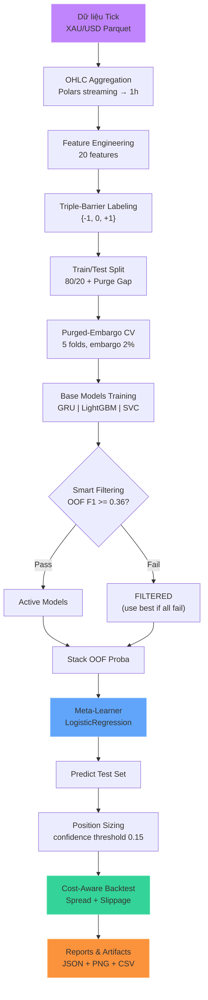
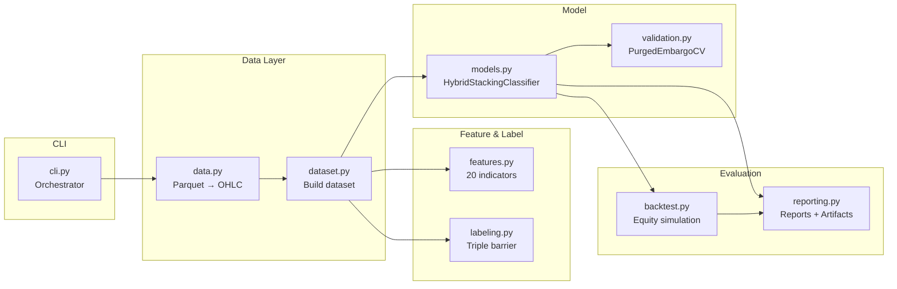

# Tổng quan kiến trúc Pipeline

## Mục đích

Pipeline dự báo tín hiệu giao dịch **XAU/USD CFD** (Vàng/Gold) từ dữ liệu tick-level. Sử dụng **hybrid stacking ensemble** kết hợp GRU (PyTorch), LightGBM, và SVC với purged-embargo cross-validation để tránh data leakage.

## Luồng tổng thể



## Kiến trúc module



## Cấu trúc thư mục

```
.
├── main.py                        # Entrypoint
├── src/
│   ├── __init__.py                # Module docstring
│   ├── cli.py                     # CLI + pipeline orchestration
│   ├── config.py                  # Hằng số: CV, threshold, costs...
│   ├── data.py                    # Đọc parquet + resampling OHLC
│   ├── dataset.py                 # Ghép features + labels + split
│   ├── features.py                # Feature engineering pipeline: 20 features
│   ├── labeling.py                # Triple-barrier labeling
│   ├── validation.py              # PurgedEmbargoTimeSeriesSplit
│   ├── models.py                  # GRU, LightGBM, SVC + Stacking
│   ├── backtest.py                # Backtest mô phỏng equity
│   └── reporting.py               # In báo cáo + lưu artifacts
├── data/XAUUSD/               # Dữ liệu parquet đầu vào
├── reports/run_*/                 # Artifacts đầu ra
├── docs/                          # Tài liệu
├── pixi.toml                      # Dependencies
└── viz.ipynb                     # Notebook phân tích
```

## Thông số cấu hình chính (`config.py`)

| Tham số | Giá trị | Ý nghĩa |
|---|---|---|
| `TIMEFRAME` | `1h` | Khung thời gian OHLC |
| `FRACTIONAL_D` | `0.4` | Bậc fractional differencing |

| `CV_SPLITS` | `5` | Số fold cross-validation |
| `EMBARGO_PCT` | `0.02` | Tỷ lệ embargo (2%) |
| `PURGE_PCT` | `0.02` | Tỷ lệ purge gap (2%) |
| `MIN_OOF_F1` | `0.36` | Ngưỡng smart filtering |
| `CONFIDENCE_THRESHOLD` | `0.15` | Ngưỡng confidence position |
| `USE_META_LABELING` | `false` | Bật meta-labeling? |
| `INITIAL_BALANCE` | `$10,000` | Vốn khởi đầu |
| `CONTRACT_SIZE` | `100` | Kích thước hợp đồng |
| `FIXED_LOTS` | `0.01` | Lot cố định cho mỗi lệnh |
| `LEVERAGE` | `20` | Đòn bẩy tài khoản |

## Kết quả gần nhất (full data 2019-2023)

| Metric | Giá trị |
|---|---|
| Dataset | 29,505 rows (80% train / 20% test) |
| 20 features, 3 classes {-1, 0, +1} | -1: 13,447 / 0: 10,830 / +1: 5,228 |
| OOF F1 (GRU) | 0.413 |
| OOF F1 (LightGBM) | 0.409 |
| OOF F1 (SVC) | 0.391 |
| Test F1 macro | 0.378 |
| Total Return | -8.84% |
| Sharpe | -1.72 |
| Max DD | -11.93% |
| Training time | ~560s |

## File tham chiếu

- `cli.py`: `run_model_pipeline()` — toàn bộ pipeline chạy tuần tự
- `config.py`: tất cả hằng số
- `main.py`: `from src.cli import main`
