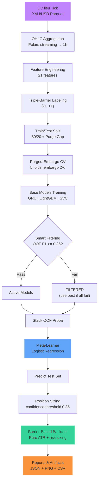
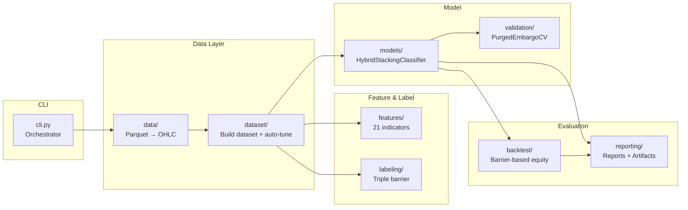

# Tổng quan kiến trúc Pipeline

## Mục đích

Pipeline dự báo tín hiệu giao dịch **XAU/USD CFD** (Vàng/Gold) từ dữ liệu tick-level. Sử dụng **hybrid stacking ensemble** kết hợp GRU (PyTorch), LightGBM, và SVC với purged-embargo cross-validation để tránh data leakage.

## Luồng tổng thể



## Kiến trúc module



## Cấu trúc thư mục

```
.
├── main.py                        # Entrypoint
├── src/
│   ├── __init__.py                # Module docstring
│   ├── cli/                       # CLI + pipeline orchestration
│   ├── config/                    # Hằng số + Pipeline configs
│   ├── data/                      # Đọc parquet + resampling OHLC
│   ├── dataset/                   # Build dataset: features + labels + split + auto-tune
│   ├── features/                  # Feature engineering: 21 features
│   ├── labeling/                  # Triple-barrier labeling (swing H/L + ATR fallback)
│   ├── models/                    # GRU, LightGBM, SVC + Stacking + Meta-label
│   ├── backtest/                  # Backtest barrier-based (pure ATR, risk sizing)
│   ├── reporting/                 # Báo cáo + artifacts (console + file)
│   └── validation/                # PurgedEmbargoTimeSeriesSplit
├── data/XAUUSD/                   # Dữ liệu parquet đầu vào
├── reports/run_*/                 # Artifacts đầu ra
├── docs/                          # Tài liệu
├── pixi.toml                      # Dependencies
└── viz.ipynb                      # Notebook phân tích
```

## Thông số cấu hình chính (`src/config/`)

| Tham số | Giá trị | Ý nghĩa |
|---|---|---|
| `TIMEFRAME` | `1h` | Khung thời gian OHLC |
| `FRACTIONAL_D` | `0.4` | Bậc fractional differencing |
| `CV_SPLITS` | `5` | Số fold cross-validation |
| `EMBARGO_PCT` | `0.02` | Tỷ lệ embargo (2%) |
| `PURGE_PCT` | `0.02` | Tỷ lệ purge gap (2%) |
| `MIN_OOF_F1` | `0.36` | Ngưỡng smart filtering |
| `CONFIDENCE_THRESHOLD` | `0.35` | Ngưỡng confidence position |
| `USE_META_LABELING` | `true` | Bật meta-labeling? |
| `META_LABEL_THRESHOLD` | `0.55` | Ngưỡng P(correct) cho long |
| `SHORT_META_LABEL_THRESHOLD` | `0.60` | Ngưỡng P(correct) cho short |
| `INITIAL_BALANCE` | `$10,000` | Vốn khởi đầu (equity curve start) |
| `CONTRACT_SIZE` | `100` | Kích thước 1 lot XAU/USD (oz) |
| `RISK_PER_TRADE` | `0.01` | Rủi ro 1% equity mỗi trade |
| `LABELING_HORIZON` | `24` | Vertical barrier (nến) |
| `TUNE_TP_RANGE` | `(0.5, 4.0, 0.25)` | Grid search range cho TP |
| `TUNE_SL_RANGE` | `(0.5, 4.0, 0.25)` | Grid search range cho SL |
| `TUNE_TARGET_BALANCE` | `0.35` | Target class balance cho auto-tune |
| `ADX_THRESHOLD` | `20.0` | Ngưỡng ADX cho regime filter |
| `TREND_FILTER_ENABLED` | `true` | Bật trend filter (89-EMA chặn SHORT trong uptrend) |
| `TREND_EMA_PERIOD` | `89` | Chu kỳ EMA cho trend filter |
| `BACKTEST_TP_ATR` | `1.5` | Risk-controlled backtest TP distance (ATR multiples) |
| `BACKTEST_SL_ATR` | `1.0` | Risk-controlled backtest SL distance (ATR multiples) |
| `MIN_POSITION_HOLD` | `24` | Minimum bars to hold a position (anti-flicker) |
## Kết quả tham khảo (run_20260601_000518, full 2019-2023)

| Metric | Giá trị |
|---|---|
| Dataset | 28,660 kept rows (23,396 train / 5,264 test, 585-row purge) |
| Features / labels | 21 features, binary labels {-1, +1} |
| OOF F1 (GRU) | 0.647 |
| OOF F1 (LightGBM) | 0.717 |
| OOF F1 (SVC) | 0.678 |
| Test F1 macro | 0.731 |
| Total Return | 22.15% |
| Sharpe | 1.49 |
| Max DD | -11.50% |
| Runtime | ~498s total (~434s model training) |

## File tham chiếu

- `src/cli/pipeline.py`: `run_pipeline()` — toàn bộ pipeline chạy tuần tự
- `src/config/constants.py` + `src/config/pipeline.py`: tất cả hằng số và dataclass config
- `src/models/main.py`: `HybridStackingSignalClassifier` — model chính
- `main.py`: `from src.cli import main`
