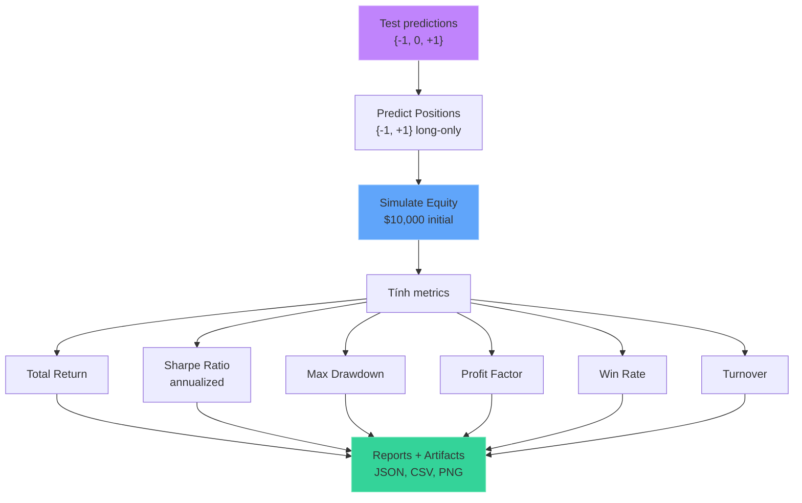
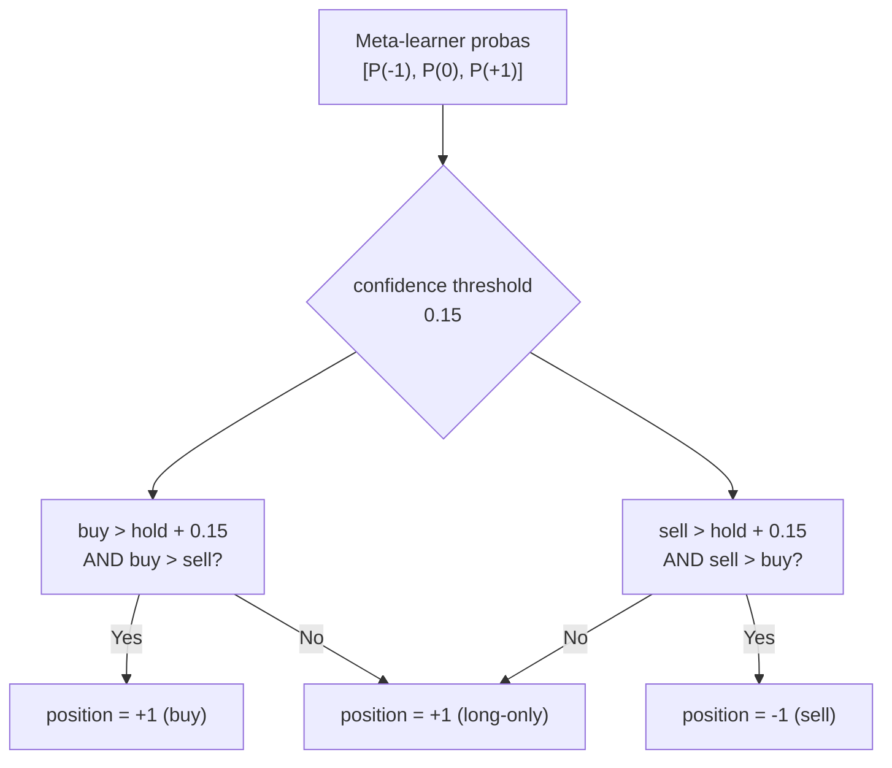
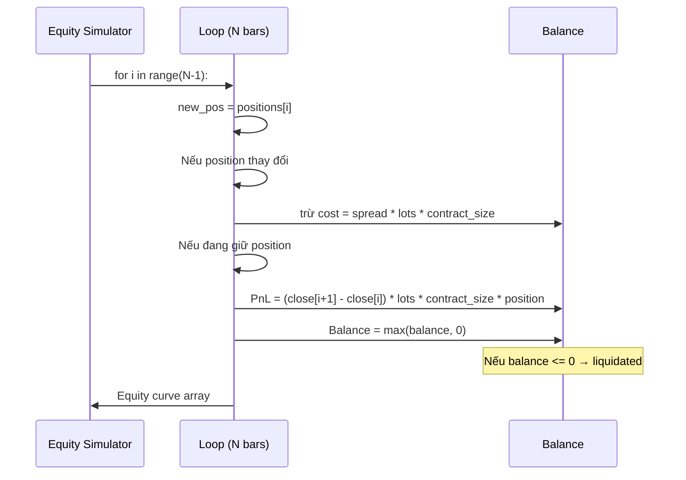
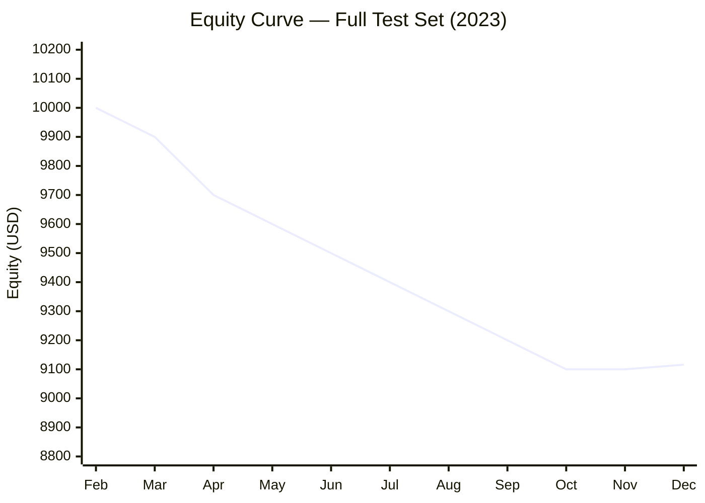

# Backtest & Evaluation

## Mục đích

Đánh giá chiến lược giao dịch dựa trên tín hiệu từ mô hình. Mô phỏng equity curve với chi phí thực tế (spread, slippage) và tính các metrics tài chính chuẩn.

## Luồng xử lý



## 1. Position Sizing (`models.py:predict_positions`)



**Long-only strategy**: mặc định luôn giữ position = +1. Chỉ chuyển sang -1 khi có tín hiệu sell đủ mạnh (confidence > threshold).

## 2. Equity Simulation (`backtest.py:simulate_equity`)



### Công thức tính

```text
# Chi phí giao dịch (mỗi lần đổi position)
cost = spread_points * |new_pos - old_pos| * active_lots * contract_size

# PnL mỗi nến (nếu có position)
pnl = (close[t+1] - close[t]) * lots * contract_size * position

# Balance
balance[t+1] = max(balance[t] - cost + pnl, 0)
```

### Thông số

| Parameter | Value | Ý nghĩa |
|---|---|---|
| `INITIAL_BALANCE` | $10,000 | Vốn khởi đầu |
| `CONTRACT_SIZE` | 100 oz | Kích thước 1 lot vàng |
| `FIXED_LOTS` | 0.03 lot | Khối lượng mỗi lệnh (= 3 oz) |
| `slippage_points` | 0.03 | Slippage mặc định |
| `spread_multiplier` | 1.0 | Hệ số nhân spread |

## 3. Metrics

### Total Return

```text
total_return = final_balance / initial_balance - 1
```

Return đơn giản, không annualized (vì test period ~10 tháng).

### Sharpe Ratio

```text
# Annualization factor: sqrt(24 * 252) = sqrt(6048)
# 24 bars/ngày (1h) * 252 ngày/năm

returns = diff(equity) / equity[:-1]
sharpe = sqrt(6048) * mean(returns) / std(returns)
```

### Max Drawdown

```text
cummax = max_accumulate(equity)
drawdown = (equity - cummax) / cummax
max_drawdown = min(drawdown)
```

### Profit Factor

```text
pnl = diff(equity)
gross_profit = sum(pnl[pnl > 0])
gross_loss = abs(sum(pnl[pnl < 0]))
profit_factor = gross_profit / gross_loss  # inf nếu gross_loss = 0
```

### Win Rate

```text
# Chỉ tính trên các nến có position thay đổi (có giao dịch thực tế)
win_rate = số nến có lãi / tổng số nến giao dịch
```

### Turnover

```text
# Số lần đổi position / tổng số nến
turnover = n_trades / N_bars
```

## Kết quả backtest gần nhất



| Metric | Giá trị | Đánh giá |
|---|---|---|
| **Total Return** | -8.84% | Âm nhẹ |
| **Sharpe** | -1.72 | Dưới 0 — không tốt |
| **Max Drawdown** | -11.93% | Drawdown vừa phải |
| **Profit Factor** | 0.915 | < 1.0 — thua lỗ |
| **Win Rate** | 44.8% | Dưới 50% |
| **Turnover** | 12.1% | Tần suất giao dịch thấp |

### Phân tích

- **Sharpe âm** và **Profit Factor < 1**: chiến lược đang thua lỗ nhẹ trên test set
- **Turnover thấp** (12.1%): model ít thay đổi position, phù hợp với long-only + threshold
- **Win rate 44.8%**: cần cải thiện chất lượng tín hiệu buy/sell
- **So sánh Classification vs Trading**: F1 macro = 0.378 (trên cả 3 classes) nhưng trading performance vẫn âm — cho thấy classification accuracy chưa đủ tốt để trading có lợi nhuận

## Artifacts đầu ra

Mỗi run tạo một thư mục `reports/run_{YYYYMMDD}_{HHMMSS}/`:

```
run_20260525_174002/
├── backtest_metrics.csv     # Metrics dạng CSV
├── equity_curve.png          # Đồ thị equity curve
├── model_oof_f1.png          # Bar chart OOF F1 từng model
├── predictions.csv           # Predictions + PnL chi tiết
└── run_data.json             # Toàn bộ metadata (config + results)
```

### run_data.json structure

```json
{
  "run_id": "run_20260525_174002",
  "timestamp": "2026-05-25T10:40:03+00:00",
  "config": { ... },
  "dataset": {
    "total_rows": 29505,
    "feature_count": 20,
    "label_distribution": {...}
  },
  "training": {
    "oof_scores": {"gru": 0.413, ...},
    "active_models": ["gru", "lightgbm", "svc"]
  },
  "evaluation": {
    "accuracy": 0.379,
    "f1_macro": 0.378,
    "confusion_matrix": {...}
  },
  "backtest": {
    "total_return": -0.088,
    "sharpe": -1.722,
    "max_drawdown": -0.119,
    "profit_factor": 0.915,
    "win_rate": 0.448,
    "turnover": 0.121
  },
  "reproducibility": {
    "python_version": "3.14.5",
    "git_commit": "5b13186...",
    "git_branch": "acc"
  }
}
```

## File tham chiếu

- `backtest.py`: `simulate_equity()`, `sharpe_ratio()`, `max_drawdown()`, `profit_factor()`, `backtest_signals()`
- `reporting.py`: `save_run_artifacts()`, `build_run_data()`, `print_backtest_report()`
- `config.py`: `INITIAL_BALANCE`, `CONTRACT_SIZE`, `FIXED_LOTS`
