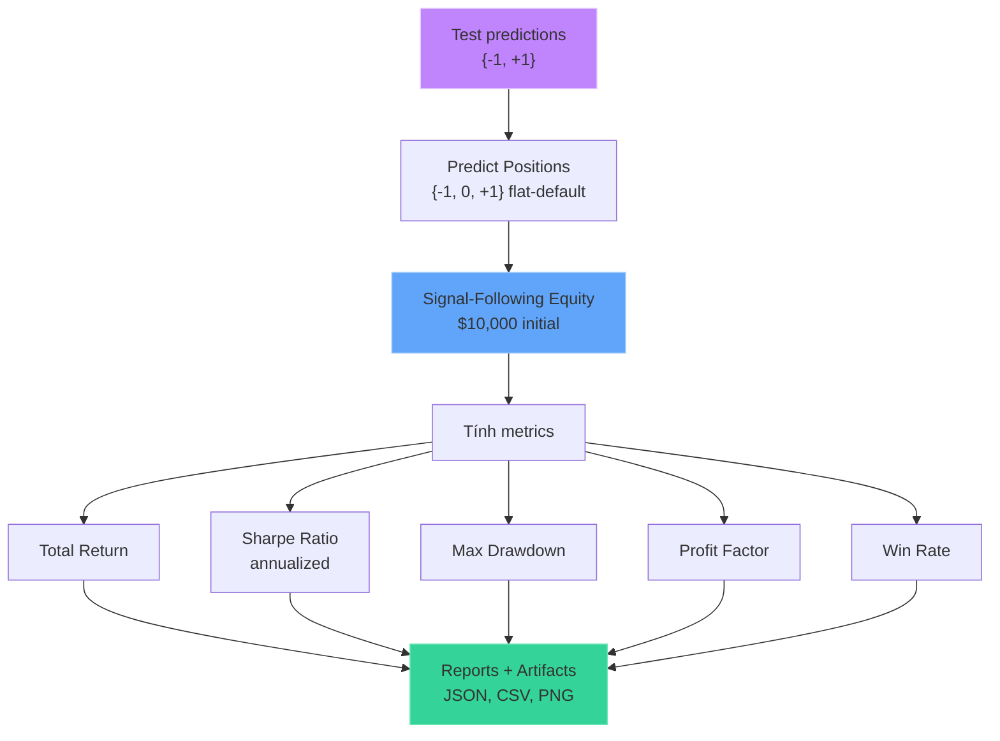
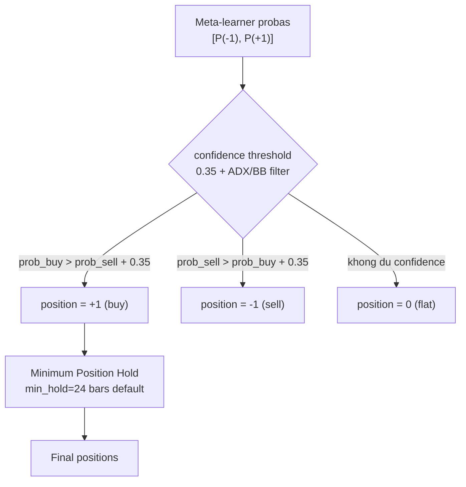

# Backtest & Evaluation

## Mục đích
Đánh giá chất lượng tín hiệu giao dịch từ mô hình. Backtest barrier-based: pure ATR-derived TP/SL levels, risk-based position sizing (1% equity per trade), hợp đồng 100 oz/lot chuẩn XAU/USD.
## Luồng xử lý



## 1. Position Sizing (`src/models/main.py:HybridStackingSignalClassifier.predict_positions`)


**Binary classification**: chi co 2 lop {buy, sell}. Mac dinh flat (position = 0) khi khong du confidence. Khi dung meta-labeling, quyet dinh buy/sell duoc loc qua meta-label model de xac nhan thesis co dung khong. Co them ADX/BB_width market regime filter de tranh sideways market, trend filter (89-EMA) de chan counter-trend SHORT trong downtrend, va asymmetric SHORT threshold (0.60) de loc tin hieu SHORT yeu. `--long-only` flag ep toan bo SHORT ve flat.
## 2. Minimum Position Hold (`src/models/main.py:enforce_minimum_position_hold`)
Positions are post-processed with `MIN_POSITION_HOLD` (default: 24 bars). Any active segment shorter than this is extended forward (zeros only — genuine reversals are preserved). This kills signal flicker — the model cannot re-enter a new trade until the minimum hold expires. See `src/cli/args.py` flag `--min-hold`.

## 3. Equity Simulation (`src/backtest/engine.py:backtest_signal_positions`)

Barrier-based backtest: pure ATR-derived TP/SL levels. Risk-based position sizing (1% equity per trade), hop dong 100 oz/lot. Khong spread/slippage, khong margin. Entry ONLY on signal CHANGE — one signal block produces at most one trade.
```
for each bar i (1..N):
   # Mark-to-market
   if direction != 0:
       pnl = direction * (close[i] - close[i-1]) * lots * CONTRACT_SIZE
       equity[i] = equity[i-1] + pnl
   else:
       equity[i] = equity[i-1]
   # Barrier breach check (pure ATR TP/SL)
   if direction != 0:
       if (direction > 0 and high[i] >= tp) or (direction < 0 and low[i] <= tp):
           exit at tp → close trade
       elif (direction > 0 and low[i] <= sl) or (direction < 0 and high[i] >= sl):
           exit at sl → close trade
       elif signal reversal (positions[i] != direction):
           exit at close[i] → close trade
   # Entry — only on signal CHANGE
   if not in_trade and positions[i] != 0 and positions[i] != positions[i-1]:
       enter at close[i]
       tp_price = close[i] ± tp_atr * atr_abs  (direction-dependent)
       sl_price = close[i] ∓ sl_atr * atr_abs
       lots = (equity * RISK_PER_TRADE) / (|entry - sl| * CONTRACT_SIZE)
       lots = clamp(lots, 0.01, 1.0)
```
Trade-level tracking: entry khi position chuyen 0→±1 hoac dao dau, exit khi ve 0 hoac dao dau → tinh win rate, profit factor, avg bars held.
### Thong so
| Parameter | Value | Y nghia |
|---|---|---|
| `INITIAL_BALANCE` | $10,000 | Von khoi dau |
| `CONTRACT_SIZE` | 100 oz | Kich thuoc 1 lot vang |
| `RISK_PER_TRADE` | 1% | Rui ro toi da tren moi giao dich |
| `BACKTEST_TP_ATR` | 1.5 (or tuned) | Risk-controlled backtest TP distance (ATR multiples) |
| `BACKTEST_SL_ATR` | 1.0 (or tuned) | Risk-controlled backtest SL distance (ATR multiples) |
| `MIN_POSITION_HOLD` | 24 (or tuned) | Minimum bars per position |
| `TREND_EMA_PERIOD` | 89 | Trend filter EMA period |
### Decoupling from Labeling Barriers
Labeling uses auto-calibrated barrier widths (`TUNE_TP_RANGE`, `TUNE_SL_RANGE`) tuned for class balance in the triple-barrier labeling horizon (24 bars). Backtest uses a separate risk-controlled profile (`BACKTEST_TP_ATR=1.5`, `BACKTEST_SL_ATR=1.0`, `MIN_POSITION_HOLD=24`) tuned to keep realized drawdown bounded while preserving positive Sharpe:
| Aspect | Labeling | Backtest |
|---|---|---|
| Purpose | Balanced classes | Realistic exits |
| Barrier type | Swing H/L + ATR fallback | Pure ATR |
| TP width | ~0.75x ATR (auto-tuned) | 1.5x ATR (or tuned) |
| SL width | ~0.50x ATR (auto-tuned) | 1.0x ATR (or tuned) |
| Horizon | 24 bars | Until signal reversal or breach |
### Backtest Hyperparameter Tuning (`src/backtest/tune.py`)
By default (`--tune` enabled), the pipeline evaluates the risk-controlled backtest profile from `src/config/constants.py` on training data after model training. The selected combo is then used for the test-set backtest. Disable with `--no-tune`.
Default grid: `TUNE_TP_RANGE_BT=(1.5, 1.5, 0.5)`, `TUNE_SL_RANGE_BT=(1.0, 1.0, 0.5)`, `TUNE_HOLD_VALUES=[24]`.
Tuning on train data provides relative comparison only; final metrics come from the test set.
## 4. Metrics
### Total Return

```text
total_return = final_equity / initial_balance - 1
```

Return đơn giản, không annualized (vì test period thay đổi).

### Sharpe Ratio

```text
# Per-bar returns, annualized: sqrt(252 * 24)
returns = diff(equity) / equity[:-1]
sharpe = sqrt(252*24) * mean(returns) / std(returns)
```

### Max Drawdown

```text
cummax = max_accumulate(equity)
drawdown = (equity - cummax) / cummax
max_drawdown = min(drawdown)
```

### Profit Factor
```text
# Từ danh sách executed trades (ưu tiên) hoặc equity diffs (fallback)
pnl = [t.pnl_usd for t in executed_trades]
gross_profit = sum(pnl[pnl > 0])
gross_loss = abs(sum(pnl[pnl < 0]))
profit_factor = gross_profit / gross_loss  # inf nếu gross_loss = 0
```

### Win Rate

```text
# Từ danh sách executed trades (ưu tiên) hoặc bar-level PnL (fallback)
wins = sum(1 for t in executed_trades if t.win)
win_rate = wins / len(executed_trades)
```

## Artifacts đầu ra

Mỗi run tạo một thư mục `reports/run_{YYYYMMDD}_{HHMMSS}/`:

```
run_20260526_051825/
├── backtest_metrics.csv     # Metrics dạng CSV
├── predictions.csv          # Predictions + positions + PnL chi tiết
├── trades.csv               # Danh sách trades (entry/exit, PnL)
├── feature_importance.csv   # LightGBM feature importance
├── run_data.json            # Toàn bộ metadata (config + results)
└── figures/                     # Plots
    ├── price_volume_spread.png
    ├── label_distribution.png
    ├── ...
    ├── equity_curve.png
    ├── equity_drawdown_positions.png
    ├── pnl_analysis.png
    ├── entry_exit_points.png
    ├── trade_frequency.png
    ├── rolling_performance.png
    └── summary_dashboard.png
```

### run_data.json structure

```json
{
  "run_id": "run_20260601_000518",
  "timestamp": "2026-05-31T17:05:18.905402+00:00",
  "config": { ... },
  "dataset": {
    "total_rows": 28660,
    "train_rows": 23396,
    "test_rows": 5264,
    "feature_count": 21,
    "features": ["volume", "spread", "return_4", "...", "close_fracdiff"],
    "data_range": {"start": "2019-01-18 04:00:00+00:00", "end": "2023-12-28 20:00:00+00:00"},
    "train_date_range": {"start": "2019-01-18 04:00:00+00:00", "end": "2023-01-03 15:00:00+00:00"},
    "test_date_range": {"start": "2023-02-08 07:00:00+00:00", "end": "2023-12-28 20:00:00+00:00"},
    "label_distribution_total": {"-1.0": 15373, "1.0": 13287},
    "label_distribution_train": {"-1.0": 12395, "1.0": 11001},
    "label_distribution_test": {"-1.0": 2978, "1.0": 2286}
  },
  "training": {
    "oof_scores": {"gru": 0.647398, "lightgbm": 0.716518, "svc": 0.677864},
    "per_class_oof_f1": {"gru": {...}, "lightgbm": {...}, "svc": {...}},
    "active_models": ["gru", "lightgbm", "svc"],
    "filtered_models": []
  },
  "evaluation": {
    "accuracy": 0.731003,
    "f1_macro": 0.730729,
    "confusion_matrix": {"labels": [-1, 1], "matrix": [[2008, 970], [446, 1840]]}
  },
  "backtest": {
    "total_return": 0.221479,
    "sharpe": 1.49131,
    "max_drawdown": -0.115049,
    "profit_factor": 1.14101,
    "trades": 92,
    "win_rate": 0.445652,
    "turnover": 0.031725
  },
  "feature_importance": {"obv": 11.83, "volatility_24": 10.33, ...},
  "trade_summary": {
    "total_trades": 92,
    "wins": 41,
    "losses": 51,
    "avg_bars_held": 8.2,
    "avg_pnl_usd": 8.46
  },
  "artifacts": {
    "files": ["backtest_metrics.csv", "predictions.csv", "trades.csv", "figures/*.png", ...],
    "figure_count": 17
  },
  "reproducibility": {
    "python_version": "3.14.5",
    "git_commit": "a93b911...",
    "git_branch": "acc",
    "git_dirty": true,
    "run_entrypoint": "notebook"
  }
}
```

## File tham chiếu

- `src/backtest/engine.py`: `backtest_signal_positions()` — barrier-based equity simulation (pure ATR barriers, signal-change-only entry, risk sizing)
- `src/backtest/metrics.py`: `compute_sharpe_ratio()`, `compute_max_drawdown()`, `compute_profit_factor()`, `compute_win_rate()`, `aggregate_backtest_metrics()`
- `src/reporting/main.py`: `publish_pipeline_results()`, `persist_run_artifacts()`, `build_run_metadata()`, `build_win_rate_metadata()`
- `src/reporting/console.py`: `print_backtest_metrics_report()`
- `src/reporting/trades.py`: `extract_trades_from_results()`, `convert_executed_trades_to_dataframe()`
- `src/config/constants.py`: `INITIAL_BALANCE`, `TREND_FILTER_ENABLED`, `TREND_EMA_PERIOD`
