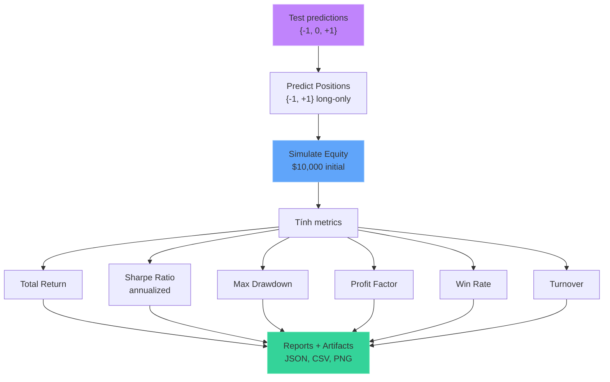
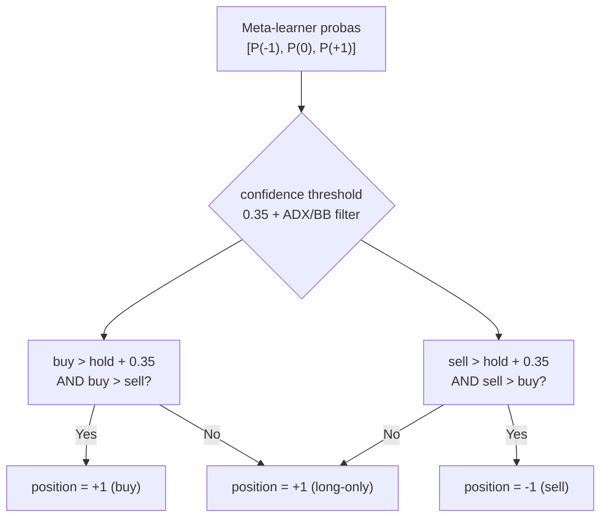
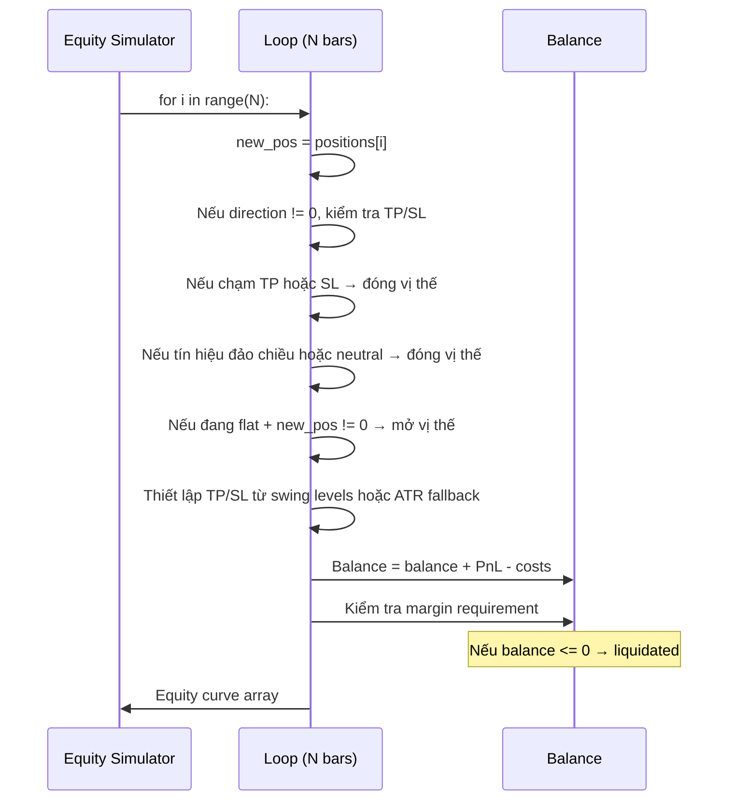
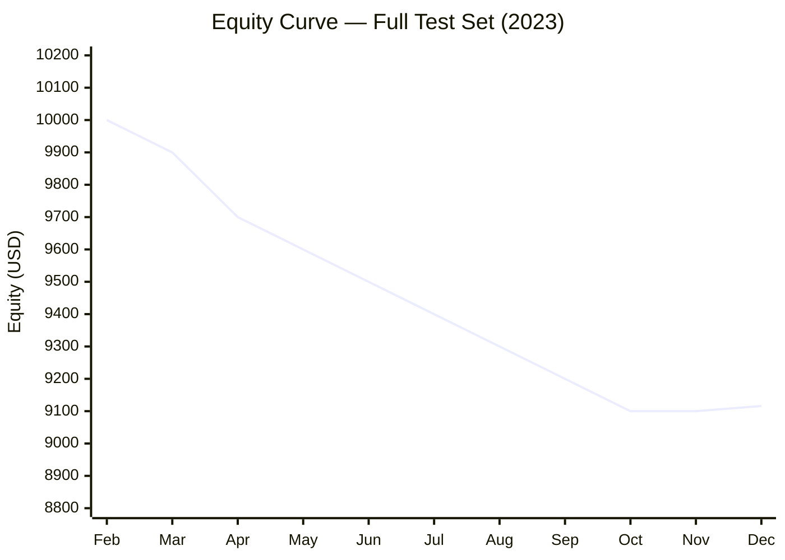

# Backtest & Evaluation

## Mục đích

Đánh giá chiến lược giao dịch dựa trên tín hiệu từ mô hình. Mô phỏng equity curve với barrier-based exit (TP/SL dựa trên swing levels + ATR fallback) và chi phí thực tế (spread, slippage, leverage).

## Luồng xử lý



## 1. Position Sizing (`src/models/main.py:HybridStackingSignalClassifier.predict_positions`)



**Long-only strategy**: mặc định luôn giữ position = +1. Chỉ chuyển sang -1 khi có tín hiệu sell đủ mạnh (confidence > threshold). Có thêm ADX/BB_width market regime filter để tránh sideways market.

## 2. Equity Simulation (`src/backtest/engine.py:simulate_equity_barrier`)

Sử dụng barrier-based backtest: mỗi vị thế được quản lý với TP/SL xác định từ swing levels (ưu tiên) hoặc ATR multiplier (fallback). Khi giá chạm TP hoặc SL, vị thế tự động đóng. Nếu chạm deadline (vertical barrier sau `LABELING_HORIZON` nến), đóng tại giá hiện tại.



### Công thức tính

```text
# Chi phí mở vị thế (mỗi lần vào lệnh)
opening_cost = 0.5 * spread_points * |new_pos| * lots * contract_size

# Chi phí đóng vị thế (khi chạm TP/SL)
exit_cost = 0.5 * spread_points * abs(direction) * lots * contract_size

# PnL mỗi vị thế
pnl = (exit_price - entry_price) * lots * contract_size * direction

# Margin check trước khi mở vị thế
notional = |new_pos| * close_price * contract_size * lots
required_margin = notional / LEVERAGE
# Chỉ mở vị thế nếu balance >= required_margin
```

### Thông số

| Parameter | Value | Ý nghĩa |
|---|---|---|
| `INITIAL_BALANCE` | $10,000 | Vốn khởi đầu |
| `CONTRACT_SIZE` | 100 oz | Kích thước 1 lot vàng |
| `FIXED_LOTS` | 0.01 lot | Khối lượng mỗi lệnh (= 1 oz) |
| `LEVERAGE` | 30 | Đòn bẩy tài khoản |
| `slippage_points` | 0.03 | Slippage mặc định |
| `spread_multiplier` | 1.0 | Hệ số nhân spread |
| `FALLBACK_TP_ATR` | 2.0 | ATR multiplier cho TP fallback |
| `FALLBACK_SL_ATR` | 2.0 | ATR multiplier cho SL fallback |
| `MAX_LOSS_ATR` | 3.0 | Max loss barrier (ATR) |
| `LABELING_HORIZON` | 24 | Vertical barrier (nến) |

## 3. Metrics

### Total Return

```text
total_return = final_balance / initial_balance - 1
```

Return đơn giản, không annualized (vì test period ~10 tháng).

### Sharpe Ratio

```text
# Annualization factor: sqrt(24 * 252) = sqrt(6048)
# 24 bars/ngày (1h) * 252 ngày/năm

returns = diff(equity) / equity[:-1]
sharpe = sqrt(6048) * mean(returns) / std(returns)
```

### Max Drawdown

```text
cummax = max_accumulate(equity)
drawdown = (equity - cummax) / cummax
max_drawdown = min(drawdown)
```

### Profit Factor

```text
pnl = diff(equity)
gross_profit = sum(pnl[pnl > 0])
gross_loss = abs(sum(pnl[pnl < 0]))
profit_factor = gross_profit / gross_loss  # inf nếu gross_loss = 0
```

### Win Rate (`src/reporting/main.py:_win_rate_meta`)

```text
# Chỉ tính trên các nến có PnL != 0
nonzero_pnl = pnl[pnl != 0]
win_rate = len(nonzero_pnl > 0) / len(nonzero_pnl)
```

### Turnover (`src/reporting/main.py:_win_rate_meta`)

```text
# Số lần đổi position / tổng số nến
turnover = n_position_changes / N_bars
```

Win Rate và Turnover được tính trong `src/reporting/main.py:_win_rate_meta()` từ prediction results.

## Kết quả backtest tham khảo (run mẫu)



| Metric | Giá trị | Đánh giá |
|---|---|---|
| **Total Return** | -8.84% | Âm nhẹ |
| **Sharpe** | -1.72 | Dưới 0 — không tốt |
| **Max Drawdown** | -11.93% | Drawdown vừa phải |
| **Profit Factor** | 0.915 | < 1.0 — thua lỗ |
| **Win Rate** | 44.8% | Dưới 50% |
| **Turnover** | 12.1% | Tần suất giao dịch thấp |

### Phân tích

- **Sharpe âm** và **Profit Factor < 1**: chiến lược đang thua lỗ nhẹ trên test set
- **Turnover thấp** (12.1%): model ít thay đổi position, phù hợp với long-only + threshold
- **Win rate 44.8%**: cần cải thiện chất lượng tín hiệu buy/sell
- **So sánh Classification vs Trading**: F1 macro = 0.378 (trên cả 3 classes) nhưng trading performance vẫn âm — cho thấy classification accuracy chưa đủ tốt để trading có lợi nhuận

## Artifacts đầu ra

Mỗi run tạo một thư mục `reports/run_{YYYYMMDD}_{HHMMSS}/`:

```
run_20260526_051825/
├── backtest_metrics.csv     # Metrics dạng CSV
├── predictions.csv          # Predictions + positions + PnL chi tiết
├── trades.csv               # Danh sách trades (entry/exit, PnL)
├── feature_importance.csv   # LightGBM feature importance
├── run_data.json            # Toàn bộ metadata (config + results)
└── figures/                     # 20 figures (3 từ reporting.py, 17 từ viz.ipynb)
    ├── price_volume_spread.png              # Giá + volume + spread
    ├── label_distribution.png              # Phân bổ label {-1, 0, +1}
    ├── triple_barrier_labels.png           # Triple barrier trực quan
    ├── fracdiff_comparison.png             # So sánh fracdiff vs raw vs d=1
    ├── technical_indicators.png            # EMA, RSI, ATR, Bollinger
    ├── feature_correlation.png             # Heatmap tương quan features
    ├── feature_distributions_by_label.png  # Distribution mỗi feature theo label
    ├── cv_splits.png                       # PurgedEmbargo CV folds
    ├── oof_scores.png                      # Bar chart OOF F1 từng model
    ├── confusion_matrix.png                # Confusion matrix test set
    ├── test_predicted_signals.png          # Tín hiệu dự đoán trên giá test
    ├── prediction_accuracy_map.png         # Accuracy theo thời gian
    ├── predicted_probabilities.png         # Heatmap P(-1)/P(0)/P(+1)
    ├── equity_curve.png                    # Đồ thị equity curve
    ├── equity_drawdown_positions.png       # Equity + drawdown + positions
    ├── pnl_analysis.png                    # PnL phân tích
    ├── entry_exit_points.png               # Entry/exit trên giá
    ├── trade_frequency.png                 # Tần suất giao dịch
    ├── rolling_performance.png             # Rolling Sharpe/return
    └── summary_dashboard.png               # Dashboard tổng hợp
```

### run_data.json structure

```json
{
  "run_id": "run_20260526_051825",
  "timestamp": "2026-05-25T22:18:31+00:00",
  "config": { ... },
  "dataset": {
    "total_rows": 29505,
    "train_rows": 23604,
    "test_rows": 5310,
    "feature_count": 25,
    "features": ["return_1", ...],
    "data_range": {"start": "...", "end": "..."},
    "train_date_range": {"start": "...", "end": "..."},
    "test_date_range": {"start": "...", "end": "..."},
    "label_distribution_total": {"-1": 13447, "0": 10830, "1": 5228},
    "label_distribution_train": {...},
    "label_distribution_test": {...},
    "split_gap_info": {
      "train_end": "2022-12-29 21:00",
      "test_start": "2023-02-06 19:00",
      "purge_rows": 591
    }
  },
  "training": {
    "oof_scores": {"gru": 0.413, "lightgbm": 0.409, "svc": 0.391},
    "per_class_oof_f1": {"gru": {...}, ...},
    "active_models": ["gru", "lightgbm", "svc"],
    "filtered_models": []
  },
  "evaluation": {
    "accuracy": 0.379,
    "f1_macro": 0.378,
    "confusion_matrix": {"labels": [-1, 0, 1], "matrix": [...]}
  },
  "backtest": {
    "total_return": -0.088,
    "sharpe": -1.722,
    "max_drawdown": -0.119,
    "profit_factor": 0.915,
    "trades": 644,
    "win_rate": 0.448,
    "turnover": 0.121
  },
  "feature_importance": {"return_1": 12.5, ...},
  "trade_summary": {
    "total_trades": 48,
    "wins": 20,
    "losses": 28,
    "avg_bars_held": 110.3,
    "avg_pnl_usd": -18.42
  },
  "artifacts": {
    "files": ["backtest_metrics.csv", "predictions.csv", ...],
    "figure_count": 3
  },
  "reproducibility": {
    "python_version": "3.14.5",
    "git_commit": "5b13186...",
    "git_branch": "acc",
    "git_dirty": false,
    "run_entrypoint": "cli"
  }
}
```

## File tham chiếu

- `src/backtest/engine.py`: `simulate_equity_barrier()`, `backtest_signal_positions()`
- `src/backtest/metrics.py`: `compute_sharpe_ratio()`, `compute_max_drawdown()`, `compute_profit_factor()`, `aggregate_backtest_metrics()`
- `src/backtest/barriers.py`: `compute_atr_from_raw_ohlc()`, `derive_barrier_levels()`, `detect_barrier_breach()`
- `src/backtest/main.py`: `backtest_signal_positions()` (orchestration wrapper)
- `src/reporting/main.py`: `publish_pipeline_results()`, `persist_run_artifacts()`, `_build_run_data()`, `_win_rate_meta()`
- `src/reporting/console.py`: `print_backtest_metrics_report()`
- `src/reporting/trades.py`: `extract_trades_from_results()`, `convert_executed_trades_to_dataframe()`
- `src/config/constants.py`: `INITIAL_BALANCE`, `CONTRACT_SIZE`, `FIXED_LOTS`, `LEVERAGE`
- `src/config/pipeline.py`: `TradingCosts` (slippage_points, spread_multiplier)
