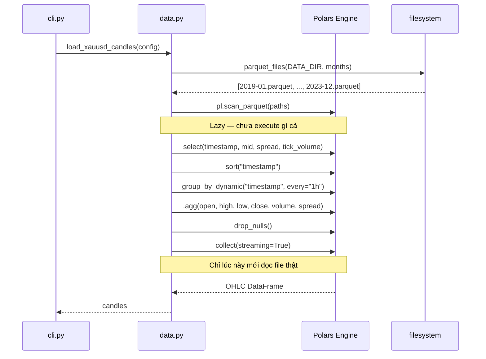

# Data Pipeline — Parquet → OHLC 1h

## Mục đích

Đọc dữ liệu tick XAU/USD từ file Parquet tháng, aggregate thành nến OHLC khung 1h bằng Polars lazy evaluation (streaming, tránh OOM với 300M+ ticks).

## Luồng xử lý

```mermaid
flowchart LR
    A["data/raw/XAUUSD/<br/>2019-01.parquet<br/>...<br/>2023-12.parquet"] --> B["parquet_files()<br/>Chọn N file đầu"]
    B --> C["pl.scan_parquet()<br/>Lazy scan"]
    C --> D["Select columns<br/>timestamp, ask, bid<br/>ask_volume, bid_volume"]
    D --> E["Tính mid price + spread<br/>mid = (ask + bid)/2<br/>spread = ask - bid<br/>tick_volume = ask_vol + bid_vol"]
    E --> F["group_by_dynamic()<br/>every='1h'"]
    F --> G["Aggregation<br/>open: first, high: max<br/>low: min, close: last<br/>volume: sum, spread: mean"]
    G --> H["drop_nulls()"]
    H --> I["collect(streaming)<br/>→ Polars DataFrame"]
    I --> J["OHLC 1h DataFrame<br/>timestamp, open, high<br/>low, close, volume, spread"]

    style A fill:#c084fc,stroke:#e9d5ff
    style C fill:#60a5fa,stroke:#93c5fd
    style G fill:#34d399,stroke:#6ee7b7
    style J fill:#fb923c,stroke:#fdba74
```



## Chi tiết các bước

### 1. Chọn file Parquet (`data.py:parquet_files`)

```python
def parquet_files(data_dir: Path, months: int | None) -> list[Path]:
    files = sorted(data_dir.glob("*.parquet"))
    return files if months is None else files[:months]
```

- `months=None` (--full): dùng **tất cả** file
- `months=N`: dùng **N file đầu** (theo thứ tự alphabet = theo thời gian)

### 2. Lazy scan + Resample (`data.py:load_xauusd_candles`)



### 3. Dữ liệu đầu vào

File Parquet chứa tick data từ Dukascopy:

| Column | Ý nghĩa |
|---|---|
| `timestamp` | Thời gian tick |
| `ask` | Giá ask |
| `bid` | Giá bid |
| `ask_volume` | Khối lượng bên ask |
| `bid_volume` | Khối lượng bên bid |

### 4. Transform

| Output | Công thức |
|---|---|
| `mid` | `(ask + bid) / 2` |
| `spread` | `ask - bid` |
| `tick_volume` | `ask_volume + bid_volume` |
| `open` | `mid.first()` trong khung 1h |
| `high` | `mid.max()` |
| `low` | `mid.min()` |
| `close` | `mid.last()` |
| `volume` | `tick_volume.sum()` |
| `spread` | `spread.mean()` |

### 5. Kết quả

- **29,505 rows** cho 5 năm dữ liệu (2019-01 → 2023-12)
- Khoảng **~600 rows/tháng** (24h x 30 ngày)
- Dữ liệu gốc ~306 triệu ticks được nén thành ~30k nến 1h

## File tham chiếu

- `data.py`: `parquet_files()`, `load_xauusd_candles()`
- `dataset.py`: `build_dataset()` gọi `load_xauusd_candles()`
- `config.py`: `DATA_DIR`, `TIMEFRAME`
