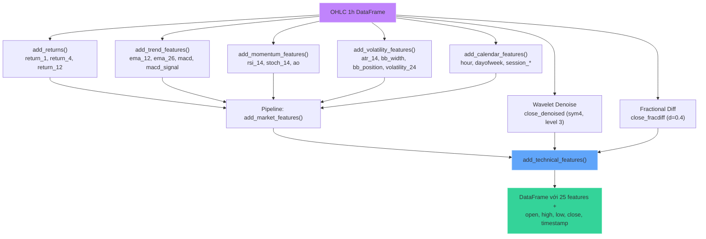
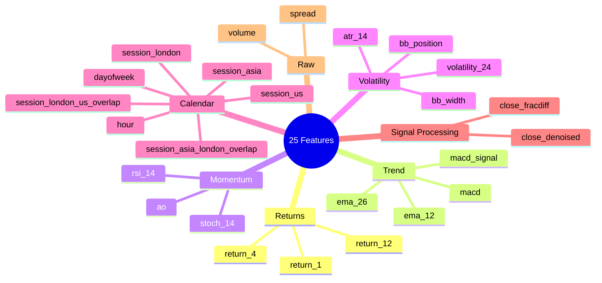
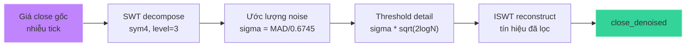
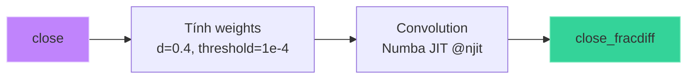
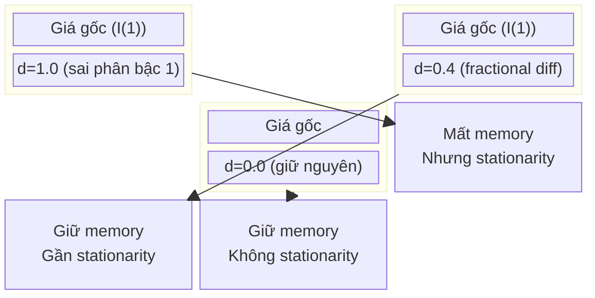

# Feature Engineering — 20 Indicators

## Mục đích

Xây dựng 20 đặc trưng từ dữ liệu nến OHLC 1h. Bao gồm: returns, trend indicators, momentum, volatility, calendar features, wavelet denoising, và fractional differencing.

## Luồng xử lý



## Danh sách 20 features



## Chi tiết từng nhóm

### 1. Returns (`features.py:add_returns`)

```python
close / close.shift(1) - 1   # return_1: lợi nhuận 1 nến
close / close.shift(4) - 1   # return_4: lợi nhuận 4 nến (~4h)
close / close.shift(12) - 1  # return_12: lợi nhuận 12 nến (~12h)
```

### 2. Trend Indicators (`features.py:add_trend_features`)

| Feature | Công thức | Mục đích |
|---|---|---|
| `ema_12` | `EMA(close, 12) / close - 1` | Xu hướng ngắn hạn |
| `ema_26` | `EMA(close, 26) / close - 1` | Xu hướng trung hạn |
| `macd` | `EMA(close, 12) - EMA(close, 26)` | MACD line |
| `macd_signal` | `EMA(macd, 9)` | MACD signal line |

### 3. Momentum Indicators (`features.py:add_momentum_features`)

| Feature | Công thức | Mục đích |
|---|---|---|
| `rsi_14` | `100 - 100 / (1 + avg_gain / avg_loss)` | Relative Strength Index (14) |
| `stoch_14` | `100 * (close - low_14) / (high_14 - low_14)` | Stochastic oscillator |
| `ao` | `SMA(median, 5) - SMA(median, 34)` | Awesome Oscillator |

### 4. Volatility Indicators (`features.py:add_volatility_features`)

| Feature | Công thức | Mục đích |
|---|---|---|
| `atr_14` | `ATR(high, low, close, 14) / close` | Average True Range (normalized) |
| `bb_width` | `4 * std(close, 20) / SMA(close, 20)` | Bollinger Band width |
| `bb_position` | `(close - BB_mid) / (2 * BB_std)` | Position trong band |
| `volatility_24` | `std(return_1, 24)` | Volatility 24 nến |

### 5. Calendar Features (`features.py:add_calendar_features`)

| Feature | Giá trị | Mục đích |
|---|---|---|
| `hour` | 0–23 | Giờ UTC |
| `dayofweek` | 0–6 | Effects cuối tuần |
| `session_asia` | 0/1 | Phiên Tokyo (00:00–07:59 UTC) |
| `session_london` | 0/1 | Phiên London (08:00–16:59 UTC) |
| `session_us` | 0/1 | Phiên New York (13:00–21:59 UTC) |
| `session_asia_london_overlap` | 0/1 | Giao nhau Tokyo–London (08:00–08:59) |
| `session_london_us_overlap` | 0/1 | Giao nhau London–New York (13:00–16:59) — thanh khoản cao nhất cho XAU/USD |

## Xử lý tín hiệu nâng cao

### Wavelet Denoising (`features.py:wavelet_denoise`)



- Dùng **Stationary Wavelet Transform (SWT)** — không downsampling (tránh mất mốc thời gian)
- Wavelet: `sym4` (Symlet 4 — cân bằng giữa độ trơn và localization)
- Level: `3` — đủ để lọc nhiễu tick mà không làm mất cấu trúc xu hướng
- Threshold: `soft` — universal threshold
- **Rolling window**: mỗi bước tính SWT trên cửa sổ `min_window=256` nến (~10 ngày)

### Fractional Differencing (`features.py:fractional_diff`)



- **Mục đích**: Giữ long memory (tính dừng yếu) của chuỗi giá mà không làm mất hoàn toàn thông tin như difference bậc 1
- `d=0.4`: fractional differencing order — cân bằng giữa stationarity và memory
- `threshold=1e-4`: cắt weights nhỏ để giới hạn độ dài convolution
- Dùng **Numba `@njit`** cho tốc độ

### So sánh: Fractional vs Integer Difference



## File tham chiếu

- `features.py`: toàn bộ feature engineering
- `dataset.py`: `add_technical_features()` được gọi từ `build_dataset()`
- `config.py`: `FRACTIONAL_D`, `WAVELET`, `WAVELET_LEVEL`
