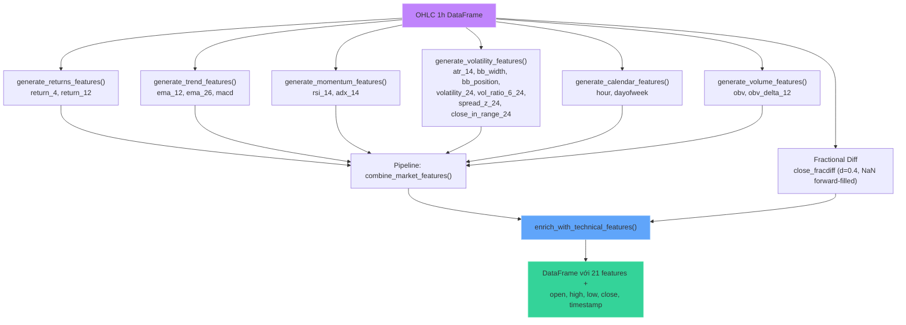
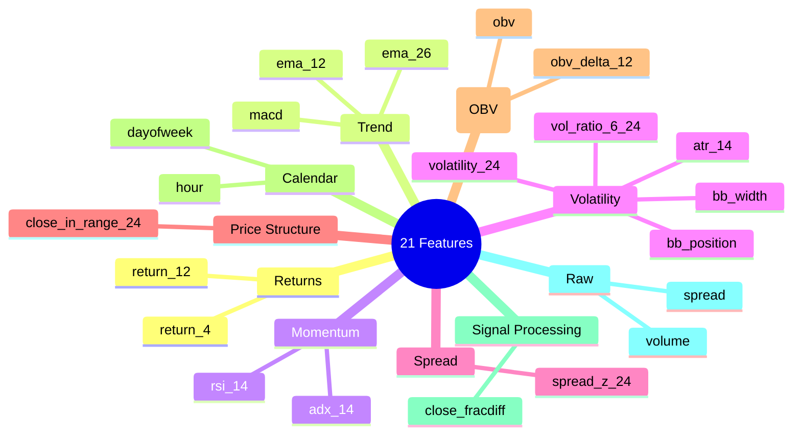
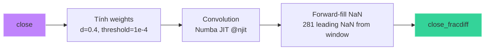
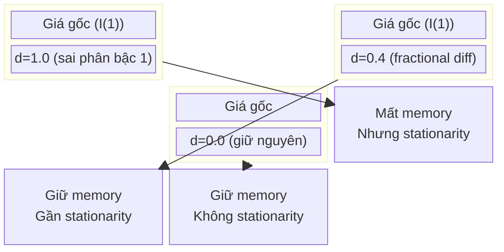

# Feature Engineering — 21 Features

## Mục đích

Xây dựng 21 đặc trưng từ dữ liệu nến OHLC 1h. Bao gồm: returns, trend indicators, momentum, volatility, volume (OBV), calendar features, signal processing (fractional differencing), và volume/spread normalization.

## Luồng xử lý



## Danh sách 21 features



## Chi tiết từng nhóm

### 1. Returns (`src/features/builders.py:generate_returns_features`)

```python
close / close.shift(4) - 1   # return_4: lợi nhuận 4 nến (~4h)
close / close.shift(12) - 1  # return_12: lợi nhuận 12 nến (~12h)
```

### 2. Trend Indicators (`src/features/builders.py:generate_trend_features`)

| Feature | Công thức | Mục đích |
|---|---|---|
| `ema_12` | `EMA(close, 12) / close - 1` | Xu hướng ngắn hạn |
| `ema_26` | `EMA(close, 26) / close - 1` | Xu hướng trung hạn |
| `macd` | `EMA(close, 12) - EMA(close, 26)` | MACD line |

### 3. Momentum Indicators (`src/features/builders.py:generate_momentum_features`)

| Feature | Công thức | Mục đích |
|---|---|---|
| `rsi_14` | `100 - 100 / (1 + avg_gain / avg_loss)` | Relative Strength Index (14) |
| `adx_14` | `ADX(high, low, close, 14)` | Average Directional Index — regime filter |

### 4. Volatility Indicators (`src/features/builders.py:generate_volatility_features`)

| Feature | Công thức | Mục đích |
|---|---|---|
| `atr_14` | `ATR(high, low, close, 14) / close` | Average True Range (normalized) |
| `bb_width` | `4 * std(close, 20) / SMA(close, 20)` | Bollinger Band width |
| `bb_position` | `(close - BB_mid) / (2 * BB_std)` | Position trong band |
| `volatility_24` | `std(return_1, 24)` | Volatility 24 nến |
| `vol_ratio_6_24` | `std(return_1, 6) / std(return_1, 24)` | Tỷ lệ vol ngắn/trung — phát hiện regime change |
| `spread_z_24` | `(spread - SMA(spread, 24)) / std(spread, 24)` | Z-score của spread — phát hiện bất thường thanh khoản |
| `close_in_range_24` | `(close - low_24) / (high_24 - low_24)` | Vị trí đóng cửa trong biên độ 24 nến |

### 5. Calendar Features (`src/features/builders.py:generate_calendar_features`)

| Feature | Giá trị | Mục đích |
|---|---|---|
| `hour` | 0–23 | Giờ UTC |
| `dayofweek` | 0–6 | Effects cuối tuần |

### 6. Volume (OBV) Features (`src/features/builders.py:generate_volume_features`)

| Feature | Công thức | Mục đích |
|---|---|---|
| `obv` | `cumsum(sign(Δclose) * volume)` | On-Balance Volume — xác nhận xu hướng |
| `obv_delta_12` | `obv - obv.shift(12)` | OBV thay đổi trong 12 nến |

## Xử lý tín hiệu

### Fractional Differencing (`src/features/fractional.py:derive_fractionally_differentiated_series`)



- **Mục đích**: Giữ long memory (tính dừng yếu) của chuỗi giá mà không làm mất hoàn toàn thông tin như difference bậc 1
- `d=0.4`: fractional differencing order — cân bằng giữa stationarity và memory
- `threshold=1e-4`: cắt weights nhỏ để giới hạn độ dài convolution (~282 weights, ~12 ngày lookback)
- NaN được forward-fill, 281 leading NaN đầu bị drop bởi `clean_labeled_frame`
- Dùng **Numba `@njit`** cho tốc độ

### So sánh: Fractional vs Integer Difference



## File tham chiếu

- `src/features/builders.py`: toàn bộ feature engineering (generate_*, combine_market_features)
- `src/features/fractional.py`: `derive_fractionally_differentiated_series()`
- `src/features/builders.py`: `enrich_with_technical_features()` — aggregating call
- `src/dataset/builder.py`: `load_featured_candles()` gọi `enrich_with_technical_features()`
- `src/config/constants.py`: `FRACTIONAL_D`
