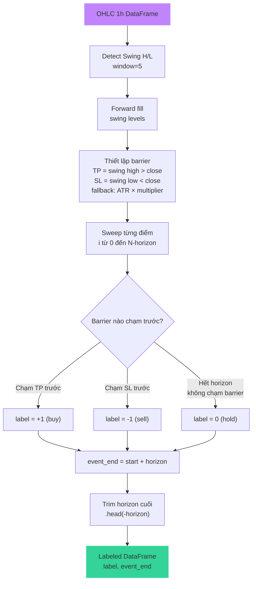
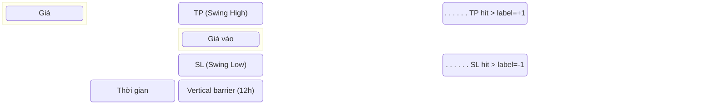

# Triple-Barrier Labeling (Swing H/L)

## Mục đích

Gán nhãn cho mỗi điểm dữ liệu với một trong ba trạng thái: **-1 (sell)**, **0 (hold)**, **+1 (buy)** dựa trên phương pháp **triple barrier** của Marcos López de Prado.

Barrier được xác định bằng **Swing High/Low** — mức resistance/support từ cấu trúc thị trường thực tế, thay vì ATR cố định. ATR chỉ dùng làm fallback khi chưa có swing level hợp lệ.

## Luồng xử lý



## Minh họa Triple Barrier



## Chi tiết thuật toán

### 1. Phát hiện Swing H/L (`labeling.py:compute_swing_levels`)

```python
swing_window = 5  # bars mỗi bên để xác nhận swing
```

- **Swing high** tại bar `i`: `high[i]` > tất cả neighbors trong `window` bars mỗi bên
- **Swing low** tại bar `i`: `low[i]` < tất cả neighbors trong `window` bars mỗi bên
- Forward fill: swing level gần nhất được kéo dài cho đến khi có swing mới
- Tất cả được compile với **`@njit(cache=True)`** qua Numba

### 2. Thiết lập Barrier (`labeling.py:first_barrier_hit_swing`)

```python
horizon = 12              # Vertical barrier: 12 nến 1h = 12h
fallback_tp_atr = 2.0     # Fallback TP = 2.0 * ATR
fallback_sl_atr = 1.5     # Fallback SL = 1.5 * ATR
swing_window = 5          # Window xác nhận swing
```

- **TP (upper barrier)**: swing high gần nhất **trên** close[start]
- **SL (lower barrier)**: swing low gần nhất **dưới** close[start]
- **Fallback**: nếu không có swing level hợp lệ → dùng ATR × multiplier
- ATR points: `atr_points = atr_14 * close`

### 3. Quét Barrier (`labeling.py:scan_barrier_arrays_swing`)

```python
for current in range(start + 1, horizon_end + 1):
    if high[current] >= upper:   # Chạm TP
        return 1, current
    if low[current] <= lower:    # Chạm SL
        return -1, current
return 0, horizon_end            # Hết giờ, không chạm barrier nào
```

### 4. Xử lý với Numba JIT

Tất cả hàm core được compile với **`@njit(cache=True)`**:

- `compute_swing_levels()` — phát hiện + forward fill swing H/L
- `first_barrier_hit_swing()` — tìm barrier đầu tiên bị chạm
- `scan_barrier_arrays_swing()` — quét toàn bộ dataset

## Ưu điểm so với ATR-only

| Khía cạnh | ATR-only (cũ) | Swing H/L (hiện tại) |
|---|---|---|
| **TP/SL source** | ATR × multiplier cố định | Cấu trúc thị trường thực |
| **Adaptive** | Không — cùng multiplier mọi lúc | Tự động — TP/SL theo swing size |
| **Market context** | Bỏ qua S/R | Tôn trọng support/resistance |
| **Fallback** | N/A | ATR × multiplier khi chưa có swing |

## Tham số

| Tham số | Giá trị | Mô tả |
|---|---|---|
| `LABELING_HORIZON` | 12 | Vertical barrier (giờ) |
| `SWING_WINDOW` | 5 | Bars mỗi bên để xác nhận swing |
| `FALLBACK_TP_ATR` | 2.0 | ATR multiplier cho TP khi không có swing |
| `FALLBACK_SL_ATR` | 1.5 | ATR multiplier cho SL khi không có swing |

## File tham chiếu

- `labeling.py`: `compute_swing_levels()`, `first_barrier_hit_swing()`, `scan_barrier_arrays_swing()`, `scan_barriers()`, `triple_barrier_labels()`
- `dataset.py`: `triple_barrier_labels()` được gọi trong `build_dataset()`
- `config.py`: `SWING_WINDOW`, `LABELING_HORIZON`, `FALLBACK_TP_ATR`, `FALLBACK_SL_ATR`, `LABELS`
