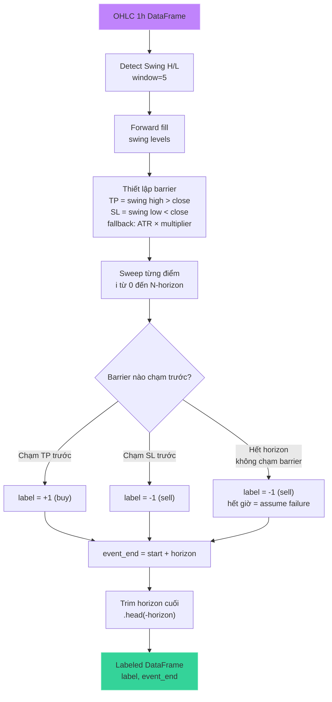

# Triple-Barrier Labeling (Swing H/L)

## Mục đích

Gán nhãn cho mỗi điểm dữ liệu với một trong hai trạng thái: **-1 (sell)**, **+1 (buy)** dựa trên phương pháp **triple barrier** của Marcos López de Prado (binary labeling — không có class HOLD).

Barrier được xác định bằng **Swing High/Low** — mức resistance/support từ cấu trúc thị trường thực tế, thay vì ATR cố định. ATR chỉ dùng làm fallback khi chưa có swing level hợp lệ.

## Luồng xử lý



## Minh họa Triple Barrier


## Chi tiết thuật toán

### 1. Phát hiện Swing H/L (`src/labeling/swing.py:detect_swing_extremes`)

```python
swing_window = 5  # bars mỗi bên để xác nhận swing
```

- **Swing high** tại bar `i`: `high[i]` > tất cả neighbors trong `window` bars mỗi bên
- **Swing low** tại bar `i`: `low[i]` < tất cả neighbors trong `window` bars mỗi bên
- Forward fill: swing level gần nhất được kéo dài cho đến khi có swing mới
- `derive_trailing_swing_levels()`: phiên bản lag-safe, chỉ dùng swing đã xác nhận trước `window+1` bars
- Tất cả được compile với **`@njit(cache=True)`** qua Numba

### 2. Thiết lập Barrier (`src/labeling/barriers.py:detect_first_barrier_breach`)

```python
horizon = 24              # Vertical barrier: 24 nến 1h = 24h
fallback_tp_atr = 2.0     # Fallback TP = 2.0 * ATR
fallback_sl_atr = 2.0     # Fallback SL = 2.0 * ATR
swing_window = 5          # Window xác nhận swing
```

- **TP (upper barrier)**: swing high gần nhất **trên** close[start]
- **SL (lower barrier)**: swing low gần nhất **dưới** close[start]
- **Fallback**: nếu không có swing level hợp lệ → dùng ATR × multiplier
- ATR points: `atr_points = atr_14 * close`

### 3. Quét Barrier (`src/labeling/barriers.py:scan_triple_barrier_arrays`)

```python
for current in range(start + 1, horizon_end + 1):
    if high[current] >= upper:   # Chạm TP
        return 1, current
    if low[current] <= lower:    # Chạm SL
        return -1, current
return 0, horizon_end            # Hết giờ → mapped thành -1 (unresolved = assume failure)
```

### 4. Xử lý với Numba JIT

Tất cả hàm core được compile với **`@njit(cache=True)`**:

- `detect_swing_extremes()` + `derive_trailing_swing_levels()` — phát hiện + forward fill swing H/L
- `detect_first_barrier_breach()` — tìm barrier đầu tiên bị chạm
- `scan_triple_barrier_arrays()` — quét toàn bộ dataset

## Ưu điểm so với ATR-only

| Khía cạnh | ATR-only (cũ) | Swing H/L (hiện tại) |
|---|---|---|
| **TP/SL source** | ATR × multiplier cố định | Cấu trúc thị trường thực |
| **Adaptive** | Không — cùng multiplier mọi lúc | Tự động — TP/SL theo swing size |
| **Market context** | Bỏ qua S/R | Tôn trọng support/resistance |
| **Fallback** | N/A | ATR × multiplier khi chưa có swing |

## Tham số

| Tham số | Giá trị | Mô tả |
|---|---|---|
| `LABELING_HORIZON` | 24 | Vertical barrier (giờ) |
| `SWING_WINDOW` | 5 | Bars mỗi bên để xác nhận swing |
| `FALLBACK_TP_ATR` | 2.0 | ATR multiplier cho TP khi không có swing |
| `FALLBACK_SL_ATR` | 2.0 | ATR multiplier cho SL khi không có swing |
| `MAX_LOSS_ATR` | 3.0 | Max loss barrier (ATR) |
| `AUTO_TUNE_BARRIERS` | true | Tự động calibrate TP/SL cho balance label |

## Auto Barrier Tuning

Pipeline hỗ trợ tự động calibrate barrier widths để tối ưu label balance ratio:

```python
# src/labeling/labels.py:search_optimal_barrier_widths
best_tp, best_sl, best_balance, dist = search_optimal_barrier_widths(
    frame, horizon=24, tp_range=(0.5, 4.0, 0.25), sl_range=(0.5, 4.0, 0.25),
    target_balance=0.50,
)
```

- Grid search trên 60% search / 20% validation split (không dùng toàn bộ train) để tránh data leakage
- Target balance = 0.50: cân bằng cho 2 class (-1 và +1)
- `src/dataset/builder.py:assemble_labeled_dataset()` gọi `auto_calibrate_barrier_widths()` nếu `AUTO_TUNE_BARRIERS=true`

## File tham chiếu

- `src/labeling/swing.py`: `detect_swing_extremes()`, `derive_trailing_swing_levels()`
- `src/labeling/barriers.py`: `detect_first_barrier_breach()`, `scan_triple_barrier_arrays()`, `scan_barriers_from_frame()`
- `src/labeling/labels.py`: `assign_triple_barrier_labels()`, `search_optimal_barrier_widths()`
- `src/labeling/main.py`: `assign_triple_barrier_labels()` (orchestration wrapper)
- `src/dataset/builder.py`: `assemble_labeled_dataset()` gọi `auto_calibrate_barrier_widths()` + `apply_labels_to_frame()`
- `src/config/constants.py`: `SWING_WINDOW`, `LABELING_HORIZON`, `FALLBACK_TP_ATR`, `FALLBACK_SL_ATR`, `MAX_LOSS_ATR`, `AUTO_TUNE_BARRIERS`, `LABELS`
