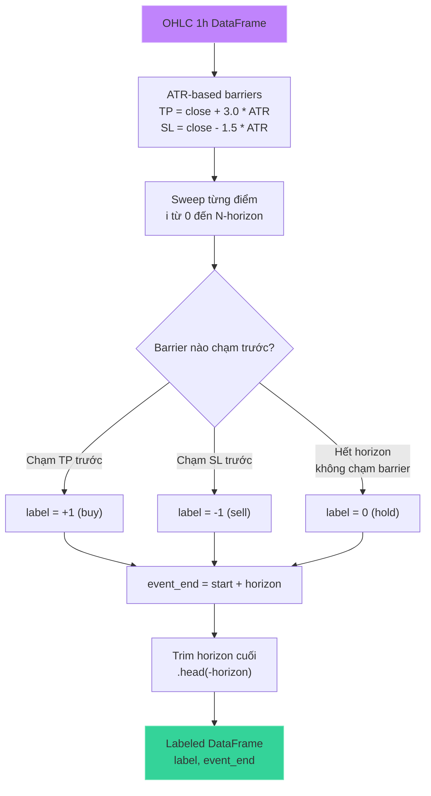
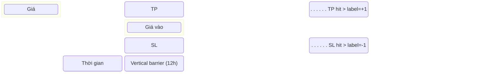
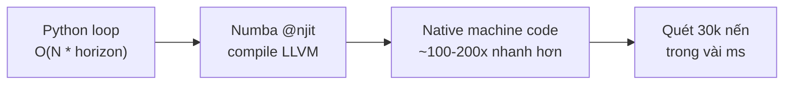

# Triple-Barrier Labeling

## Mục đích

Gán nhãn cho mỗi điểm dữ liệu với một trong ba trạng thái: **-1 (sell)**, **0 (hold)**, **+1 (buy)** dựa trên phương pháp **triple barrier** của Marcos López de Prado.

Khác với labeling đơn giản (giá tương lai > ngưỡng → buy), triple barrier xác định barrier nào được chạm trước: take-profit (TP) hay stop-loss (SL), trong một khung thời gian cố định (vertical barrier).

## Luồng xử lý



## Minh họa Triple Barrier



## Chi tiết thuật toán

### 1. Thiết lập Barrier (`labeling.py:scan_barriers`)

```python
horizon = 12           # Vertical barrier: 12 nến 1h = 12h
take_profit_atr = 3.0  # TP = 3 * ATR
stop_loss_atr = 1.5    # SL = 1.5 * ATR
```

- **ATR (Average True Range)** được tính ở feature engineering
- Barrier tính bằng ATR **points**: `upper = close[i] + TP_atr * atr_points[i]` với `atr_points = atr_14 * close`

### 2. Quét Barrier (`labeling.py:first_barrier_hit`)

```python
for current in range(start + 1, horizon_end + 1):
    if high[current] >= upper:   # Chạm TP
        return 1, current
    if low[current] <= lower:    # Chạm SL
        return -1, current
return 0, horizon_end            # Hết giờ, không chạm barrier nào
```

### 3. Xử lý với Numba JIT

Hàm `first_barrier_hit` và `scan_barrier_arrays` được compile với **`@njit(cache=True)`**:



## Kết quả Label Distribution

Trên full dataset (2019–2023):

| Label | Count | Tỷ lệ | Ý nghĩa |
|---|---|---|---|
| **-1** | 13,447 | 45.6% | Chạm stop-loss trước (dự đoán giảm) |
| **0** | 10,830 | 36.7% | Hết horizon, không chạm barrier (sideways) |
| **+1** | 5,228 | 17.7% | Chạm take-profit trước (dự đoán tăng) |

### Nhận xét

- Lớp **-1 chiếm đa số**: phản ánh đặc tính hay giảm/điều chỉnh của XAU/USD trong giai đoạn này
- Lớp **+1 ít nhất** (17.7%): phản ánh SL=1.5xATR dễ chạm hơn TP=3.0xATR
- **Imbalance** rõ rệt → model dùng `class_weight="balanced"`

## Tham số ảnh hưởng

| Tham số | Giá trị hiện tại | Effect nếu tăng | Effect nếu giảm |
|---|---|---|---|
| `horizon` | 12 (giờ) | Nhiều label 0 hơn, ít tín hiệu hơn | Nhiều label +/- hơn, nhiễu hơn |
| `take_profit_atr` | 3.0 | Khó chạm TP → ít +1 | Dễ chạm TP → nhiều +1 |
| `stop_loss_atr` | 1.5 | Khó chạm SL → ít -1 | Dễ chạm SL → nhiều -1 |

## File tham chiếu

- `labeling.py`: `first_barrier_hit()`, `scan_barrier_arrays()`, `scan_barriers()`, `triple_barrier_labels()`
- `dataset.py`: `triple_barrier_labels()` được gọi trong `build_dataset()`
- `config.py`: `LABELS = np.array([-1, 0, 1])`
