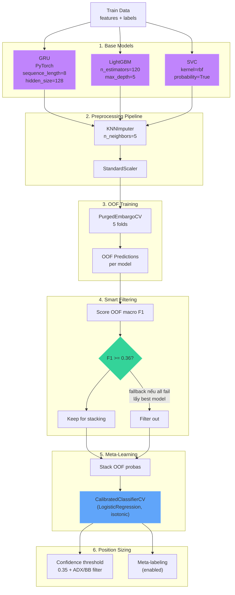
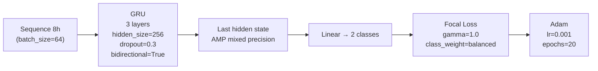
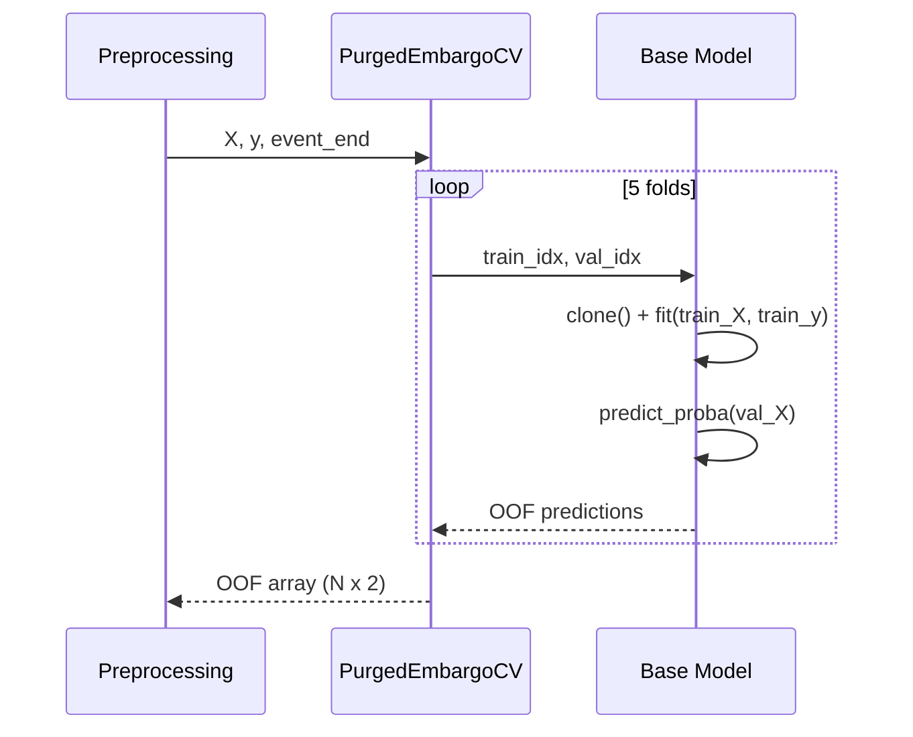
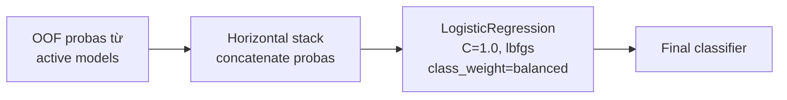
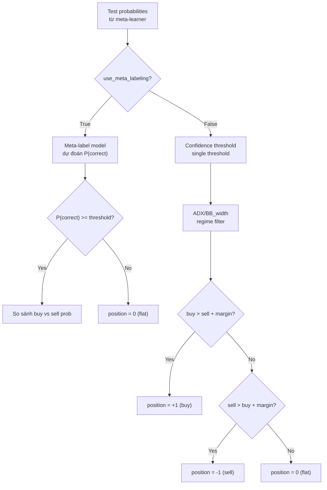
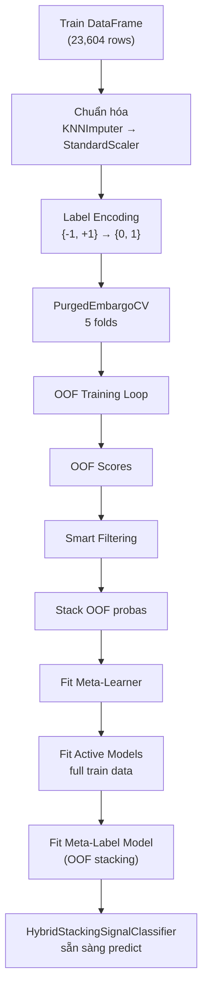

# Model Training — Hybrid Stacking Signal Classifier

## Mục đích

Huấn luyện **HybridStackingSignalClassifier** — một stacking ensemble kết hợp 3 base models khác nhau (GRU, LightGBM, SVC) với smart filtering và meta-learner.

## Kiến trúc tổng thể



## Chi tiết từng thành phần

### 1. Base Models

#### GRU (Gated Recurrent Unit) — `src/models/gru.py:GRUClassifier`



- **Input**: sequences 8 nến 1h (8 bước thời gian)
- **GRU**: 3 layers, hidden size 256, dropout 0.3, bidirectional=True, AMP mixed precision
- **Loss function**: Focal Loss — giảm trọng số các sample dễ, tập trung vào sample khó (hiệu quả với class imbalance)
- **Optimizer**: Adam, lr=0.001, epochs=20
- **Device**: auto CUDA nếu có GPU

#### LightGBM — `src/models/builders.py:create_lightgbm_classifier`

| Parameter | Value | Rationale |
|---|---|---|
| `n_estimators` | 120 | Đủ để học patterns, không overfit |
| `max_depth` | 5 | Giới hạn độ sâu |
| `learning_rate` | 0.035 | Step size nhỏ |
| `num_leaves` | 31 | Leaf-wise tree |
| `subsample` | 0.85 | Bagging fraction |
| `colsample_bytree` | 0.85 | Feature fraction |
| `class_weight` | balanced | Xử lý imbalance |
| `verbosity` | -1 | Silent |

#### SVC — `src/models/builders.py:create_svm_classifier`

| Parameter | Value |
|---|---|
| `C` | 1.0 |
| `kernel` | rbf |
| `gamma` | scale |
| `class_weight` | balanced |
| `probability` | True (cần predict_proba cho stacking) |

### 2. OOF (Out-of-Fold) Training



- Mỗi model được clone và train trên 4/5 folds, predict fold còn lại
- OOF shape: `(N_samples, 2 classes)` — probability distribution
- NaN cho những samples không được predict trong fold nào

### 3. Smart Filtering (`src/models/stacking.py:select_qualified_oof_predictions`)

```python
def select_qualified_oof_predictions(oof_by_model, scores, min_oof_f1):
    selected = {name: oof for name, oof in oof_by_model.items()
                if scores[name] >= min_oof_f1}
    if selected:
        return selected
    best_name = max(scores, key=scores.get)
    return {best_name: oof_by_model[best_name]}
```

- Tính **macro F1** cho OOF predictions của mỗi model
- Chỉ giữ model có F1 >= `MIN_OOF_F1` (0.36)
- Nếu tất cả đều dưới ngưỡng: lấy **model tốt nhất** (fallback)

### 4. Meta-Learner



- Input: stacked probability vectors từ tất cả active base models
  - VD: 3 models active → vector 6 chiều (3 models x 2 classes)
- Output: label {-1, +1}
- Meta model được train trên **OOF predictions** — không phải train predictions (tránh overfit)

### 5. Position Sizing (`src/models/main.py:HybridStackingSignalClassifier.predict_positions`)



**Market regime filter**: chỉ vào lệnh khi ADX >= 20.0 và BB_width >= 1.2× mean. Tránh giao dịch trong thị trường sideways/low vol.

**Chi tiết meta-labeling** (đang enabled):

```python
# Bước 1: Train meta-label model trên OOF
meta_X = np.column_stack([meta_probas, stacked])
meta_y = (primary_pred == y_enc).astype(int)  # 1 nếu meta model predict đúng

# Bước 2: Predict P(correct) trên test
P_correct = meta_label_model.predict_proba(test_meta_X)[:, 1]

# Bước 3: Chỉ vào lệnh nếu P(correct) >= threshold
if P_correct >= meta_label_threshold:
    # Chọn hướng dựa trên proba
```

## Pipeline huấn luyện đầy đủ



## Kết quả OOF gần nhất

| Model | OOF macro F1 | Status |
|---|---|---|
| **GRU** | 0.413 (kiến trúc cũ) | ACTIVE |
| **LightGBM** | 0.409 (kiến trúc cũ) | ACTIVE |
| **SVC** | 0.391 (kiến trúc cũ) | ACTIVE |

Cả 3 model đều vượt ngưỡng `MIN_OOF_F1=0.36`.

## Sample Weights

```python
# src/models/stacking.py:compute_class_weights
def compute_class_weights(y: np.ndarray) -> np.ndarray:
    classes, counts = np.unique(y, return_counts=True)
    weight_map = {c: len(y) / (len(classes) * cnt)
                  for c, cnt in zip(classes, counts)}
    return np.array([weight_map[v] for v in y])
```

- Mỗi class được weight nghịch đảo với tần suất
- Được truyền qua sklearn pipeline: `{stepname__sample_weight: weights}`

## File tham chiếu

- `src/models/main.py`: `HybridStackingSignalClassifier`
- `src/models/gru.py`: `GRUClassifier`, `GRUNet`, `FocalLoss`, `derive_rolling_sequences`
- `src/models/builders.py`: `assemble_base_model_registry`, `create_*_classifier`, `create_meta_classifier`, `create_meta_label_classifier`
- `src/models/stacking.py`: `select_qualified_oof_predictions`, `compute_class_weights`, `cross_validate_oof_probabilities`
- `src/validation/main.py`: `PurgedEmbargoTimeSeriesSplit`
- `src/config/constants.py`: `MIN_OOF_F1`, `CONFIDENCE_THRESHOLD`, `USE_META_LABELING`, `META_LABEL_THRESHOLD`, `SHORT_META_LABEL_THRESHOLD`, `ADX_THRESHOLD`, `BB_WIDTH_MIN_MULT`
