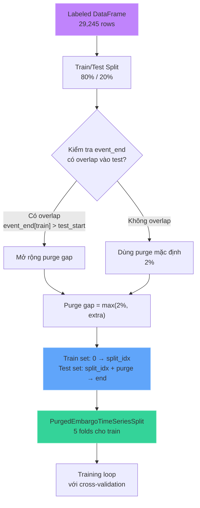
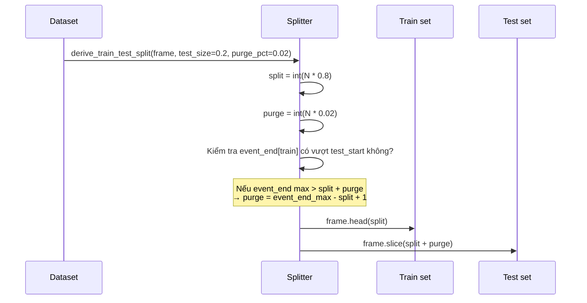
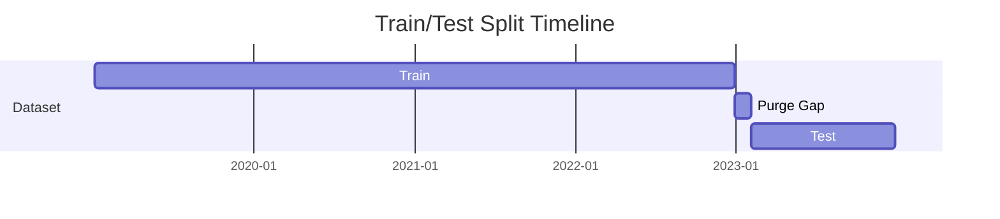
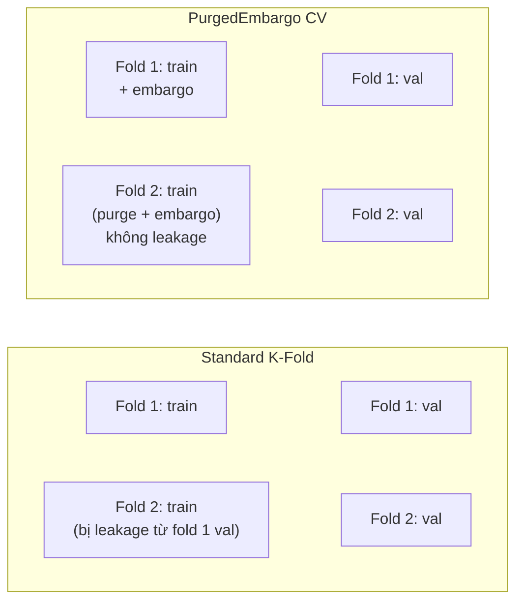
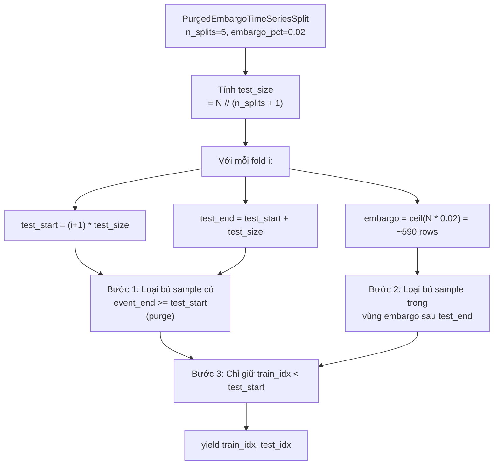
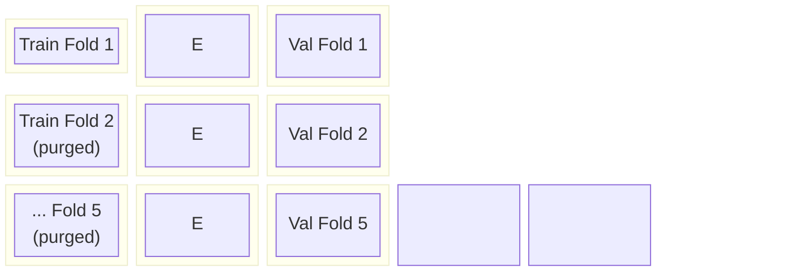

# Validation & Train/Test Split

## Mục đích

Chia dữ liệu chuỗi thời gian mà không bị **data leakage** (thông tin từ tương lai rò rỉ vào quá khứ). Sử dụng hai cơ chế:

1. **Train/Test split** với **purge gap** — ngăn test labels dùng thông tin từ tương lai
2. **PurgedEmbargoTimeSeriesSplit** cho cross-validation — ngăn leakage giữa các fold

## Luồng tổng thể



## 1. Train/Test Split với Purge Gap (`src/dataset/builder.py:derive_train_test_split`)



### Minh họa split



### Tại sao cần purge gap?

```
Train event window: |-------event_end--------|
                                Test start: |---|
```

Nếu `event_end` của một sample trong train **vượt quá** `test_start`, thì sample đó chứa thông tin giá từ tương lai (từ góc nhìn của test set). Purge gap loại bỏ vùng overlap này.

## 2. PurgedEmbargoTimeSeriesSplit (`src/validation/split.py`)

### So sánh với CV thông thường



### Cơ chế Purge + Embargo



### Minh họa 5 folds



**E** = Embargo zone (2% — loại bỏ samples ngay sau test set để tránh leakage từ tương lai)

### Chi tiết thuật toán (`src/validation/split.py:compute_embargo_clean_train_indices`)

```python
def compute_embargo_clean_train_indices(indices, event_end_pos, test_idx, embargo):
    # 1. Purge: loại samples có event_end nằm trong hoặc sau test window
    train_mask[(indices <= test_end) & (event_end_pos >= test_start)] = False

    # 2. Embargo: loại samples ngay sau test window
    train_mask[test_end + 1 : test_end + embargo + 1] = False

    return indices[train_mask]
```

## Thông số split (full dataset)

| Tham số | Giá trị |
|---|---|
| Labeled rows before purge | 29,245 |
| Kept rows (train+test) | 28,660 |
| Train rows | 23,396 (80%) |
| Test rows | 5,264 (18%) |
| Purge rows | 585 (2%) |
| Train end | 2023-01-03 15:00 UTC |
| Test start | 2023-02-08 07:00 UTC |
| Purge gap | ~35.7 ngày |
| CV folds | 5 |
| Embargo per fold | ~468 rows (2% of train) |

## Tại sao không dùng Shuffle?

Dữ liệu chuỗi thời gian tài chính có:
- **Autocorrelation**: giá hôm nay correlated với giá hôm qua
- **Look-ahead bias**: nếu shuffle, mô hình học được patterns từ tương lai
- PurgedEmbargo giải quyết cả hai vấn đề trên

## File tham chiếu

- `src/validation/split.py`: `PurgedEmbargoTimeSeriesSplit`
- `src/validation/split.py`: `compute_embargo_clean_train_indices()`
- `src/dataset/builder.py`: `derive_train_test_split()`, `compute_purge_gap()`
 - `src/config/constants.py`: `CV_SPLITS`, `EMBARGO_PCT`, `PURGE_PCT`, `TEST_SIZE`
