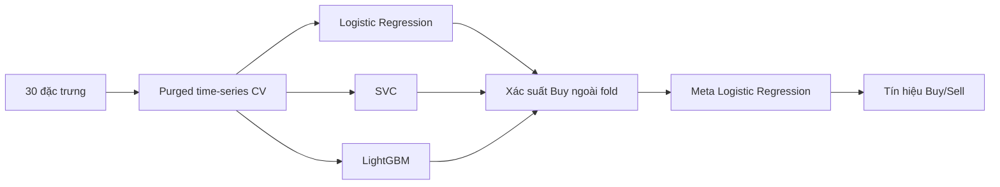

<div class="tk-kicker" flex items-center gap-2>
  <div i-carbon:document-attachment /> Báo cáo đồ án · 63CNTT.VA
</div>

# Ứng dụng mô hình Hybrid Stacking dự báo tín hiệu giao dịch CFD Vàng

<p class="subtitle" max-w-720px text-base mt-2 text-slate-300>
  Xây dựng quy trình học máy từ dữ liệu tick XAUUSD đến tín hiệu Buy/Sell, kết hợp đánh giá phân loại và kiểm thử lịch sử; kết quả được trình bày như một baseline nghiên cứu, không phải khuyến nghị giao dịch.
</p>

<div class="tk-cover-meta">
  <div><span>Sinh viên</span><strong>Nguyễn Đức Hiếu</strong></div>
  <div><span>Mã sinh viên</span><strong>2151061192</strong></div>
  <div><span>Lớp</span><strong>63CNTT.VA</strong></div>
  <div><span>GVHD</span><strong>Hoàng Quốc Dũng</strong></div>
  <div><span>Liên hệ</span><strong>hieuteo03@gmail.com</strong></div>
  <div><span>Số điện thoại</span><strong>0929033808</strong></div>
</div>

<!--
Mở đầu: giới thiệu tên đề tài, định vị đây là bài toán dự báo tín hiệu giao dịch CFD Vàng - không cam kết lợi nhuận.
-->

---
layout: section
class: section
glowSeed: 1
glow: top-right
---

<div class="tk-section-num">
  <div i-carbon:database /> SECTION 01
</div>

# Dữ liệu & Quy trình

<p class="tk-section-sub">Từ dữ liệu tick XAUUSD thô đến tập huấn luyện có nhãn, phục vụ quá trình huấn luyện và đánh giá mô hình.</p>

---
class: py-10
glowSeed: 7
---

<div class="tk-kicker cyan"><div i-carbon:target-prediction /> Mục tiêu</div>

# Mục tiêu nghiên cứu

<p>Mục tiêu của đồ án là dự báo tín hiệu <strong>Buy</strong> hoặc <strong>Sell</strong> cho CFD Vàng bằng mô hình <strong>Hybrid Stacking</strong>. Nhãn được xây dựng từ lợi suất tương lai sau 4 giờ.</p>

<div class="tk-pill-row mt-8">
  <span class="tk-pill buy"><div i-carbon:arrow-up /> Tín hiệu Buy · +1</span>
  <span class="tk-pill sell"><div i-carbon:arrow-down /> Tín hiệu Sell · -1</span>
  <span class="tk-pill gold"><div i-carbon:time /> Dự báo sau 4 giờ</span>
  <span class="tk-pill"><div i-carbon:currency /> CFD XAUUSD</span>
</div>

<div class="tk-formula mt-8">
  <span class="text-xs text-slate-400 uppercase tracking-widest">Quy tắc nhãn</span>
  <code class="block mt-2 text-sm">signal[t] = sign( close[t + 4h] − close[t] )</code>
</div>

---
class: py-10
glowSeed: 19
---

<div class="tk-kicker"><div i-carbon:warning-alt /> Thách thức</div>

# Vì sao bài toán khó?

<div class="tk-grid-3 mt-6">
  <div class="tk-card accent-sell">
    <div class="tk-card-head"><div i-carbon:noise /> Dữ liệu thị trường nhiễu</div>
    <div class="tk-card-body">
      <p>Biến động ngắn hạn của XAUUSD chịu ảnh hưởng mạnh từ tin tức địa chính trị, thanh khoản và spread.</p>
    </div>
  </div>
  <div class="tk-card accent-gold">
    <div class="tk-card-head"><div i-carbon:warning /> Dễ rò rỉ dữ liệu</div>
    <div class="tk-card-body">
      <p>Nhãn sử dụng giá tương lai, vì vậy quá trình chia dữ liệu và cross-validation cần khoảng cách an toàn.</p>
    </div>
  </div>
  <div class="tk-card accent-buy">
    <div class="tk-card-head"><div i-carbon:scale /> Độ lệch tín hiệu nhỏ</div>
    <div class="tk-card-body">
      <p>Chênh lệch nhỏ trong chỉ số phân loại có thể không còn ý nghĩa khi đưa chi phí giao dịch vào backtest.</p>
    </div>
  </div>
</div>

<div class="tk-formula mt-7">
  <span class="text-xs text-slate-400 uppercase tracking-widest">Công thức tạo tín hiệu</span>
  <div class="mt-2 text-sm">tín hiệu[t] = dấu của lợi suất từ <strong>close[t]</strong> đến <strong>close[t + 4 giờ]</strong></div>
</div>

---
class: py-10
glowSeed: 33
---

<div class="tk-kicker cyan"><div i-carbon:data-base /> Thông tin dữ liệu</div>

# Thông tin dữ liệu

<div class="tk-grid-4 mt-5">
  <div class="tk-metric"><span class="value">2019–2023</span><span class="label">Khoảng dữ liệu</span></div>
  <div class="tk-metric cyan"><span class="value">23.479</span><span class="label">Mẫu có nhãn</span></div>
  <div class="tk-metric gold"><span class="value">18.909</span><span class="label">Mẫu huấn luyện</span></div>
  <div class="tk-metric buy"><span class="value">4.570</span><span class="label">Mẫu kiểm thử</span></div>
</div>

<div class="tk-two-pane mt-7">
  <div>
    <h2><div i-carbon:input inline-block mr-2 />Dữ liệu đầu vào</h2>
    <ul class="tk-tight-list">
      <li><strong>Ask/Bid</strong> — giá mua và bán từ dữ liệu tick</li>
      <li><strong>Spread</strong> — chi phí chênh lệch ask − bid</li>
      <li><strong>Volume</strong> — tổng khối lượng ask và bid</li>
      <li><strong>Tick count</strong> — số tick trong mỗi nến 1 giờ</li>
    </ul>
  </div>
  <div class="tk-card accent-cyan">
    <div class="tk-card-head"><div i-carbon:cube-view /> Kết quả tiền xử lý</div>
    <div class="tk-card-body">
      <p>Dữ liệu tick được gom thành nến OHLC 1 giờ, sau đó sinh đặc trưng kỹ thuật và nhãn Buy/Sell. Toàn bộ quy trình được triển khai bằng Polars và NumPy.</p>
    </div>
  </div>
</div>

---
class: py-10
glowSeed: 51
---

<div class="tk-kicker"><div i-carbon:data-vis-1 /> Xử lý dữ liệu</div>

# Gom tick thành nến 1 giờ

<div class="tk-grid-3 mt-6">
  <div class="tk-card accent-cyan">
    <div class="tk-card-head"><div i-carbon:calculate /> Giá đại diện</div>
    <div class="tk-card-body">
      <p>Dùng giá giữa <code>(ask + bid) / 2</code> để giảm lệch giữa hai phía báo giá.</p>
    </div>
  </div>
  <div class="tk-card accent-gold">
    <div class="tk-card-head"><div i-carbon:time /> Gom theo 1 giờ</div>
    <div class="tk-card-body">
      <p>Tạo nến OHLC theo khung 1 giờ, thống nhất với mốc dự báo sau 4 giờ.</p>
    </div>
  </div>
  <div class="tk-card accent-buy">
    <div class="tk-card-head"><div i-carbon:chart-line-data /> Biến vận hành</div>
    <div class="tk-card-body">
      <p>Giữ lại spread, volume và tick_count để phản ánh thanh khoản và chi phí giao dịch.</p>
    </div>
  </div>
</div>

<div class="tk-formula mt-7">
  <span class="text-xs text-slate-400 uppercase tracking-widest">Điểm cần trình bày</span>
  <div class="mt-2 text-sm">Đây là bước tiền xử lý bắt buộc; phần mã chi tiết không cần đưa lên slide vì chủ yếu là thao tác gom nhóm dữ liệu.</div>
</div>

---
class: py-10
glowSeed: 64
---

<div class="tk-kicker cyan"><div i-carbon:flow /> Quy trình</div>

# Quy trình tổng quan

<div class="tk-figure-slide mt-4">
  <div class="tk-figure tk-figure-full">
    
  </div>

  <div class="tk-image-note">
    <div i-carbon:arrow-right inline-block mr-1 />tick → nến 1H → đặc trưng → nhãn → mô hình → chỉ số đánh giá và backtest
  </div>
</div>

---
class: py-10
glowSeed: 73
---

<div class="tk-kicker"><div i-carbon:branch /> Codebase</div>

# Luồng xử lý trong mã nguồn

<div class="tk-flow mt-7">
  <div class="tk-step">
    <span class="tk-step-no">1</span>
    <h3>Tải dữ liệu</h3>
    <p>Đọc dữ liệu parquet XAUUSD, gom tick thành nến 1H.</p>
  </div>
  <div class="tk-step">
    <span class="tk-step-no">2</span>
    <h3>Tạo đặc trưng</h3>
    <p>30 biến mô tả xu hướng, dao động, thanh khoản và thời gian.</p>
  </div>
  <div class="tk-step">
    <span class="tk-step-no">3</span>
    <h3>Gán nhãn</h3>
    <p>Nhãn Buy/Sell theo lợi suất tương lai 4 giờ.</p>
  </div>
  <div class="tk-step">
    <span class="tk-step-no">4</span>
    <h3>Huấn luyện</h3>
    <p>Hybrid Stacking với purged time-series CV.</p>
  </div>
  <div class="tk-step">
    <span class="tk-step-no">5</span>
    <h3>Báo cáo</h3>
    <p>Lưu bảng, hình, chỉ số và thông tin tái lập.</p>
  </div>
</div>

<div class="tk-grid-3 mt-7">
  <div class="tk-card accent-cyan">
    <div class="tk-card-head"><div i-simple-icons:polars /> src/data</div>
    <div class="tk-card-body"><p>Tải dữ liệu, gán nhãn, chia tập huấn luyện/kiểm thử.</p></div>
  </div>
  <div class="tk-card accent-gold">
    <div class="tk-card-head"><div i-devicon:scikitlearn /> src/models</div>
    <div class="tk-card-body"><p>Mô hình cơ sở, stacking và cross-validation.</p></div>
  </div>
  <div class="tk-card accent-buy">
    <div class="tk-card-head"><div i-carbon:report /> src/reporting</div>
    <div class="tk-card-body"><p>Xuất hình, bảng và siêu dữ liệu cho báo cáo.</p></div>
  </div>
</div>

---
class: py-10
glowSeed: 88
---

<div class="tk-kicker cyan"><div i-carbon:tag-edit /> Gán nhãn</div>

# Gán nhãn tín hiệu

<div class="tk-two-pane mt-5">
  <div>
    <div class="tk-metric buy"><span class="value">+1</span><span class="label">Tín hiệu Buy</span></div>
    <div class="tk-metric sell mt-4"><span class="value">−1</span><span class="label">Tín hiệu Sell</span></div>
    <div class="tk-card mt-4">
      <div class="tk-card-head"><div i-carbon:filter /> Mẫu trung tính</div>
      <div class="tk-card-body"><p>Bị loại khi |future_return| không vượt ngưỡng 0,05%.</p></div>
    </div>
  </div>
  <div class="tk-formula-stack">
    <div class="tk-formula"><span class="text-xs text-slate-400 uppercase tracking-widest">Quy tắc Buy</span><code class="block mt-2 text-sm">future_return &gt; 0,0005</code></div>
    <div class="tk-formula"><span class="text-xs text-slate-400 uppercase tracking-widest">Quy tắc Sell</span><code class="block mt-2 text-sm">future_return &lt; −0,0005</code></div>
    <div class="tk-formula"><span class="text-xs text-slate-400 uppercase tracking-widest">Bỏ mẫu</span><code class="block mt-2 text-sm">|future_return| ≤ 0,0005</code></div>
  </div>
</div>

---
class: py-10
glowSeed: 99
---

<div class="tk-kicker"><div i-carbon:code /> Mã nguồn rút gọn</div>

# Tạo nhãn theo mốc dự báo cố định

<div class="tk-code-grid mt-5">
  <div class="tk-card">
    <div class="tk-card-head"><div i-carbon:help /> Vai trò trong quy trình</div>
    <div class="tk-card-body">
      <p>Phần này mô tả cách tạo nhãn Buy/Sell và loại bỏ các mẫu có biến động chưa đủ rõ ràng.</p>
    </div>
  </div>

```python
close = frame["close"].to_numpy()
future_return = compute_future_returns(close, horizon)

valid = np.isfinite(future_return)
valid &= np.abs(future_return) > threshold

labels = np.where(future_return > threshold, BUY_LABEL, SELL_LABEL)
event_start = np.arange(len(frame), dtype=np.int64)
event_end = np.minimum(event_start + horizon, len(frame) - 1)
```

</div>

---
class: py-10
glowSeed: 110
---

<div class="tk-kicker cyan"><div i-carbon:time-plot /> Chia dữ liệu</div>

# Chia dữ liệu theo thời gian

<div class="tk-figure tk-figure-full small">
  
</div>

<div class="tk-stat">
  <div><span>Huấn luyện</span><strong>2019-01 → trước kiểm thử</strong></div>
  <div><span>Khoảng purge</span><strong>4 nến</strong></div>
  <div><span>Kiểm thử</span><strong>sau purge → 2023-12</strong></div>
</div>

---
layout: section
class: section
glowSeed: 2
glow: top-left
---

<div class="tk-section-num">
  <div i-carbon:chart-tree /> SECTION 02
</div>

# Mô hình Hybrid Stacking

<p class="tk-section-sub">30 đặc trưng → ba mô hình cơ sở → xác suất ngoài fold → mô hình meta tổng hợp tín hiệu Buy/Sell.</p>

---
class: py-10
glowSeed: 121
---

<div class="tk-kicker"><div i-carbon:grid /> Đặc trưng</div>

# 30 đặc trưng đầu vào

<div class="tk-grid-3 mt-5">
  <div class="tk-card accent-cyan">
    <div class="tk-card-head"><div i-carbon:percentage /> Lợi suất</div>
    <div class="tk-card-body"><p><code>return_4</code>, <code>return_12</code></p></div>
  </div>
  <div class="tk-card accent-cyan">
    <div class="tk-card-head"><div i-carbon:trend-up /> Xu hướng</div>
    <div class="tk-card-body"><p><code>ema_12</code>, <code>ema_26</code>, <code>macd_pct</code></p></div>
  </div>
  <div class="tk-card accent-cyan">
    <div class="tk-card-head"><div i-carbon:rocket /> Động lượng</div>
    <div class="tk-card-body"><p><code>rsi_14</code>, <code>adx_14</code></p></div>
  </div>
  <div class="tk-card accent-gold">
    <div class="tk-card-head"><div i-carbon:activity /> Biến động</div>
    <div class="tk-card-body"><p><code>atr_14</code>, <code>bb_width</code>, <code>volatility_24</code></p></div>
  </div>
  <div class="tk-card accent-gold">
    <div class="tk-card-head"><div i-carbon:layers /> Vi cấu trúc</div>
    <div class="tk-card-body"><p><code>spread_pct</code>, <code>tick_count_z_24</code></p></div>
  </div>
  <div class="tk-card accent-buy">
    <div class="tk-card-head"><div i-carbon:time /> Thời gian</div>
    <div class="tk-card-body"><p><code>hour_sin/cos</code>, <code>dow_sin/cos</code></p></div>
  </div>
</div>

<div class="tk-pill-row mt-7">
  <span class="tk-pill"><div i-carbon:chart-line /> Chỉ báo kỹ thuật</span>
  <span class="tk-pill"><div i-carbon:cube /> Cấu trúc nến</span>
  <span class="tk-pill"><div i-carbon:data-vis-2 /> Thanh khoản</span>
  <span class="tk-pill"><div i-carbon:time /> Chu kỳ thời gian</span>
</div>

---
class: py-10
glowSeed: 134
---

<div class="tk-kicker cyan"><div i-carbon:flow-chart /> Stacking</div>

# Mô hình Hybrid Stacking

<div class="tk-mermaid mt-3">



</div>

<div class="tk-grid-3 mt-5">
  <div class="tk-card accent-cyan">
    <div class="tk-card-head"><div i-carbon:cube /> Mô hình cơ sở</div>
    <div class="tk-card-body"><p>Ba mô hình học các góc nhìn khác nhau trên cùng bộ đặc trưng.</p></div>
  </div>
  <div class="tk-card accent-gold">
    <div class="tk-card-head"><div i-carbon:probability /> Xác suất ngoài fold</div>
    <div class="tk-card-body"><p>Dùng xác suất ngoài fold làm đầu vào cho mô hình meta, nhằm giảm rủi ro rò rỉ dữ liệu.</p></div>
  </div>
  <div class="tk-card accent-buy">
    <div class="tk-card-head"><div i-carbon:layers /> Mô hình meta</div>
    <div class="tk-card-body"><p>Logistic Regression tổng hợp xác suất dự báo từ các mô hình cơ sở.</p></div>
  </div>
</div>

---
class: py-10
glowSeed: 145
---

<div class="tk-kicker"><div i-carbon:code /> Mã nguồn rút gọn</div>

# Huấn luyện Hybrid Stacking

<div class="tk-code-grid mt-5">
  <div class="tk-card">
    <div class="tk-card-head"><div i-carbon:help /> Vai trò trong quy trình</div>
    <div class="tk-card-body">
      <p>Đây là bước trọng tâm của đề tài: tạo xác suất ngoài fold cho stacking, sau đó huấn luyện lại các mô hình cơ sở trên toàn bộ tập huấn luyện.</p>
    </div>
  </div>

```python
oof_by_model, scores = self.compute_base_model_oof_scores(
    X_pdf, y_np, y_enc, event_start, event_end
)

selected_oof = dict(oof_by_model)
self.train_meta_classifier(selected_oof, y_enc)
self.train_active_base_models(selected_oof, X_pdf, y_enc)
self.oof_scores_ = scores
```

</div>

---
class: py-10
glowSeed: 156
---

<div class="tk-kicker cyan"><div i-carbon:chart-bar /> Đánh giá OOF</div>

# Điểm OOF của các mô hình cơ sở

<div class="tk-two-pane mt-4">
  <div class="tk-grid-2">
    <div class="tk-metric"><span class="value">0,506</span><span class="label">Logistic Regression</span></div>
    <div class="tk-metric"><span class="value">0,497</span><span class="label">SVC</span></div>
    <div class="tk-metric warn"><span class="value">0,492</span><span class="label">LightGBM</span></div>
    <div class="tk-card">
      <div class="tk-card-head"><div i-carbon:information /> Diễn giải</div>
      <div class="tk-card-body"><p>ROC AUC được tính ngoài fold trên tập train. Cả ba mô hình cơ sở đều xấp xỉ 0,5, cho thấy tín hiệu dự báo ngắn hạn còn yếu.</p></div>
    </div>
  </div>
  <div class="tk-figure-card h-90"></div>
</div>

---
class: py-10
glowSeed: 167
---

<div class="tk-kicker"><div i-carbon:compare /> Baseline</div>

# So sánh với các mô hình baseline

<div class="tk-figure-slide mt-4">
  <div class="tk-figure tk-figure-full">
    
  </div>

  <div class="tk-image-note">
    <div i-carbon:idea inline-block mr-1 />Hybrid Stacking cân bằng F1 macro; LR và LightGBM nhỉnh hơn về accuracy/ROC AUC.
  </div>
</div>

---
layout: section
class: section
glowSeed: 3
glow: center
---

<div class="tk-section-num">
  <div i-carbon:analytics /> SECTION 03
</div>

# Kết quả thực nghiệm

<p class="tk-section-sub">Đánh giá phân loại, ma trận nhầm lẫn, đặc trưng quan trọng và kiểm thử lịch sử trên 4.570 mẫu kiểm thử.</p>

---
class: py-10
glowSeed: 178
---

<div class="tk-kicker cyan"><div i-carbon:dashboard /> Phân loại</div>

# Kết quả phân loại

<div class="tk-grid-4 mt-5">
  <div class="tk-metric"><span class="value">51,73%</span><span class="label">Accuracy</span></div>
  <div class="tk-metric cyan"><span class="value">0,5173</span><span class="label">F1 macro</span></div>
  <div class="tk-metric gold"><span class="value">0,5163</span><span class="label">ROC AUC</span></div>
  <div class="tk-metric buy"><span class="value">4.570</span><span class="label">Mẫu kiểm thử</span></div>
</div>

<div class="tk-grid-2 mt-7">
  <div class="tk-card accent-sell">
    <div class="tk-card-head"><div i-carbon:arrow-down /> Lớp Sell</div>
    <div class="tk-card-body"><p>Precision <strong>0,5107</strong> · recall <strong>0,5297</strong> · F1 <strong>0,5200</strong>.</p></div>
  </div>
  <div class="tk-card accent-buy">
    <div class="tk-card-head"><div i-carbon:arrow-up /> Lớp Buy</div>
    <div class="tk-card-body"><p>Precision <strong>0,5242</strong> · recall <strong>0,5052</strong> · F1 <strong>0,5145</strong>.</p></div>
  </div>
</div>

---
class: py-10
glowSeed: 189
---

<div class="tk-kicker"><div i-carbon:grid /> Confusion</div>

# Ma trận nhầm lẫn

<div class="tk-two-pane mt-4">
  <div>
    <h2><div i-carbon:view inline-block mr-2 />Tóm tắt</h2>
    <ul class="tk-tight-list">
      <li><span class="text-emerald-400">Sell đúng:</span> <strong>1.195</strong></li>
      <li><span class="text-emerald-400">Buy đúng:</span> <strong>1.169</strong></li>
      <li><span class="text-rose-400">Sell → Buy:</span> <strong>1.061</strong></li>
      <li><span class="text-rose-400">Buy → Sell:</span> <strong>1.145</strong></li>
    </ul>
  </div>
  <div class="tk-figure-card h-92"></div>
</div>

---
class: py-8 feature-slide
glowSeed: 200
---

<div class="tk-kicker cyan"><div i-carbon:chart-bar-filter /> Quan trọng</div>

# Top 10 đặc trưng quan trọng

<div class="tk-feature mt-3">
  <div class="tk-bars">
    <div style="--w: 100%"><span>volatility_24</span><b>7,78%</b></div>
    <div style="--w: 75.7%"><span>adx_14</span><b>5,89%</b></div>
    <div style="--w: 74.8%"><span>atr_14</span><b>5,81%</b></div>
    <div style="--w: 65.7%"><span>obv_z_48</span><b>5,11%</b></div>
    <div style="--w: 64.3%"><span>spread_pct</span><b>5,00%</b></div>
    <div style="--w: 61.9%"><span>bb_width</span><b>4,81%</b></div>
    <div style="--w: 60.5%"><span>close_in_range_24</span><b>4,70%</b></div>
    <div style="--w: 59.1%"><span>macd_pct</span><b>4,59%</b></div>
    <div style="--w: 55.7%"><span>vol_ratio_6_24</span><b>4,33%</b></div>
    <div style="--w: 53.8%"><span>spread</span><b>4,19%</b></div>
  </div>
  <div class="tk-side-metrics">
    <div class="tk-metric gold"><span class="value">7,78%</span><span class="label">volatility_24 dẫn đầu</span></div>
    <div class="tk-metric cyan"><span class="value">5/10</span><span class="label">thuộc nhóm biến động/spread</span></div>
    <div class="tk-card">
      <div class="tk-card-head"><div i-carbon:light /> Diễn giải</div>
      <div class="tk-card-body"><p>Nhóm biến động, xu hướng và chi phí giao dịch đóng góp lớn nhất trong mô hình LightGBM.</p></div>
    </div>
  </div>
</div>

---
class: py-10
glowSeed: 211
---

<div class="tk-kicker"><div i-carbon:chart-line /> Logic backtest</div>

# Giữ vị thế theo mốc dự báo

<div class="tk-grid-3 mt-6">
  <div class="tk-card accent-cyan">
    <div class="tk-card-head"><div i-carbon:time /> Đồng bộ mốc dự báo</div>
    <div class="tk-card-body">
      <p>Mỗi tín hiệu được giữ theo đúng mốc gán nhãn, tránh đánh giá lệch so với mục tiêu huấn luyện.</p>
    </div>
  </div>
  <div class="tk-card accent-gold">
    <div class="tk-card-head"><div i-carbon:currency /> Chi phí giao dịch</div>
    <div class="tk-card-body">
      <p>Spread được đưa vào kết quả, nên chỉ số phân loại tốt hơn chưa chắc tạo lợi nhuận.</p>
    </div>
  </div>
  <div class="tk-card accent-sell">
    <div class="tk-card-head"><div i-carbon:warning /> Giới hạn mô phỏng</div>
    <div class="tk-card-body">
      <p>Backtest hiện chưa mô phỏng đầy đủ khối lượng, ký quỹ, swap, trượt giá và quản trị vốn.</p>
    </div>
  </div>
</div>

<div class="tk-formula mt-7">
  <span class="text-xs text-slate-400 uppercase tracking-widest">Điểm cần bảo vệ</span>
  <div class="mt-2 text-sm">Kết quả backtest dùng để kiểm tra tính khả thi ban đầu, chưa được trình bày như chiến lược giao dịch hoàn chỉnh.</div>
</div>

---
class: py-10
glowSeed: 222
---

<div class="tk-kicker cyan"><div i-carbon:money /> Backtest</div>

# Kết quả kiểm thử lịch sử

<div class="tk-grid-4 mt-5">
  <div class="tk-metric bad"><span class="value">−1,04%</span><span class="label">Tổng lợi nhuận</span></div>
  <div class="tk-metric bad"><span class="value">−12,66%</span><span class="label">Sụt giảm lớn nhất</span></div>
  <div class="tk-metric warn"><span class="value">52,68%</span><span class="label">Tỷ lệ thắng</span></div>
  <div class="tk-metric"><span class="value">541</span><span class="label">Số giao dịch</span></div>
</div>

<div class="tk-grid-2 mt-6">
  <div class="tk-figure-card h-74"></div>
  <div class="tk-figure-card h-74"></div>
</div>

<div class="tk-stat mt-3">
  <div><span>Sharpe</span><strong>−0,014</strong></div>
  <div><span>Profit factor</span><strong>0,99</strong></div>
  <div><span>Số nến giữ TB</span><strong>10,9</strong></div>
</div>

<div class="tk-image-note mt-3">
  <div i-carbon:information inline-block mr-1 />Tỷ lệ thắng trên 50% chưa đủ tạo lợi nhuận khi có spread, kích thước lãi/lỗ và thời gian giữ vị thế.
</div>

---
class: py-10
glowSeed: 233
---

<div class="tk-kicker"><div i-carbon:inspect /> Nhận xét</div>

# Nhận xét kết quả

<div class="tk-grid-3 mt-7">
  <div class="tk-card accent-sell">
    <div class="tk-card-head"><div i-carbon:warning /> Đánh giá thận trọng</div>
    <div class="tk-card-body"><p>Mô hình thể hiện tín hiệu phân loại nhẹ, nhưng chưa tạo lợi nhuận sau khi tính spread.</p></div>
  </div>
  <div class="tk-card accent-buy">
    <div class="tk-card-head"><div i-carbon:checkmark-outline /> Quy trình có thể tái lập</div>
    <div class="tk-card-body"><p>Toàn bộ luồng dữ liệu, nhãn, mô hình, backtest và kết quả sinh ra được tổ chức để có thể tái lập.</p></div>
  </div>
  <div class="tk-card accent-gold">
    <div class="tk-card-head"><div i-carbon:growth /> Hướng cải thiện</div>
    <div class="tk-card-body"><p>Cần thêm lọc tín hiệu, walk-forward, quản trị rủi ro và tối ưu mục tiêu giao dịch.</p></div>
  </div>
</div>

<div class="tk-formula mt-7">
  <span class="text-xs text-slate-400 uppercase tracking-widest">Kết quả tái lập</span>
  <code class="block mt-2 text-sm">reports/run_20260605_190928 · 9 hình · 5 bảng · run_data.json · thông tin môi trường</code>
</div>

---
layout: section
class: section
glowSeed: 4
glow: bottom-right
---

<div class="tk-section-num">
  <div i-carbon:chat /> SECTION 04
</div>

# Thảo luận & Phát triển

<p class="tk-section-sub">Hạn chế hiện tại và lộ trình mở rộng từ baseline nghiên cứu sang mô hình giao dịch có kiểm soát rủi ro tốt hơn.</p>

---
class: py-10
glowSeed: 244
---

<div class="tk-kicker"><div i-carbon:warning-alt /> Hạn chế</div>

# Hạn chế hiện tại

<div class="tk-grid-2 mt-6">
  <div class="tk-card accent-sell">
    <div class="tk-card-head"><div i-carbon:cube-view /> Backtest còn đơn giản</div>
    <div class="tk-card-body"><p>Chưa mô phỏng khối lượng giao dịch, đòn bẩy, ký quỹ, swap, trượt giá và quản trị vốn.</p></div>
  </div>
  <div class="tk-card accent-gold">
    <div class="tk-card-head"><div i-carbon:filter /> Chưa tối ưu ngưỡng tín hiệu</div>
    <div class="tk-card-body"><p>Mô hình hiện chọn lớp có xác suất lớn hơn, chưa áp dụng ngưỡng tự tin để giảm giao dịch nhiễu.</p></div>
  </div>
  <div class="tk-card accent-cyan">
    <div class="tk-card-head"><div i-carbon:cube /> Đặc trưng thuần kỹ thuật</div>
    <div class="tk-card-body"><p>Chưa đưa tin tức, lịch kinh tế, phiên giao dịch hoặc chế độ biến động thị trường vào mô hình.</p></div>
  </div>
  <div class="tk-card accent-buy">
    <div class="tk-card-head"><div i-carbon:target-prediction /> Mục tiêu chưa tối ưu giao dịch</div>
    <div class="tk-card-body"><p>F1 và ROC AUC hữu ích cho phân loại, nhưng chưa trực tiếp tối ưu lợi nhuận/rủi ro.</p></div>
  </div>
</div>

---
class: py-10
glowSeed: 255
---

<div class="tk-kicker cyan"><div i-carbon:roadmap /> Phát triển</div>

# Hướng phát triển

<div class="tk-flow mt-7">
  <div class="tk-step accent-cyan">
    <span class="tk-step-no">1</span>
    <h3>Walk-forward</h3>
    <p>Đánh giá nhiều giai đoạn để kiểm tra độ ổn định.</p>
  </div>
  <div class="tk-step accent-gold">
    <span class="tk-step-no">2</span>
    <h3>Lọc tín hiệu</h3>
    <p>Chỉ giao dịch khi xác suất đủ cao.</p>
  </div>
  <div class="tk-step accent-sell">
    <span class="tk-step-no">3</span>
    <h3>Quản trị rủi ro</h3>
    <p>Quy mô vị thế, dừng lỗ, giới hạn sụt giảm.</p>
  </div>
  <div class="tk-step accent-buy">
    <span class="tk-step-no">4</span>
    <h3>Mở rộng đặc trưng</h3>
    <p>Chế độ thị trường, phiên giao dịch, tin tức, đa khung thời gian.</p>
  </div>
  <div class="tk-step">
    <span class="tk-step-no">5</span>
    <h3>Tối ưu mục tiêu</h3>
    <p>Profit factor, Sharpe, mức sụt giảm.</p>
  </div>
</div>

---
layout: center
class: statement
glowSeed: 13
---

# Kết luận

<p class="subtitle mx-auto text-center mt-6 max-w-740px text-base">
  Đồ án đã xây dựng được <strong>quy trình nghiên cứu đầu-cuối</strong> cho dự báo tín hiệu CFD Vàng: từ dữ liệu tick, gán nhãn, tạo đặc trưng, Hybrid Stacking, đánh giá phân loại đến kiểm thử lịch sử. Kết quả hiện tại phù hợp vai trò <strong>baseline nghiên cứu</strong> và là nền tảng để tiếp tục cải thiện mô hình, lọc tín hiệu và quản trị rủi ro.
</p>

---
layout: center
class: statement
glowSeed: 99
glowOpacity: 0.5
---

<div class="tk-kicker" style="margin: 0 auto 1.5rem;"><div i-carbon:thumb-up /> Cảm ơn</div>

# Em xin cảm ơn

<p class="subtitle mx-auto text-center mt-4 max-w-640px">
  Rất mong nhận được góp ý từ thầy cô và hội đồng.
</p>

<div class="tk-pill-row mt-8 justify-center">
  <span class="tk-pill gold"><div i-carbon:email /> hieuteo03@gmail.com</span>
  <span class="tk-pill cyan"><div i-carbon:phone /> 0929033808</span>
  <span class="tk-pill"><div i-carbon:document /> Nguyễn Đức Hiếu · 2151061192</span>
</div>
